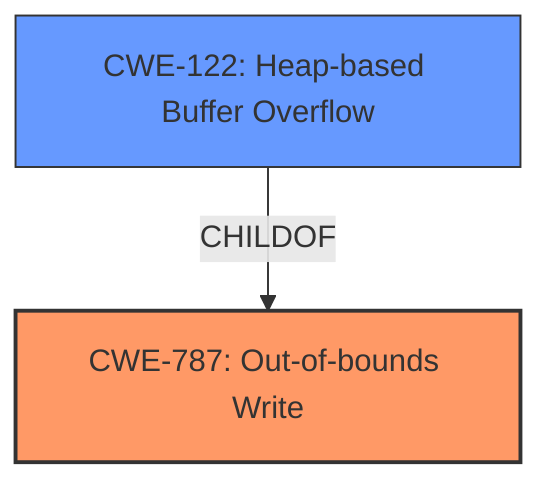

# Analysis for CVE-2021-34384

# Summary
| CWE ID | CWE Name | Confidence | CWE Abstraction Level | CWE Vulnerability Mapping Label | CWE-Vulnerability Mapping Notes |
|---|---|---|---|---|---|
| CWE-787 | Out-of-bounds Write | 1.0 | Base | Allowed | Primary CWE |
| CWE-122 | Heap-based Buffer Overflow | 0.7 | Variant | Allowed | Secondary Candidate |

## Evidence and Confidence

*   **Confidence Score:** 0.9
*   **Evidence Strength:** HIGH

## Relationship Analysis
The primary relationship considered was the parent-child relationship between **CWE-787 (Out-of-bounds Write)** and **CWE-122 (Heap-based Buffer Overflow)**. Since the vulnerability specifically mentions a heap overflow, **CWE-122 (Heap-based Buffer Overflow)** could have been selected. However, **CWE-787 (Out-of-bounds Write)** is more general, and the description doesn't give any more information about what type of data is being written out of bounds, so **CWE-787 (Out-of-bounds Write)** is the best fit.

## Vulnerability Chain
The vulnerability chain starts with a **heap overflow**, which results in memory corruption, and ultimately leads to denial of service or code execution.

Heap Overflow -> Memory Corruption -> Denial of Service / Code Execution

## Summary of Analysis
The initial analysis identified a **heap overflow** vulnerability in the NVIDIA MB2 bootloader, leading to potential memory corruption, denial of service, or code execution. The key phrase "heap overflow" in the vulnerability description, along with the **root cause** information extracted from the CVE Reference Links Content Summary, strongly suggests a buffer overflow condition.

The **Retriever Results** provided a list of candidate CWEs, with **CWE-190 (Integer Overflow or Wraparound)**, **CWE-122 (Heap-based Buffer Overflow)**, and **CWE-787 (Out-of-bounds Write)** being the top contenders.

**CWE-190 (Integer Overflow or Wraparound)** was considered but deemed less relevant as the primary issue is not an integer overflow but rather a buffer overflow. While integer overflows can sometimes lead to buffer overflows, the description focuses on the heap overflow itself.

**CWE-122 (Heap-based Buffer Overflow)** is a strong candidate, since the vulnerability description explicitly specifies a heap overflow. However, **CWE-787 (Out-of-bounds Write)** is a more general description of what is happening.

The final decision was to select **CWE-787 (Out-of-bounds Write)** as the primary CWE, because that's what the **root cause** of the problem is.
**CWE-122 (Heap-based Buffer Overflow)** is a good secondary candidate.

The evidence supporting this decision includes:

*   The vulnerability description explicitly mentions "**heap overflow**".
*   The CVE Reference Links Content Summary identifies a "**heap overflow** vulnerability" as the **root cause**.
*   The impact of the vulnerability includes "memory corruption," "denial of service," and "code execution," all of which are consistent with buffer overflow vulnerabilities.

Based on the evidence and the relationship analysis, **CWE-787 (Out-of-bounds Write)** is the most appropriate CWE at the optimal level of specificity.
It is a base level CWE.

Relevant CWE Information:

# Enhanced Context (25 CWEs)
The following CWEs were identified as potentially relevant to this vulnerability:

## CWE-197: Numeric Truncation Error
**Abstraction Level**: Base
**Similarity Score**: 0.79
**Source**: dense

**Description**:
Truncation errors occur when a primitive is cast to a primitive of a smaller size and data is lost in the conversion.

**Mapping Guidance**:
- Usage: Allowed
- Rationale: This CWE entry is at the Base level of abstraction, which is a preferred level of abstraction for mapping to the root causes of vulnerabilities.

## CWE-191: Integer Underflow (Wrap or Wraparound)
**Abstraction Level**: Base
**Similarity Score**: 0.79
**Source**: dense

**Description**:
The product subtracts one value from another, such that the result is less than the minimum allowable integer value, which produces a value that is not equal to the correct result.

**Mapping Guidance**:
- Usage: Allowed
- Rationale: This CWE entry is at the Base level of abstraction, which is a preferred level of abstraction for mapping to the root causes of vulnerabilities.

## CWE-131: Incorrect Calculation of Buffer Size
**Abstraction Level**: Base
**Similarity Score**: 0.78
**Source**: dense

**Description**:
The product does not correctly calculate the size to be used when allocating a buffer, which could lead to a buffer overflow.

**Mapping Guidance**:
- Usage: Allowed
- Rationale: This CWE entry is at the Base level of abstraction, which is a preferred level of abstraction for mapping to the root causes of vulnerabilities.

## CWE-805: Buffer Access with Incorrect Length Value
**Abstraction Level**: Base
**Similarity Score**: 0.77
**Source**: dense

**Description**:
The product uses a sequential operation to read or write a buffer, but it uses an incorrect length value that causes it to access memory that is outside of the bounds of the buffer.

**Mapping Guidance**:
- Usage: Allowed
- Rationale: This CWE entry is at the Base level of abstraction, which is a preferred level of abstraction for mapping to the root causes of vulnerabilities.

## CWE-125: Out-of-bounds Read
**Abstraction Level**: Base
**Similarity Score**: 0.76
**Source**: dense

**Description**:
The product reads data past the end, or before the beginning, of the intended buffer.

**Mapping Guidance**:
- Usage: Allowed
- Rationale: This CWE entry is at the Base level of abstraction, which is a preferred level of abstraction for mapping to the root causes of vulnerabilities.

## CWE-681: Incorrect Conversion between Numeric Types
**Abstraction Level**: Base
**Similarity Score**: 0.76
**Source**: dense

**Description**:
When converting from one data type to another, such as long to integer, data can be omitted or translated in a way that produces unexpected values. If the resulting values are used in a sensitive context, then dangerous behaviors may occur.

**Mapping Guidance**:
- Usage: Allowed
- Rationale: This CWE entry is at the Base level of abstraction, which is a preferred level of abstraction for mapping to the root causes of vulnerabilities.

## CWE-190: Integer Overflow or Wraparound
**Abstraction Level**: Base
**Similarity Score**: 0.76
**Source**: dense

**Description**:
The product performs a calculation that can
         produce an integer overflow or wraparound when the logic
         assumes that the resulting value will always be larger than
         the original value. This occurs when an integer value is
         incremented to a value that is too large to store in the
         associated representation. When this occurs, the value may
         become a very small or negative number.

**Mapping Guidance**:
- Usage: Allowed
- Rationale: This CWE entry is at the Base level of abstraction, which is a preferred level of abstraction for mapping to the root causes of vulnerabilities.

## CWE-193: Off-by-one Error
**Abstraction Level**: Base
**Similarity Score**: 0.76
**Source**: dense

**Description**:
A product calculates or uses an incorrect maximum or minimum value that is 1 more, or 1 less, than the correct value.

**Mapping Guidance**:
- Usage: Allowed
- Rationale: This CWE entry is at the Base level of abstraction, which is a preferred level of abstraction for mapping to the root causes of vulnerabilities.

## CWE-126: Buffer Over-read
**Abstraction Level**: Variant
**Similarity Score**: 0.76
**Source**: dense

**Description**:
The product reads from a buffer using buffer access mechanisms such as indexes or pointers that reference memory locations after the targeted buffer.

**Mapping Guidance**:
- Usage: Allowed
- Rationale: This CWE entry is at the Variant level of abstraction, which is a preferred level of abstraction for mapping to the root causes of vulnerabilities.

## CWE-667: Improper Locking
**Abstraction Level**: Class
**Similarity Score**: 0.76
**Source**: dense

**Description**:
The product does not properly acquire or release a lock on a resource, leading to unexpected resource state changes and behaviors.

**Mapping Guidance**:
- Usage: Allowed-with-Review
- Rationale: This CWE entry is a Class and might have Base-level children that would be more appropriate

## CWE