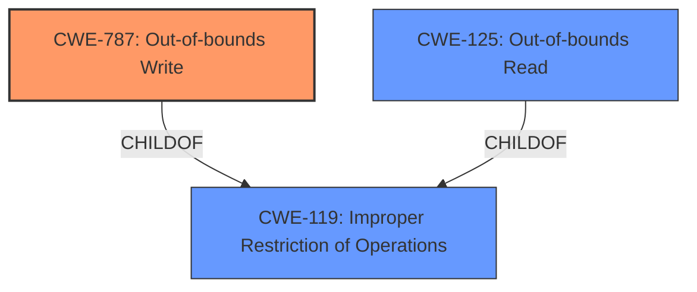

# Raw Analyzer Response for CVE-2021-34402

# Summary
| CWE ID | CWE Name | Confidence | CWE Abstraction Level | CWE Vulnerability Mapping Label | CWE-Vulnerability Mapping Notes |
|---|---|---|---|---|---|
| CWE-787 | Out-of-bounds Write | 1.0 | Base | Allowed | Primary CWE |
| CWE-125 | Out-of-bounds Read | 0.7 | Base | Allowed | Secondary CWE |
| CWE-119 | Improper Restriction of Operations within the Bounds of a Memory Buffer | 0.5 | Class | Discouraged | Secondary CWE |

## Evidence and Confidence

*   **Confidence Score:** 0.9
*   **Evidence Strength:** HIGH

## Relationship Analysis
The primary CWE is CWE-787 **Out-of-bounds Write**, which is a **Base** level CWE and a child of CWE-119 **Improper Restriction of Operations within the Bounds of a Memory Buffer**, a **Class** level CWE. CWE-125 **Out-of-bounds Read** is also a child of CWE-119. While CWE-119 is a parent, it is **Discouraged** for use, with a recommendation to use its children.

## Vulnerability Chain
The chain of events starts with the **weakness** where a user with high privileges is able to read or write to memory locations outside the intended boundary of the buffer.
- **Root Cause:** **Memory Corruption** due to insufficient bounds checking
- **Impact:** Denial of service, Information disclosure, loss of integrity, possible escalation of privileges

## Summary of Analysis
The initial assessment identified CWE-787 **Out-of-bounds Write** as the primary candidate, aligning with the vulnerability description indicating a user with high privileges can write to memory locations outside the intended buffer boundary. The CVE Reference Links Content Summary explicitly mentions "Out-of-bounds read/write vulnerability due to insufficient bounds checking."

The description says "read from or write to a memory location that is outside the intended boundaries of the buffer". This suggests both an out-of-bounds read and an out-of-bounds write are possible. So I will also include CWE-125 **Out-of-bounds Read** as a secondary candidate.

The Retriever Results list CWE-787 as the top candidate with a score of 1.0. The Retriever Results also lists CWE-119, but mapping guidance recommends using more specific child CWEs when available.

Based on the evidence provided, the selected CWEs are at the optimal level of specificity. CWE-787 directly reflects the **out-of-bounds write** aspect of the vulnerability, while CWE-125 captures the **out-of-bounds read** possibility.

Relevant CWE Information:

# Enhanced Context (25 CWEs)

## CWE-667: Improper Locking
**Abstraction Level**: Class
**Similarity Score**: 0.79
**Source**: dense

**Description**:
The product does not properly acquire or release a lock on a resource, leading to unexpected resource state changes and behaviors.

**Mapping Guidance**:
- Usage: Allowed-with-Review
- Rationale: This CWE entry is a Class and might have Base-level children that would be more appropriate

*Not used because this vulnerability is about memory access, not synchronization issues.*

## CWE-415: Double Free
**Abstraction Level**: Variant
**Similarity Score**: 0.79
**Source**: dense

**Description**:
The product calls free() twice on the same memory address, potentially leading to modification of unexpected memory locations.

**Mapping Guidance**:
- Usage: Allowed
- Rationale: This CWE entry is at the Variant level of abstraction, which is a preferred level of abstraction for mapping to the root causes of vulnerabilities.

*Not used because the issue is out-of-bounds access, not double freeing of memory.*

## CWE-226: Sensitive Information in Resource Not Removed Before Reuse
**Abstraction Level**: Base
**Similarity Score**: 0.78
**Source**: dense

**Description**:
The product releases a resource such as memory or a file so that it can be made available for reuse, but it does not clear or "zeroize" the information contained in the resource before the product performs a critical state transition or makes the resource available for reuse by other entities.

**Mapping Guidance**:
- Usage: Allowed
- Rationale: This CWE entry is at the Base level of abstraction, which is a preferred level of abstraction for mapping to the root causes of vulnerabilities.

*Not used because the vulnerability isn't about sensitive information being left in resources.*

## CWE-404: Improper Resource Shutdown or Release
**Abstraction Level**: Class
**Similarity Score**: 0.78
**Source**: dense

**Description**:
The product does not release or incorrectly releases a resource before it is made available for re-use.

**Mapping Guidance**:
- Usage: Allowed-with-Review
- Rationale: This CWE entry is a Class and might have Base-level children that would be more appropriate

*Not used because the vulnerability is about memory corruption, not resource management.*

## CWE-131: Incorrect Calculation of Buffer Size
**Abstraction Level**: Base
**Similarity Score**: 0.77
**Source**: dense

**Description**:
The product does not correctly calculate the size to be used when allocating a buffer, which could lead to a buffer overflow.

**Mapping Guidance**:
- Usage: Allowed
- Rationale: This CWE entry is at the Base level of abstraction, which is a preferred level of abstraction for mapping to the root causes of vulnerabilities.

*Not used because the description doesn't indicate an incorrect calculation of buffer size, just that the buffer boundary is not checked.*

## CWE-125: Out-of-bounds Read
**Abstraction Level**: Base
**Similarity Score**: 0.76
**Source**: dense

**Description**:
The product reads data past the end, or before the beginning, of the intended buffer.

**Mapping Guidance**:
- Usage: Allowed
- Rationale: This CWE entry is at the Base level of abstraction, which is a preferred level of abstraction for mapping to the root causes of vulnerabilities.

*CWE-125 **Out-of-bounds Read** is being used as a secondary CWE.*

## CWE-824: Access of Uninitialized Pointer
**Abstraction Level**: Base
**Similarity Score**: 0.76
**Source**: dense

**Description**:
The product accesses or uses a pointer that has not been initialized.

**Mapping Guidance**:
- Usage: Allowed
- Rationale: This CWE entry is at the Base level of abstraction, which is a preferred level of abstraction for mapping to the root causes of vulnerabilities.

*Not used because the issue is not related to uninitialized pointers.*

## CWE-252: Unchecked Return Value
**Abstraction Level**: Base
**Similarity Score**: 0.76
**Source**: dense

**Description**:
The product does not check the return value from a method or function, which can prevent it from detecting unexpected states and conditions.

**Mapping Guidance**:
- Usage: Allowed
- Rationale: This CWE entry is at the Base level of abstraction, which is a preferred level of abstraction for mapping to the root causes of vulnerabilities.

*Not used because the problem is not related to unchecked return values.*

## CWE-476: NULL Pointer Dereference
**Abstraction Level**: Base
**Similarity Score**: 0.76
**Source**: dense

**Description**:
The product dereferences a pointer that it expects to be valid but is NULL.

**Mapping Guidance**:
- Usage: Allowed
- Rationale: This CWE entry is at the Base level of abstraction, which is a preferred level of abstraction for mapping to the root causes of vulnerabilities.

*Not used because the vulnerability is not a NULL pointer dereference.*

## CWE-362: Concurrent Execution using Shared Resource with Improper Synchronization ('Race Condition')
**Abstraction Level**: Class
**Similarity Score**: 0.76
**Source**: dense

**Description**:
The product contains a concurrent code sequence that requires temporary, exclusive access to a shared resource, but a timing window exists in which the shared resource can be modified by another code sequence operating concurrently.

**Mapping Guidance**:
- Usage: Allowed-with-Review
- Rationale: This CWE entry is a Class and might have Base-level children that would be more appropriate

*Not used because the vulnerability is not related to concurrent execution or race conditions.*

## CWE-823: Use of Out-of-range Pointer Offset
**Abstraction Level**: Base