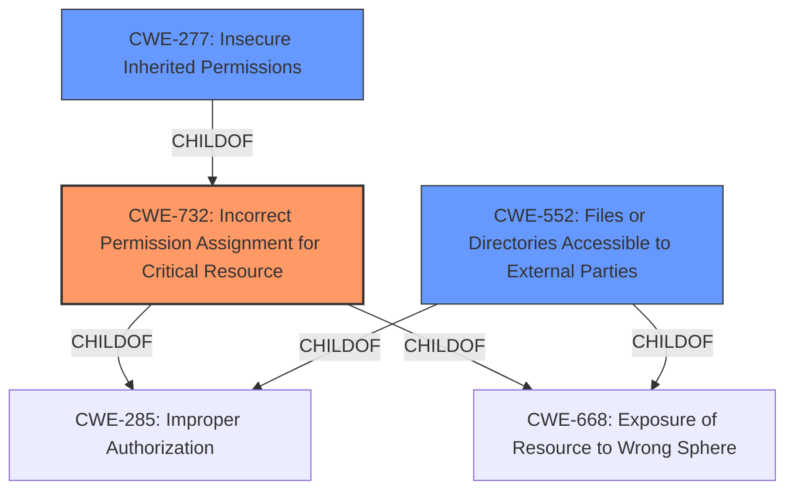

# Raw Analyzer Response for CVE-2021-34410

# Summary
| CWE ID | CWE Name | Confidence | CWE Abstraction Level | CWE Vulnerability Mapping Label | CWE-Vulnerability Mapping Notes |
|---|---|---|---|---|---|
| CWE-732 | Incorrect Permission Assignment for Critical Resource | 0.8 | Class | Allowed-with-Review | Primary CWE |
| CWE-277 | Insecure Inherited Permissions | 0.6 | Variant | Allowed | Secondary Candidate |
| CWE-552 | Files or Directories Accessible to External Parties | 0.5 | Base | Allowed | Secondary Candidate |

## Evidence and Confidence

*   **Confidence Score:** 0.7
*   **Evidence Strength:** LOW

## Relationship Analysis
The primary CWE selected is CWE-732 (Incorrect Permission Assignment for Critical Resource), which is a Class-level CWE. CWE-277 (Insecure Inherited Permissions) is a Variant of CWE-732 and represents a more specific case where permissions are incorrectly inherited. CWE-552 (Files or Directories Accessible to External Parties) is another potential related CWE, focusing on the exposure of files or directories to unauthorized parties. The choice between these CWEs depends on the specific root cause, which is not fully detailed in the provided vulnerability description.

## Vulnerability Chain
The vulnerability chain involves a user-writable application bundle, which leads to incorrect permission assignments, ultimately resulting in privilege escalation to root. The chain can be described as:

1.  **User-Writable Application Bundle (Root Cause):** A component of the application is writable by a standard user.
2.  **Incorrect Permission Assignment (CWE-732):** The application bundle or files within it have permissions that allow unintended modification.
3.  **Privilege Escalation to Root (Impact):** The ability to modify the application bundle allows an attacker to gain root privileges.

## Summary of Analysis
The primary assessment is based on the vulnerability description, which states that a user-writable application bundle allows for privilege escalation. The key factor is the **incorrect permission** that allows a regular user to modify application files that should only be writable by an administrator or root.

The selection of CWE-732 is influenced by the fact that the vulnerability involves **incorrect permission assignment** for a critical resource (the application bundle). However, the lack of details on the specific mechanism of privilege escalation makes it difficult to pinpoint a more specific CWE. If the **incorrect permission** is due to **insecure inherited permissions**, then CWE-277 would be more appropriate. If the issue is that files are accessible to external parties due to the user-writable bundle, CWE-552 might be relevant.

CWE-284 (Improper Access Control) and CWE-285 (Improper Authorization) are too high-level and are therefore not selected. The description lacks the details needed to confirm that the **incorrect permission** is the result of missing or broken authorization checks, although it is implied.

The final decision is to select CWE-732 as the primary CWE, with CWE-277 and CWE-552 as secondary candidates, depending on the specifics of the vulnerability, which is not available in the provided context.

Relevant CWE Information:
*   **CWE-732 (Incorrect Permission Assignment for Critical Resource):** This CWE directly addresses the scenario where a security-critical resource has permissions that allow unintended actors to read or modify it. The description aligns with the vulnerability's core issue of a user-writable application bundle.
*   **CWE-277 (Insecure Inherited Permissions):** This CWE describes a situation where a product defines a set of **insecure permissions** that are inherited by objects created by the program. This is a more specific version of CWE-732
*   **CWE-552 (Files or Directories Accessible to External Parties):** This CWE focuses on making files or directories accessible to unauthorized actors. While related to permissions, it emphasizes the exposure aspect, which is not the primary concern in this vulnerability description.