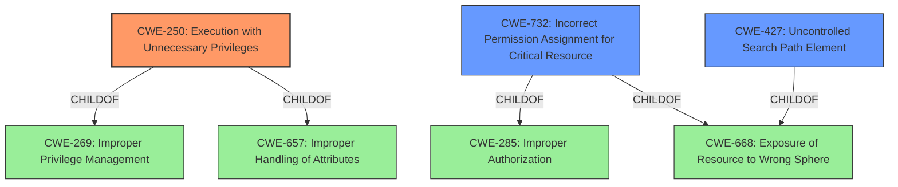

# Raw Analyzer Response for CVE-2021-34412

# Summary
| CWE ID    | CWE Name                                                                 | Confidence | CWE Abstraction Level | CWE Vulnerability Mapping Label | CWE-Vulnerability Mapping Notes |
| :--------- | :----------------------------------------------------------------------- | :--------- | :---------------------- | :------------------------------ | :------------------------------ |
| CWE-250     | Execution with Unnecessary Privileges                                    | 0.8        | Base                    | Primary CWE                     | Allowed                       |
| CWE-732     | Incorrect Permission Assignment for Critical Resource                    | 0.6        | Class                   | Secondary Candidate            | Allowed-with-Review           |
| CWE-427     | Uncontrolled Search Path Element                                         | 0.5        | Base                    | Secondary Candidate            | Allowed                       |

## Evidence and Confidence

*   **Confidence Score:** 0.7
*   **Evidence Strength:** MEDIUM

## Relationship Analysis
The primary CWE, CWE-250, is a base-level weakness and a child of CWE-269 and CWE-657. CWE-732 is a class-level weakness and is a child of CWE-285 and CWE-668. CWE-427 is a base level and child of CWE-668.

## Vulnerability Chain
The chain of events leading to the vulnerability involves the Zoom Client for Meetings installer being launched with elevated privileges. This allows the installer to launch Internet Explorer. This **execution** occurs with **unnecessary privileges**, leading to a local privilege escalation.

## Summary of Analysis
The analysis is primarily based on the vulnerability description, which highlights that the installer can launch Internet Explorer with elevated privileges, leading to a local privilege escalation.

The primary CWE selected is CWE-250 Execution with Unnecessary Privileges. The vulnerability description states that the installer, when launched with elevated privileges, can launch Internet Explorer. This **execution** with **unnecessary privileges** can lead to a local privilege escalation. This aligns with CWE-250's description: "The product performs an operation at a privilege level that is higher than the minimum level required."

CWE-732 Incorrect Permission Assignment for Critical Resource was considered because the vulnerability involves the installer running with elevated privileges, which might suggest an incorrect permission assignment. However, the root cause is the **unnecessary execution** with elevated privileges rather than an explicit incorrect permission assignment.

CWE-427 Uncontrolled Search Path Element was also considered because the installer might be using a search path to find and launch Internet Explorer. However, the vulnerability description doesn't explicitly mention a search path issue, so this CWE is less likely than CWE-250. The root cause isn't because of the search path, but because the application is being **executed** with **unnecessary privileges**.

The selection of CWE-250 is at the optimal level of specificity because it directly addresses the root cause of the vulnerability: the program being **executed** with **unnecessary privileges**.

Relevant CWE Information:

# Enhanced Context (25 CWEs)
The following CWEs were identified as potentially relevant to this vulnerability:

## CWE-250: Execution with Unnecessary Privileges
**Abstraction Level**: Base
**Similarity Score**: 0.116

**Description**:
The product performs an operation at a privilege level that is higher than the minimum level required, which creates new weaknesses or amplifies the consequences of other weaknesses.

**Mapping Guidance**:
- Usage: Allowed
- Rationale: This CWE entry is at the Base level of abstraction, which is a preferred level of abstraction for mapping to the root causes of vulnerabilities.

## CWE-732: Incorrect Permission Assignment for Critical Resource
**Abstraction Level**: Class
**Similarity Score**: 0.103

**Description**:
The product specifies permissions for a security-critical resource in a way that allows that resource to be read or modified by unintended actors.

**Mapping Guidance**:
- Usage: Allowed-with-Review
- Rationale: While the name itself indicates an assignment of permissions for resources, this is often misused for vulnerabilities in which "permissions" are not checked, which is an "authorization" weakness (CWE-285 or descendants) within CWE's model [REF-1287].

## CWE-427: Uncontrolled Search Path Element
**Abstraction Level**: Base
**Similarity Score**: 0.095

**Description**:
The product uses a fixed or controlled search path to find resources, but one or more locations in that path can be under the control of unintended actors.

**Mapping Guidance**:
- Usage: Allowed
- Rationale: This CWE entry is at the Base level of abstraction, which is a preferred level of abstraction for mapping to the root causes of vulnerabilities.