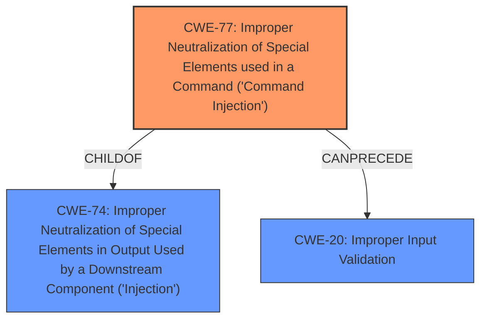

# Analysis Report for CVE-2021-34414

# Vulnerability Analysis Report: CVE-2021-34414

## Description


## Analysis (with Relationship Data)

# Summary
| CWE ID | CWE Name | Confidence | CWE Abstraction Level | CWE Vulnerability Mapping Label | CWE-Vulnerability Mapping Notes |
|---|---|---|---|---|---|
| CWE-77 | Improper Neutralization of Special Elements used in a Command ('Command Injection') | 1.0 | Class | Allowed-with-Review | Primary CWE |
| CWE-20 | Improper Input Validation | 0.7 | Class | Discouraged | Secondary CWE |

## Evidence and Confidence

*   **Confidence Score:** 0.85
*   **Evidence Strength:** HIGH

## Relationship Analysis
The primary relationship considered was the parent-child relationship between CWE-74 (Improper Neutralization of Special Elements in Output Used by a Downstream Component ('Injection')) and CWE-77. CWE-77 is a more specific type of injection related to commands. While CWE-74 is broader, CWE-77 aligns directly with the **"remote command injection"** weakness in the vulnerability description. CWE-20 was considered because the root cause is **"fails to validate input sent in requests"**; however, it is a high-level Class CWE and should be avoided if a better CWE is available.



## Vulnerability Chain
The chain of events starts with a **failure to validate input** (CWE-20), which then leads to **command injection** (CWE-77). In this case, the **"fails to validate input sent in requests"** (CWE-20) is the root cause of the vulnerability, and the **"remote command injection"** (CWE-77) is the direct result.

## Summary of Analysis
The vulnerability description explicitly states that the system **"fails to validate input sent in requests,"** which leads to **"remote command injection."** The "Retriever Results" list CWE-77 as the top candidate, with a high score. CWE-77 (Improper Neutralization of Special Elements used in a Command ('Command Injection')) aligns directly with the stated impact. Although the root cause is **"fails to validate input"** the resulting weakness is the command injection.

CWE-20 (Improper Input Validation) was also considered because of the **"fails to validate input"** statement. However, CWE-20 is a broad, high-level class, and the vulnerability description clearly points to command injection. Therefore, CWE-77 is a more specific and accurate representation of the weakness.

The selection of CWE-77 is at the optimal level of specificity because it directly describes the type of injection occurring.

Relevant CWE Information:

# Enhanced Context (25 CWEs)

## CWE-1289: Improper Validation of Unsafe Equivalence in Input
**Abstraction Level**: Base
**Similarity Score**: 0.76

## CWE-807: Reliance on Untrusted Inputs in a Security Decision
**Abstraction Level**: Base
**Similarity Score**: 0.76

## CWE-653: Improper Isolation or Compartmentalization
**Abstraction Level**: Class
**Similarity Score**: 0.76

## CWE-799: Improper Control of Interaction Frequency
**Abstraction Level**: Class
**Similarity Score**: 0.75

## CWE-183: Permissive List of Allowed Inputs
**Abstraction Level**: Base
**Similarity Score**: 0.75

## CWE-184: Incomplete List of Disallowed Inputs
**Abstraction Level**: Base
**Similarity Score**: 0.75

## CWE-274: Improper Handling of Insufficient Privileges
**Abstraction Level**: Base
**Similarity Score**: 0.75

## CWE-280: Improper Handling of Insufficient Permissions or Privileges
**Abstraction Level**: Base
**Similarity Score**: 0.75

## CWE-74: Improper Neutralization of Special Elements in Output Used by a Downstream Component ('Injection')
**Abstraction Level**: Class
**Similarity Score**: 0.75

## CWE-300: Channel Accessible by Non-Endpoint
**Abstraction Level**: Class
**Similarity Score**: 0.74

## CWE-863: Incorrect Authorization
**Abstraction Level**: Class
**Similarity Score**: 7318.78

## CWE-923: Improper Restriction of Communication Channel to Intended Endpoints
**Abstraction Level**: Class
**Similarity Score**: 7170.34

## CWE-441: Unintended Proxy or Intermediary ('Confused Deputy')
**Abstraction Level**: Class
**Similarity Score**: 7159.67

## CWE-285: Improper Authorization
**Abstraction Level**: Class
**Similarity Score**: 7156.87

## CWE-22: Improper Limitation of a Pathname to a Restricted Directory ('Path Traversal')
**Abstraction Level**: Base
**Similarity Score**: 7135.07

## CWE-170: Improper Null Termination
**Abstraction Level**: base
**Similarity Score**: 5.03

## CWE-73: External Control of File Name or Path
**Abstraction Level**: base
**Similarity Score**: 4.33

## CWE-22: Improper Limitation of a Pathname to a Restricted Directory ('Path Traversal')
**Abstraction Level**: base
**Similarity Score**: 4.33

## CWE-770: Allocation of Resources Without Limits or Throttling
**Abstraction Level**: base
**Similarity Score**: 4.33

## CWE-190: Integer Overflow or Wraparound
**Abstraction Level**: base
**Similarity Score**: 4.33

## CWE-120: Buffer Copy without Checking Size of Input ('Classic Buffer Overflow')
**Abstraction Level**: base
**Similarity Score**: 4.33

## CWE-126: Buffer Over-read
**Abstraction Level**: variant
**Similarity Score**: 3.88

## CWE-463: Deletion of Data Structure Sentinel
**Abstraction Level**: base
**Similarity Score**: 3.64

## CWE-178: Improper Handling of Case Sensitivity
**Abstraction Level**: base
**Similarity Score**: 3.64

## CWE-464: Addition of Data Structure Sentinel
**Abstraction Level**: base
**Similarity Score**: 3.64


## CWE Relationship Analysis

Current CWEs represent these abstraction levels: .


### Vulnerability Chain Analysis

**Chain starting from CWE-463:**
- 463 (Deletion of Data Structure Sentinel) - ROOT


**Chain starting from CWE-799:**
- 799 (Improper Control of Interaction Frequency) - ROOT


### CWE Relationship Diagram

```mermaid
graph TD
    classDef primary fill:#f96,stroke:#333,stroke-width:2px
    classDef secondary fill:#69f,stroke:#333
    classDef tertiary fill:#9e9,stroke:#333
```


*Report generated on 2025-04-02 13:13:24*
