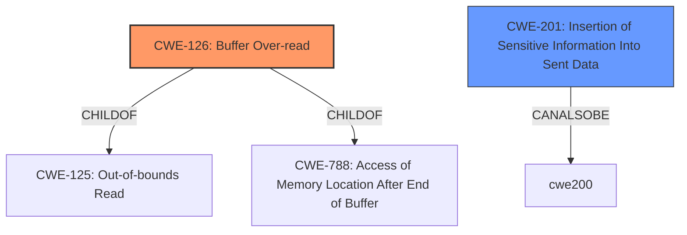

# Raw Analyzer Response for CVE-2021-34424

# Summary
| CWE ID | CWE Name | Confidence | CWE Abstraction Level | CWE Vulnerability Mapping Label | CWE-Vulnerability Mapping Notes |
|---|---|---|---|---|---|
| CWE-126 | Buffer Over-read | 0.7 | Variant | Allowed | Primary CWE |
| CWE-201 | Insertion of Sensitive Information Into Sent Data | 0.5 | Base | Allowed | Secondary Candidate |

## Evidence and Confidence

*   **Confidence Score:** 0.7
*   **Evidence Strength:** LOW

## Relationship Analysis
The primary CWE selected was CWE-126, which is a Variant of CWE-125 (Out-of-bounds Read) and CWE-788 (Access of Memory Location After End of Buffer). Although no explicit buffer is mentioned in the description, the **exposure of the state of process memory** suggests some out-of-bounds access. The next best CWE-201 is about the disclosure of memory, which is likely the result of the buffer over-read.

## Vulnerability Chain
The vulnerability chain starts with some **IMPROPER HANDLING** of memory that leads to **OUT-OF-BOUNDS READ** which results in **EXPOSURE OF PROCESS MEMORY**.

## Summary of Analysis
The vulnerability description mentions that the Zoom application potentially allowed for the **exposure of the state of process memory**. This issue could be used to potentially gain insight into arbitrary areas of the product's memory. Given the limited information, the best fit is CWE-126: Buffer Over-read, since the vulnerability description refers to reading arbitrary areas of process memory.

The selection is based on the **exposure of process memory** which could be possible by reading beyond the buffer.

Relevant CWE Information:

*   CWE-126: Buffer Over-read
    *   **Technical Explanation:** Reading beyond the intended buffer to expose process memory.
    *   **Security Implications and Potential Impact:** Exposure of sensitive information stored in memory.
    *   **Parent-Child Relationships:** ChildOf CWE-125 (Out-of-bounds Read), ChildOf CWE-788 (Access of Memory Location After End of Buffer).
    *   **MITRE Mapping Guidance Influence:** Usage: Allowed, Rationale: Preferred level of abstraction.

*   CWE-201: Insertion of Sensitive Information Into Sent Data
    *   **Technical Explanation:** Exposure of sensitive information stored in memory by sending it to another actor.
    *   **Security Implications and Potential Impact:** Exposure of sensitive information stored in memory.
    *   **Parent-Child Relationships:** ChildOf -> CWE-200, CanAlsoBe -> CWE-209, CanAlsoBe -> CWE-202
    *   **MITRE Mapping Guidance Influence:** Usage: Allowed, Rationale: Preferred level of abstraction.

CWEs Considered But Not Used:

*   CWE-119: Improper Restriction of Operations within the Bounds of a Memory Buffer: This is a very broad class and not specific enough.
*   CWE-284: Improper Access Control: Too high level; the description suggests more of a memory corruption issue.
*   CWE-20: Improper Input Validation: No specific input validation issue is described.