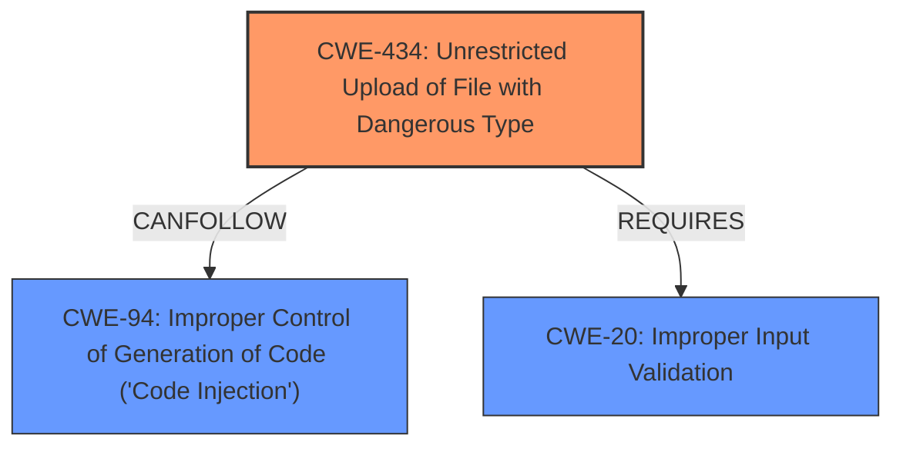

# Enhanced Analysis for CVE-2021-34427

# Summary
| CWE ID | CWE Name | Confidence | CWE Abstraction Level | CWE Vulnerability Mapping Label | CWE-Vulnerability Mapping Notes |
|---|---|---|---|---|---|
| CWE-434 | Unrestricted Upload of File with Dangerous Type | 1.0 | Base | Allowed | Primary CWE |
| CWE-94 | Improper Control of Generation of Code ('Code Injection') | 0.8 | Base | Allowed-with-Review | Secondary CWE |
| CWE-20 | Improper Input Validation | 0.7 | Class | Allowed | Secondary CWE |

## Evidence and Confidence

*   **Confidence Score:** 0.9
*   **Evidence Strength:** HIGH

## Relationship Analysis
The primary CWE is CWE-434, which represents the **unrestricted upload of a file with a dangerous type**, specifically a JSP file. This is linked to the ability to **inject JSP code**, indicating code injection (CWE-94). The vulnerability stems from **improper input validation** (CWE-20) of the `__document` parameter.



## Vulnerability Chain
The vulnerability chain starts with **improper input validation** (CWE-20), leading to **unrestricted upload of a file with a dangerous type** (CWE-434), which in turn enables **improper control of generation of code** (CWE-94), resulting in remote code execution.

## Summary of Analysis
The primary weakness is CWE-434, based on the "Root cause" evidence: "Improper input validation of the `__document` parameter allows an attacker to specify an arbitrary file name, including JSP files, and **inject code** into it using the `sample` parameter." This directly aligns with CWE-434's description: "The product allows the upload or transfer of dangerous file types that are automatically processed within its environment." The ability to **inject code** into the JSP file points to CWE-94: "The product constructs all or part of a code segment using externally-influenced input from an upstream component, but it does not neutralize or incorrectly neutralizes special elements that could modify the syntax or behavior of the intended code segment." The root cause is CWE-20, as the vulnerability stems from **improper input validation**.

CWEs 22, 78, 79, 88, 98, 138, 184, 917, 564, and 121 were considered but are not as directly relevant. CWE-22 ('Path Traversal') might seem applicable, but the core issue is not traversing directories but uploading a dangerous file type. CWE-78 ('OS Command Injection') and CWE-79 ('Cross-site Scripting') are not applicable, as the vulnerability involves JSP code injection, not OS commands or XSS. CWE-88 ('Argument Injection') is not relevant because the injection is not related to command arguments. CWE-98 ('PHP Remote File Inclusion') is specific to PHP, while this vulnerability is in a Java environment. CWE-138 ('Improper Neutralization of Special Elements') is too generic. CWE-184 ('Incomplete List of Disallowed Inputs') is a related concept as a permissive allow list, however is not the direct cause. CWE-917 ('Expression Language Injection') is related to EL statements and not directly to JSP code injection in this context. CWE-564 ('SQL Injection: Hibernate') is specific to SQL, which is not the case here. CWE-121 ('Stack-based Buffer Overflow') is unrelated.


## CWE Relationship Analysis

Current CWEs represent these abstraction levels: .


### Vulnerability Chain Analysis

**Chain starting from CWE-121:**
- 121 (Stack-based Buffer Overflow) - ROOT


**Chain starting from CWE-79:**
- 79 (Improper Neutralization of Input During Web Page Generation ('Cross-site Scripting')) - ROOT


### CWE Relationship Diagram

```mermaid
graph TD
    classDef primary fill:#f96,stroke:#333,stroke-width:2px
    classDef secondary fill:#69f,stroke:#333
    classDef tertiary fill:#9e9,stroke:#333
```