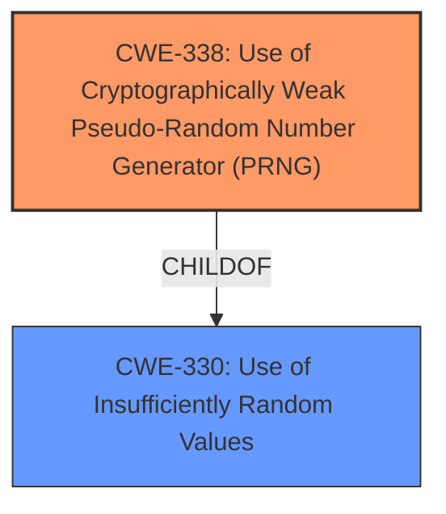

# Raw Analyzer Response for CVE-2021-34430

# Summary
| CWE ID | CWE Name | Confidence | CWE Abstraction Level | CWE Vulnerability Mapping Label | CWE-Vulnerability Mapping Notes |
|---|---|---|---|---|---|
| CWE-338 | Use of Cryptographically Weak Pseudo-Random Number Generator (PRNG) | 1.0 | Base | Primary | Allowed |
| CWE-330 | Use of Insufficiently Random Values | 0.7 | Class | Secondary | Discouraged |

## Evidence and Confidence

*   **Confidence Score:** 0.9
*   **Evidence Strength:** HIGH

## Relationship Analysis
The primary CWE is CWE-338 (Base), which is a child of CWE-330 (Class). CWE-330 represents a broader category of using insufficiently random values, while CWE-338 specifically addresses the use of cryptographically weak PRNGs. Selecting CWE-338 provides a more specific and accurate representation of the vulnerability.

## Vulnerability Chain
The chain of weaknesses starts with the **reliance on the rand function** (CWE-338), leading to predictable random values, which then allows attackers to decrypt DTLS traffic.

## Summary of Analysis
The analysis is based on the provided vulnerability description and the CVE reference links content summary. The **root cause** of the vulnerability is the **reliance on the `rand` function** for generating random numbers in a cryptographic context. This function is known to be cryptographically weak, making it easier for attackers to predict the generated values and compromise the DTLS communication.

The CVE reference summary explicitly states:
- "TinyDTLS uses the standard library's `rand()` function as its pseudo-random number generator (PRNG)."
- "The `rand()` function, typically a linear congruential generator (LCG) or similar, has predictable output based on its internal state."
- "**Insecure PRNG:** Using `rand()` is not cryptographically secure. The output of `rand()` is predictable if its internal state is known."
- "An attacker can observe the `server_random` value, use this to recover the internal state of the PRNG, and then predict the secret scalar used for elliptic curve calculations."
- "By knowing the secret scalar, an attacker can derive symmetric keys, compromising the entire DTLS communication."

Given this evidence, CWE-338, "Use of Cryptographically Weak Pseudo-Random Number Generator (PRNG)," is the most appropriate CWE. It directly addresses the **root cause** of the vulnerability, which is the use of a PRNG that is not cryptographically strong.

CWE-330 was also considered, but it is a more general class. While the `rand` function does produce "insufficiently random values," CWE-338 is more specific in that it explicitly identifies the use of a cryptographically weak PRNG as the **root cause**.

Relevant CWE Information:

# Enhanced Context (25 CWEs)
The following CWEs were identified as potentially relevant to this vulnerability:

## CWE-1240: Use of a Cryptographic Primitive with a Risky Implementation
**Abstraction Level**: Base
**Similarity Score**: 0.83
**Source**: dense

**Description**:
To fulfill the need for a cryptographic primitive, the product implements a cryptographic algorithm using a non-standard, unproven, or disallowed/non-compliant cryptographic implementation.

**Mapping Guidance**:
- Usage: Allowed
- Rationale: This CWE entry is at the Base level of abstraction, which is a preferred level of abstraction for mapping to the root causes of vulnerabilities.

## CWE-330: Use of Insufficiently Random Values
**Abstraction Level**: Class

## CWE-328: Use of Weak Hash
**Abstraction Level**: Base

## CWE-335: Incorrect Usage of Seeds in Pseudo-Random Number Generator (PRNG)
**Abstraction Level**: Base

## CWE-327: Use of a Broken or Risky Cryptographic Algorithm
**Abstraction Level**: Class

## CWE-1391: Use of Weak Credentials
**Abstraction Level**: Class

## CWE-203: Observable Discrepancy
**Abstraction Level**: Base

## CWE-208: Observable Timing Discrepancy
**Abstraction Level**: Base

## CWE-345: Insufficient Verification of Data Authenticity
**Abstraction Level**: Class

## CWE-331: Insufficient Entropy
**Abstraction Level**: Base

## CWE-1204: Generation of Weak Initialization Vector (IV)
**Abstraction Level**: Base

## CWE-804: Guessable CAPTCHA
**Abstraction Level**: base

## CWE-385: Covert Timing Channel
**Abstraction Level**: base

## CWE-190: Integer Overflow or Wraparound
**Abstraction Level**: base

## CWE-1272: Sensitive Information Uncleared Before Debug/Power State Transition
**Abstraction Level**: base

## CWE-128: Wrap-around Error
**Abstraction Level**: base

## CWE-301: Reflection Attack in an Authentication Protocol
**Abstraction Level**: base

## CWE-311: Missing Encryption of Sensitive Data
**Abstraction Level**: class

## CWE-1339: Insufficient Precision or Accuracy of a Real Number
**Abstraction Level**: base