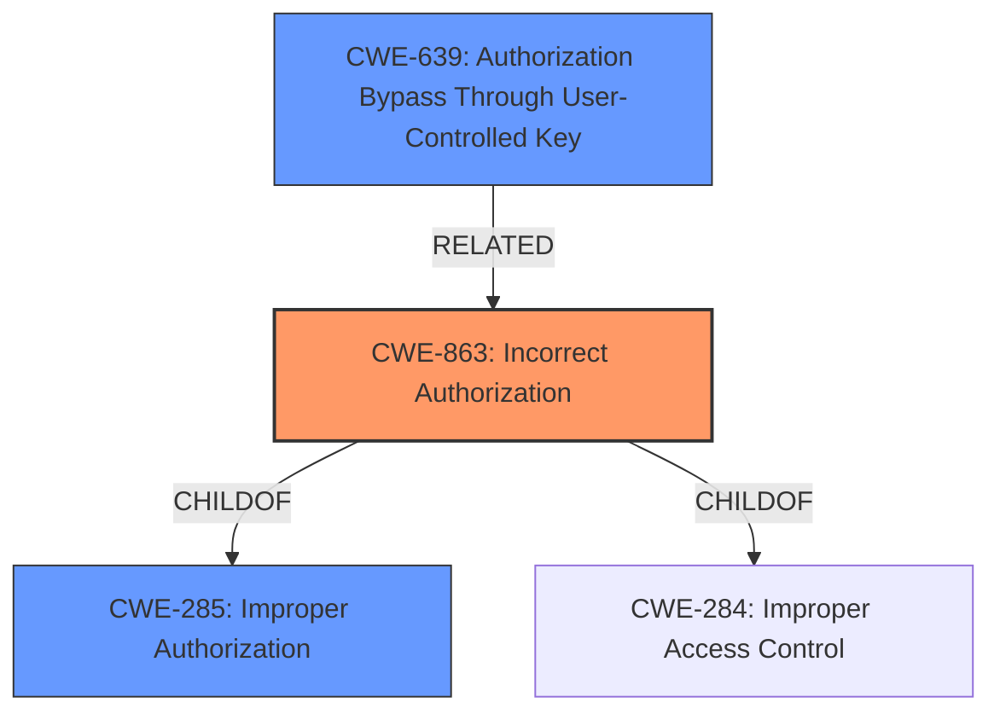

# Analysis for CVE-2021-34434

# Summary
| CWE ID | CWE Name | Confidence | CWE Abstraction Level | CWE Vulnerability Mapping Label | CWE-Vulnerability Mapping Notes |
|---|---|---|---|---|---|
| CWE-863 | Incorrect Authorization | 1.0 | Class | Allowed-with-Review | Primary CWE |
| CWE-639 | Authorization Bypass Through User-Controlled Key | 0.7 | Base | Allowed | Secondary Candidate |
| CWE-285 | Improper Authorization | 0.3 | Class | Discouraged | Secondary Candidate |

## Evidence and Confidence

*   **Confidence Score:** 1.0
*   **Evidence Strength:** HIGH

## Relationship Analysis
The primary CWE is CWE-863 (Incorrect Authorization), which is a Class-level CWE. It has parent-child relationships with CWE-285 (Improper Authorization) and CWE-284. The vulnerability involves an authorization check not being correctly performed, aligning with the description of CWE-863.
CWE-639 (Authorization Bypass Through User-Controlled Key) is a base-level CWE and a more specific instance of authorization bypass, but the provided evidence doesn't explicitly point to a user-controlled key being the root cause.
CWE-285 is a higher-level class that is not appropriate to use.

## Vulnerability Chain
The chain of events is as follows:
1.  A client subscribes to a topic.
2.  The client disconnects.
3.  The admin revokes the client's privilege.
4.  The client reconnects and retains the subscription due to the **incorrect authorization** mechanism.

The root cause is the **improper authorization** that fails to revoke existing subscriptions when a durable client is offline. The impact is the attacker retaining subscription privileges.

## Summary of Analysis
The initial analysis identified CWE-863 (Incorrect Authorization) as the primary candidate, which aligns with the **weakness** described in the CVE summary: "**Improper Authorization**". The description clearly states that "existing subscriptions for that client are **not revoked**," indicating an issue with the authorization process.

The Retriever Results also lists CWE-863 as the top combined result.

CWE-639 (Authorization Bypass Through User-Controlled Key) was considered because it is a more specific case of authorization bypass. However, the provided information doesn't explicitly state that the bypass occurs through a user-controlled key. The evidence indicates that the authorization mechanism itself **fails to revoke** the subscription, not that the user is manipulating a key to bypass authorization.

CWE-285 (Improper Authorization) was also considered. However, CWE-863 is a child of CWE-285 and is a more specific classification, making it a better fit. The mapping guidance for CWE-285 discourages its use when lower-level CWEs are available.

The final decision to select CWE-863 is based on the following evidence:

*   The CVE summary explicitly mentions "**Improper Authorization**" as the **weakness**.
*   The vulnerability description states that "existing subscriptions...are **not revoked**," indicating a failure in the authorization check.
*   CWE-863's description matches the vulnerability: "The product performs an authorization check...but it does not correctly perform the check."
*   CWE-863 is the top result in the Retriever Results.
*   CWE-863's mapping guidance suggests considering more specific children, but none are a better fit than CWE-863 itself.

The confidence in this mapping is high (1.0) due to the direct evidence and the alignment with the CWE's description.
The selected CWE is at the optimal level of specificity, as it accurately represents the **incorrect authorization** **weakness** without being overly specific or generic.
Relevant CWE Information:

# Enhanced Context (25 CWEs)
## CWE-1336: Improper Neutralization of Special Elements Used in a Template Engine
**Abstraction Level**: Base
**Similarity Score**: 0.79
**Source**: dense

**Description**:
The product uses a template engine to insert or process externally-influenced input, but it does not neutralize or incorrectly neutralizes special elements or syntax that can be interpreted as template expressions or other code directives when processed by the engine.

**Mapping Guidance**:
- Usage: Allowed
- Rationale: This CWE entry is at the Base level of abstraction, which is a preferred level of abstraction for mapping to the root causes of vulnerabilities.

## CWE-74: Improper Neutralization of Special Elements in Output Used by a Downstream Component ('Injection')
**Abstraction Level**: Class
**Similarity Score**: 0.76
**Source**: dense

**Description**:
The product constructs all or part of a command, data structure, or record using externally-influenced input from an upstream component, but it does not neutralize or incorrectly neutralizes special elements that could modify how it is parsed or interpreted when it is sent to a downstream component.

**Mapping Guidance**:
- Usage: Discouraged
- Rationale: CWE-74 is high-level and often misused when lower-level weaknesses are more appropriate.

## CWE-602: Client-Side Enforcement of Server-Side Security
**Abstraction Level**: Class
**Similarity Score**: 0.75
**Source**: dense

**Description**:
The product is composed of a server that relies on the client to implement a mechanism that is intended to protect the server.

**Mapping Guidance**:
- Usage: Allowed-with-Review
- Rationale: This CWE entry is a Class and might have Base-level children that would be more appropriate

## CWE-1289: Improper Validation of Unsafe Equivalence in Input
**Abstraction Level**: Base
**Similarity Score**: 0.75
**Source**: dense

**Description**:
The product receives an input value that is used as a resource identifier or other type of reference, but it does not validate or incorrectly validates that the input is equivalent to a potentially-unsafe value.

**Mapping Guidance**:
- Usage: Allowed
- Rationale: This CWE entry is at the Base level of abstraction, which is a preferred level of abstraction for mapping to the root causes of vulnerabilities.

## CWE-303: Incorrect Implementation of Authentication Algorithm
**Abstraction Level**: Base
**Similarity Score**: 0.75
**Source**: dense

**Description**:
The requirements for the product dictate the use of an established authentication algorithm, but the implementation of the algorithm is incorrect.

**Mapping Guidance**:
- Usage: Allowed
- Rationale: This CWE entry is at the Base level of abstraction, which is a preferred level of abstraction for mapping to the root causes of vulnerabilities.

## CWE-184: Incomplete List of Disallowed Inputs
**Abstraction Level**: Base
**Similarity Score**: 0.75
**Source**: dense

**Description**:
The product implements a protection mechanism that relies on a list of inputs (or properties of inputs) that are not allowed by policy or otherwise require other action to neutralize before additional processing takes place, but the list is incomplete.

**Mapping Guidance**:
- Usage: Allowed
- Rationale: This CWE entry is at the Base level of abstraction, which is a preferred level of abstraction for mapping to the root causes of vulnerabilities.

## CWE-917: Improper Neutralization of Special Elements used in an Expression Language Statement ('Expression Language Injection')
**Abstraction Level**: Base
**Similarity Score**: 0.75
**Source**: dense

**Description**:
The product constructs all or part of an expression language (EL) statement in a framework such as a Java Server Page (JSP) using externally-influenced input from an upstream component, but it does not neutralize or incorrectly neutralizes special elements that could modify the intended EL statement before it is executed.

**Mapping Guidance**:
- Usage: Allowed
- Rationale: This CWE entry is at the Base level of abstraction, which is a preferred level of abstraction for mapping to the root causes of vulnerabilities.

## CWE-639: Authorization Bypass Through User-Controlled Key
**Abstraction Level**: Base
**Similarity Score**: 0.75
**Source**: dense

**Description**:
The system's authorization functionality does not prevent one user from gaining access to another user's data or record by modifying the key value identifying the data.

**Mapping Guidance**:
- Usage: Allowed
- Rationale: This CWE entry is at the Base level of abstraction, which is a preferred level of abstraction for mapping to the root causes of vulnerabilities.

##