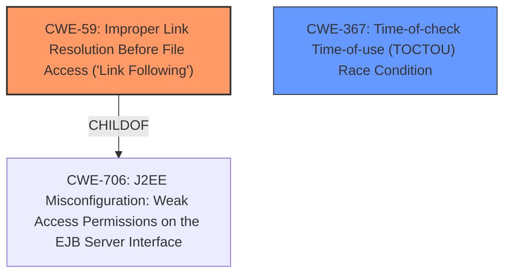

# Analysis Report for CVE-2021-34462

# Vulnerability Analysis Report: CVE-2021-34462

## Description


## Analysis (with Relationship Data)

# Summary
| CWE ID | CWE Name | Confidence | CWE Abstraction Level | CWE Vulnerability Mapping Label | CWE-Vulnerability Mapping Notes |
|---|---|---|---|---|---|
| CWE-59 | Improper Link Resolution Before File Access ('Link Following') | 0.9 | Base | Primary | Allowed |
| CWE-367 | Time-of-check Time-of-use (TOCTOU) Race Condition | 0.7 | Base | Secondary | Allowed |

## Evidence and Confidence

*   **Confidence Score:** 0.8
*   **Evidence Strength:** MEDIUM

## Relationship Analysis
The primary CWE is CWE-59, which is a Base level CWE. CWE-59 has a child relationship with CWE-706. CWE-367 is included as it is related to race conditions and time-of-check and time-of-use issues, which may be a component of the vulnerability.


## Vulnerability Chain
The vulnerability chain starts with the **improper validation of a user-supplied link** (CWE-59), which can lead to file operation issues. A race condition (CWE-367) can also be a factor. This allows an attacker to escalate privileges and execute arbitrary code as SYSTEM.

## Summary of Analysis
Initially, CWE-NVD-noinfo was listed as the primary CWE based on similar CVE descriptions. However, the "CVE Reference Links Content Summary" provides more specific details about the root cause. The vulnerability stems from the **lack of proper validation of a user-supplied link** before it's used in file operations. This aligns with CWE-59 (Improper Link Resolution Before File Access).

The summary also mentions a "Race condition", which makes CWE-367 (Time-of-check Time-of-use (TOCTOU) Race Condition) a secondary candidate.

The evidence supporting CWE-59 is: "The vulnerability exists due to the **lack of proper validation of a user-supplied link** prior to using it in file operations within the AppX Deployment Service." This clearly indicates that the application is not adequately validating the link, which is the core issue described by CWE-59.

The evidence supporting CWE-367 is: "Weaknesses/vulnerabilities present: Race condition".

CWE-59 is at the Base level of abstraction, which is preferred. It directly addresses the root cause of the vulnerability. CWE-367 is also at the Base level.

Other CWEs Considered and Rejected:

*   CWE-1386 (Insecure Operation on Windows Junction / Mount Point): While related to file system operations, it's more specific to junctions and mount points. The description doesn't mention those specifically.
*   CWE-123 (Write-what-where Condition): This is more relevant when an attacker can write arbitrary values to arbitrary locations, which isn't directly indicated in the description.
*   CWE-266 (Incorrect Privilege Assignment): This is related to privilege issues, but the root cause is the improper link validation.
*   CWE-178 (Improper Handling of Case Sensitivity): Not relevant as the issue is not case sensitivity.
*   CWE-362 (Concurrent Execution using Shared Resource with Improper Synchronization ('Race Condition')): The evidence mentions a race condition, but it appears secondary to the link validation issue.

Relevant CWE Information:

# Enhanced Context (25 CWEs)
The following CWEs were identified as potentially relevant to this vulnerability:

## CWE-59: Improper Link Resolution Before File Access ('Link Following')
**Abstraction Level**: Base
**Similarity Score**: 0.80
**Source**: dense

**Description**:
The product attempts to access a file based on the filename, but it does not properly prevent that filename from identifying a link or shortcut that resolves to an unintended resource.

**Mapping Guidance**:
- Usage: Allowed
- Rationale: This CWE entry is at the Base level of abstraction, which is a preferred level of abstraction for mapping to the root causes of vulnerabilities.

## CWE-367: Time-of-check Time-of-use (TOCTOU) Race Condition
**Abstraction Level**: Base
**Similarity Score**: 0.77
**Source**: dense

**Description**:
The product checks the state of a resource before using that resource, but the resource's state can change between the check and the use in a way that invalidates the results of the check. This can cause the product to perform invalid actions when the resource is in an unexpected state.

**Mapping Guidance**:
- Usage: Allowed
- Rationale: This CWE entry is at the Base level of abstraction, which is a preferred level of abstraction for mapping to the root causes of vulnerabilities.


## CWE Relationship Analysis

Current CWEs represent these abstraction levels: .


### Vulnerability Chain Analysis

**Chain starting from CWE-123:**
- 123 (Write-what-where Condition) - ROOT


**Chain starting from CWE-362:**
- 362 (Concurrent Execution using Shared Resource with Improper Synchronization ('Race Condition')) - ROOT


### CWE Relationship Diagram

```mermaid
graph TD
    classDef primary fill:#f96,stroke:#333,stroke-width:2px
    classDef secondary fill:#69f,stroke:#333
    classDef tertiary fill:#9e9,stroke:#333
```


*Report generated on 2025-04-02 02:50:28*
