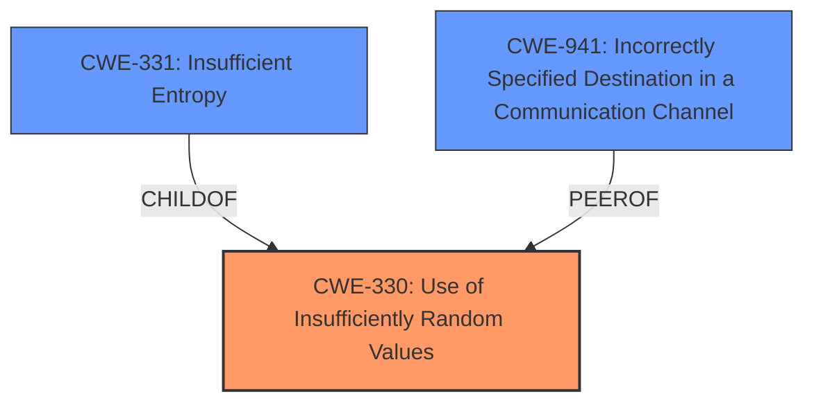

# Raw Analyzer Response for CVE-2021-3448

# Summary
| CWE ID    | CWE Name                                                           | Confidence | CWE Abstraction Level | CWE Vulnerability Mapping Label | CWE-Vulnerability Mapping Notes |
| :-------- | :----------------------------------------------------------------- | :--------- | :---------------------- | :------------------------------ | :------------------------------ |
| CWE-330   | Use of Insufficiently Random Values                                | 0.9        | Class                   | Primary                         | Discouraged                    |
| CWE-331   | Insufficient Entropy                                               | 0.7        | Base                    | Secondary                       | Allowed                        |
| CWE-941   | Incorrectly Specified Destination in a Communication Channel        | 0.6        | Base                    | Secondary                       | Allowed                        |

## Evidence and Confidence

*   **Confidence Score:** 0.8
*   **Evidence Strength:** HIGH

## Relationship Analysis
The primary CWE is CWE-330, "Use of Insufficiently Random Values," because the core issue is **insufficient randomness** in port selection. CWE-331, "Insufficient Entropy," is a child of CWE-330 and represents a more specific case. CWE-941, "Incorrectly Specified Destination in a Communication Channel," is related as the **predictable port** makes it easier to spoof the destination.

## Vulnerability Chain
The vulnerability chain starts with the **insufficient randomness** in the selection of the UDP source port (CWE-330/CWE-331). This leads to a **predictable source port**, which makes it easier for an attacker to forge DNS responses (CWE-941). The final impact is DNS cache poisoning, affecting data integrity.

## Summary of Analysis
Initially, the analysis focused on identifying the root cause of the vulnerability. The description clearly states that the use of a fixed port is the primary weakness, leading to easier DNS cache poisoning attacks. This suggests that the core issue is a lack of sufficient randomness. The retriever results also highlighted CWE-330 "Use of Insufficiently Random Values" and CWE-331 "Insufficient Entropy" as potential matches, reinforcing this initial assessment.

The "CVE Reference Links Content Summary" section provided strong evidence, stating, "The vulnerability stems from **insufficient randomness** in how dnsmasq selects the source UDP port when forwarding queries to upstream DNS servers... dnsmasq uses a fixed UDP port for all outgoing queries to the specified upstream DNS server, instead of randomizing the port." This directly supports the selection of CWE-330 and CWE-331.

CWE-941 was considered because the **predictable source port** can be seen as an "Incorrectly Specified Destination" since it allows an attacker to more easily spoof the intended DNS server.

The final decision was to select CWE-330 as the primary CWE because it directly addresses the root cause: the lack of randomness in port selection. CWE-331 is a more specific child of CWE-330 and applies because the algorithm produces predictable values. CWE-941 is included as a contributing factor because the **predictable port** facilitates spoofing attacks.

The selection of CWE-330 and CWE-331 is at the optimal level of specificity because they accurately represent the technical flaw and its implications, while also aligning with the evidence and relationships outlined in the vulnerability description.

Relevant CWE Information:

# Enhanced Context (25 CWEs)
The following CWEs were identified as potentially relevant to this vulnerability:

## CWE-330: Use of Insufficiently Random Values
**Abstraction Level**: Class
**Similarity Score**: 0.80
**Source**: dense

**Description**:
The product uses insufficiently random numbers or values in a security context that depends on unpredictable numbers.

**Mapping Guidance**:
- Usage: Discouraged
- Rationale: This CWE entry is a level-1 Class (i.e., a child of a Pillar). It might have lower-level children that would be more appropriate

## CWE-331: Insufficient Entropy
**Abstraction Level**: Base
**Similarity Score**: 0.80
**Source**: dense

**Description**:
The product uses an algorithm or scheme that produces insufficient entropy, leaving patterns or clusters of values that are more likely to occur than others.

**Mapping Guidance**:
- Usage: Allowed
- Rationale: This CWE entry is at the Base level of abstraction, which is a preferred level of abstraction for mapping to the root causes of vulnerabilities.

## CWE-1391: Use of Weak Credentials
**Abstraction Level**: Class
**Similarity Score**: 0.76
**Source**: dense

**Description**:
The product uses weak credentials (such as a default key or hard-coded password) that can be calculated, derived, reused, or guessed by an attacker.

**Mapping Guidance**:
- Usage: Allowed-with-Review
- Rationale: This CWE entry is a Class and might have Base-level children that would be more appropriate

## CWE-1240: Use of a Cryptographic Primitive with a Risky Implementation
**Abstraction Level**: Base
**Similarity Score**: 0.76
**Source**: dense

**Description**:
To fulfill the need for a cryptographic primitive, the product implements a cryptographic algorithm using a non-standard, unproven, or disallowed/non-compliant cryptographic implementation.

**Mapping Guidance**:
- Usage: Allowed
- Rationale: This CWE entry is at the Base level of abstraction, which is a preferred level of abstraction for mapping to the root causes of vulnerabilities.

## CWE-226: Sensitive Information in Resource Not Removed Before Reuse
**Abstraction Level**: Base
**Similarity Score**: 0.76
**Source**: dense

**Description**:
The product releases a resource such as memory or a file so that it can be made available for reuse, but it does not clear or "zeroize" the information contained in the resource before the product performs a critical state transition or makes the resource available for reuse by other entities.

**Mapping Guidance**:
- Usage: Allowed
- Rationale: This CWE entry is at the Base level of abstraction, which is a preferred level of abstraction for mapping to the root causes of vulnerabilities.

## CWE-319: Cleartext Transmission of Sensitive Information
**Abstraction Level**: Base
**Similarity Score**: 0.75
**Source**: dense

**Description**:
The product transmits sensitive or security-critical data in cleartext in a communication channel that can be sniffed by unauthorized actors.

**Mapping Guidance**:
- Usage: Allowed
- Rationale: This CWE entry is at the Base level of abstraction, which is a preferred level of abstraction for mapping to the root causes of vulnerabilities.

## CWE-345: Insufficient Verification of Data Authenticity
**Abstraction Level**: Class
**Similarity Score**: 0.75
**Source**: dense

**Description**:
The product does not sufficiently verify the origin or authenticity of data, in a way that causes it to accept invalid data.

**Mapping Guidance**:
- Usage: Discouraged
- Rationale: This CWE entry is a level-1 Class (i.e., a child of a Pillar). It might have lower-level children that would be more appropriate

## CWE-203: Observable Discrepancy
**Abstraction Level**: Base
**Similarity Score**: 0.75
**Source**: dense

**Description**:
The product behaves differently or sends different responses under different circumstances in a way that is observable to an unauthorized actor, which exposes security-relevant information about the state of the product, such as whether a particular operation was successful or not.

**Mapping Guidance**:
- Usage: Allowed
- Rationale: This CWE entry is at the Base level of abstraction, which is a preferred level of abstraction for mapping to the root causes of vulnerabilities.

## CWE-807: Reliance on Untrusted Inputs in a Security Decision
**Abstraction Level**: Base
**Similarity Score**: 0.75
**Source**: dense

**Description**:
The product uses a protection mechanism that relies on the existence or values of an input, but the input can be modified by an untrusted actor in a way that bypasses the protection mechanism.

**Mapping Guidance**:
- Usage: Allowed
- Rationale: This CWE entry is at the Base level of abstraction, which is a preferred level of abstraction for mapping to the root causes of vulnerabilities.

## CWE-799: Improper Control of Interaction Frequency
**Abstraction Level**: Class
**Similarity Score**: 0.75
**Source**: dense

**Description**:
The product does not properly limit the number or frequency of interactions that it has with an actor, such as the number of incoming requests.

**Mapping Guidance**:
- Usage: Allowed-with-