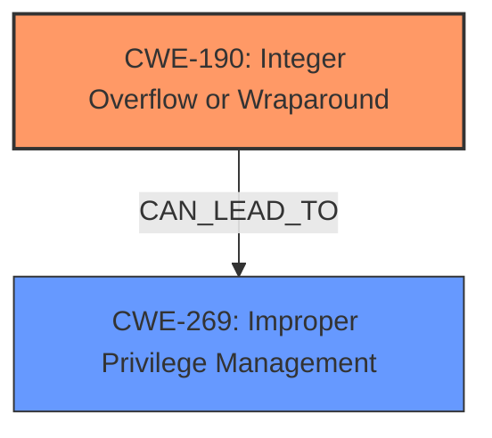

# Analysis Report for CVE-2021-34510

# Vulnerability Analysis Report: CVE-2021-34510

## Description


## Analysis (with Relationship Data)

# Summary
| CWE ID  | CWE Name                                                               | Confidence | CWE Abstraction Level | CWE Vulnerability Mapping Label | CWE-Vulnerability Mapping Notes |
| ------- | ---------------------------------------------------------------------- | ---------- | --------------------- | ------------------------------- | ----------------------------- |
| CWE-190 | Integer Overflow or Wraparound                                         | 0.9        | Base                  | Allowed                         | Primary CWE                  |
| CWE-269 | Improper Privilege Management                                          | 0.6        | Base                  | Allowed                         | Secondary Candidate           |

## Evidence and Confidence

*   **Confidence Score:** 0.75
*   **Evidence Strength:** MEDIUM

## Relationship Analysis
The primary relationship influencing my decision is the hierarchical structure. CWE-190 (Integer Overflow or Wraparound) is a **root cause** that can lead to privilege escalation. CWE-269 (Improper Privilege Management) is a broader category that could result from the integer overflow. The vulnerability description clearly points to an integer overflow within the `storport.sys` driver as the initial **root cause**, making CWE-190 the most specific and appropriate primary classification.



## Vulnerability Chain
The vulnerability chain starts with an integer overflow due to **lack of proper validation of user-supplied data** within the `storport.sys` driver (CWE-190). This leads to an improper buffer allocation and subsequent privilege escalation, ultimately allowing an attacker to execute arbitrary code in the context of SYSTEM (CWE-269).

## Summary of Analysis
The initial analysis focused on the **root cause** highlighted in the "CVE Reference Links Content Summary": "The vulnerability is due to the **lack of proper validation of user-supplied data** within the `storport.sys` driver, leading to an integer overflow before allocating a buffer." This statement directly implicates CWE-190 (Integer Overflow or Wraparound) as the primary weakness. The "Top CWEs" from "CWE for similar CVE Descriptions" included CWE-190, further supporting this selection. The subsequent "Impact of exploitation" - "Successful exploitation allows an attacker to escalate privileges and execute arbitrary code in the context of SYSTEM" - suggests CWE-269 (Improper Privilege Management) as a potential secondary weakness, representing the impact of the overflow.

The relationship graph reinforces this by showing that CWE-190 can lead to CWE-269. The provided evidence clearly identifies the integer overflow as the **root cause**, making CWE-190 the more specific and appropriate primary classification. While other CWEs like those related to symlink issues (CWE-59, CWE-1386) and cleartext storage (CWE-312) were considered based on the "Retriever Results", they do not align with the specifics of this vulnerability.

I am overriding the "Primary CWE Match" of CWE-NVD-noinfo from "CWE for similar CVE Descriptions" because the "CVE Reference Links Content Summary" provides sufficient evidence to identify the underlying weakness as an integer overflow.

The selected CWEs are at the optimal level of specificity because CWE-190 directly describes the **root cause** (integer overflow), and CWE-269 describes the resulting impact (privilege escalation).

Relevant CWE Information:

# Enhanced Context (25 CWEs)

## CWE-312: Cleartext Storage of Sensitive Information
**Abstraction Level**: Base
**Similarity Score**: 0.82
**Source**: dense

**Description**:
The product stores sensitive information in cleartext within a resource that might be accessible to another control sphere.
**Reasons for not selecting:** The vulnerability description focuses on an integer overflow, not cleartext storage.

## CWE-319: Cleartext Transmission of Sensitive Information
**Abstraction Level**: Base
**Similarity Score**: 0.78
**Source**: dense

**Description**:
The product transmits sensitive or security-critical data in cleartext in a communication channel that can be sniffed by unauthorized actors.
**Reasons for not selecting:** The vulnerability description focuses on an integer overflow, not cleartext transmission.

## CWE-538: Insertion of Sensitive Information into Externally-Accessible File or Directory
**Abstraction Level**: Base
**Similarity Score**: 0.78
**Source**: dense

**Description**:
The product places sensitive information into files or directories that are accessible to actors who are allowed to have access to the files, but not to the sensitive information.
**Reasons for not selecting:** The vulnerability description focuses on an integer overflow, not insertion of sensitive information into files.

## CWE-1391: Use of Weak Credentials
**Abstraction Level**: Class
**Similarity Score**: 0.77
**Source**: dense

**Description**:
The product uses weak credentials (such as a default key or hard-coded password) that can be calculated, derived, reused, or guessed by an attacker.
**Reasons for not selecting:** The vulnerability description focuses on an integer overflow, not the use of weak credentials.

## CWE-59: Improper Link Resolution Before File Access ('Link Following')
**Abstraction Level**: Base
**Similarity Score**: 0.77
**Source**: dense

**Description**:
The product attempts to access a file based on the filename, but it does not properly prevent that filename from identifying a link or shortcut that resolves to an unintended resource.
**Reasons for not selecting:** The vulnerability description focuses on an integer overflow, not improper link resolution.

## CWE-311: Missing Encryption of Sensitive Data
**Abstraction Level**: Class
**Similarity Score**: 0.77
**Source**: dense

**Description**:
The product does not encrypt sensitive or critical information before storage or transmission.
**Reasons for not selecting:** The vulnerability description focuses on an integer overflow, not missing encryption.

## CWE-212: Improper Removal of Sensitive Information Before Storage or Transfer
**Abstraction Level**: Base
**Similarity Score**: 0.77
**Source**: dense

**Description**:
The product stores, transfers, or shares a resource that contains sensitive information, but it does not properly remove that information before the product makes the resource available to unauthorized actors.
**Reasons for not selecting:** The vulnerability description focuses on an integer overflow, not improper removal of sensitive information.

## CWE-73: External Control of File Name or Path
**Abstraction Level**: Base
**Similarity Score**: 0.77
**Source**: dense

**Description**:
The product allows user input to control or influence paths or file names that are used in filesystem operations.
**Reasons for not selecting:** The vulnerability description focuses on an integer overflow, not external control of file names or paths.

## CWE-313: Cleartext Storage in a File or on Disk
**Abstraction Level**: Variant
**Similarity Score**: 0.77
**Source**: dense

**Description**:
The product stores sensitive information in cleartext in a file, or on disk.
**Reasons for not selecting:** The vulnerability description focuses on an integer overflow, not cleartext storage.

## CWE-552: Files or Directories Accessible to External Parties
**Abstraction Level**: Base
**Similarity Score**: 0.77
**Source**: dense

**Description**:
The product makes files or directories accessible to unauthorized actors, even though they should not be.
**Reasons for not selecting:** The vulnerability description focuses on an integer overflow, not file access control.

## CWE-59: Improper Link Resolution Before File Access ('Link Following')
**Abstraction Level**: Base
**Similarity Score**: 4858.20
**Source**: sparse

**Description**:
The product attempts to access a file based on the filename, but it does not properly prevent that filename from identifying a link or shortcut that resolves to an unintended resource.
**Reasons for not selecting:** The vulnerability description focuses on an integer overflow, not improper link resolution.

## CWE-1386: Insecure Operation on Windows Junction / Mount Point
**Abstraction Level**: Base
**Similarity Score**: 4661.82
**Source**: sparse

**Description**:
The product opens a file or directory, but it does not properly prevent the name from being associated with a junction or mount point to a destination that is outside of the intended control sphere.
**Reasons for not selecting:** The vulnerability description focuses on an integer overflow, not Windows junction/mount point issues.

## CWE-312: Cleartext Storage of Sensitive Information
**Abstraction Level**: Base
**Similarity Score**: 4503.38
**Source**: sparse

**Description**:
The product stores sensitive information in cleartext within a resource that might be accessible to another control sphere.
**Reasons for not selecting:** The vulnerability description focuses on an integer overflow, not cleartext storage.

## CWE-367: Time-of-check Time-of-use (TOCTOU) Race Condition
**Abstraction Level**: Base
**Similarity Score**: 4446.34


## CWE Relationship Analysis

Current CWEs represent these abstraction levels: .


### Vulnerability Chain Analysis

**Chain starting from CWE-73:**
- 73 (External Control of File Name or Path) - ROOT


**Chain starting from CWE-312:**
- 312 (Cleartext Storage of Sensitive Information) - ROOT


### CWE Relationship Diagram

```mermaid
graph TD
    classDef primary fill:#f96,stroke:#333,stroke-width:2px
    classDef secondary fill:#69f,stroke:#333
    classDef tertiary fill:#9e9,stroke:#333
```


*Report generated on 2025-04-02 12:10:53*
