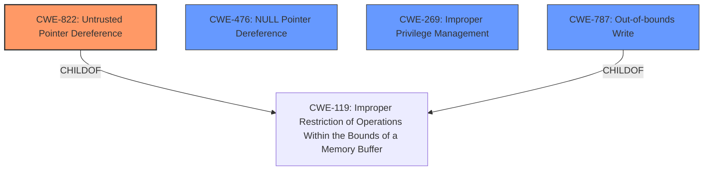

# Analysis for CVE-2021-34516

# Summary
| CWE ID | CWE Name | Confidence | CWE Abstraction Level | CWE Vulnerability Mapping Label | CWE-Vulnerability Mapping Notes |
|---|---|---|---|---|---|
| CWE-822 | Untrusted Pointer Dereference | 0.8 | Base | Allowed | Primary CWE |
| CWE-476 | NULL Pointer Dereference | 0.7 | Base | Allowed | Secondary Candidate |
| CWE-269 | Improper Privilege Management | 0.5 | Class | Allowed-with-Review | Secondary Candidate |
| CWE-787 | Out-of-bounds Write | 0.4 | Base | Allowed | Secondary Candidate |

## Evidence and Confidence

*   **Confidence Score:** 0.8
*   **Evidence Strength:** HIGH

## Relationship Analysis
The primary CWE is CWE-822 (**Untrusted Pointer Dereference**), which is a base level CWE and a child of CWE-119 (**Improper Restriction of Operations**). The vulnerability description explicitly mentions **untrusted pointer dereference** as the root cause. CWE-476 (**NULL Pointer Dereference**) is also mentioned as a root cause in the vulnerability description. CWE-269 (**Improper Privilege Management**) is a class level CWE and is listed as one of the top CWEs for similar CVE descriptions. CWE-787 (**Out-of-bounds Write**) could be a consequence of the dereference, but there isn't enough information to confirm that in the vulnerability description.

## Vulnerability Chain
The vulnerability chain starts with the lack of proper input validation, leading to an **untrusted pointer dereference** or **null pointer dereference**. Successful exploitation allows a local attacker to escalate privileges to SYSTEM.

## Summary of Analysis
The primary weakness is the **untrusted pointer dereference** due to the **lack of proper validation of user-supplied values**, as stated in the "CVE Reference Links Content Summary". The vulnerability description specifically mentions "untrusted pointer dereference" as the root cause for some functions, and "null pointer dereference" for others.

The "CVE Reference Links Content Summary" states:
"The provided content describes multiple vulnerabilities, all identified as CVE-2021-34516, affecting the Microsoft Windows Canonical Display Driver (cdd.dll). The root cause of these vulnerabilities is either an untrusted pointer dereference due to a **lack of proper validation of user-supplied values** or a null pointer dereference."

Based on this evidence, CWE-822 (**Untrusted Pointer Dereference**) is the most appropriate primary CWE.

CWE-476 (**NULL Pointer Dereference**) is also a likely cause as it's described in the vulnerability description.

CWE-269 (**Improper Privilege Management**) is a Class level CWE from the "Top CWEs" for similar CVE descriptions. The impact of the vulnerability is privilege escalation to SYSTEM, which aligns with CWE-269. However, the root cause is the **untrusted pointer dereference** and **null pointer dereference**, so CWE-269 is a secondary concern related to impact.

CWE-787 (**Out-of-bounds Write**) could be a consequence of the pointer dereference, but the information provided doesn't explicitly state that there's an out-of-bounds write.

The selected CWEs (CWE-822 and CWE-476) are at the optimal level of specificity because they directly represent the root causes described in the vulnerability description.

# Relevant CWE Information:

## Enhanced Context (25 CWEs)

## CWE-131: Incorrect Calculation of Buffer Size
Not selected. This CWE is related to incorrect buffer size calculations, and there is no direct evidence in the vulnerability description to support this.

## CWE-59: Improper Link Resolution Before File Access ('Link Following')
Not selected. This CWE is related to improper handling of symbolic links, which is not relevant to the vulnerability description.

## CWE-667: Improper Locking
Not selected. This CWE is related to improper locking mechanisms, which is not relevant to the vulnerability description.

## CWE-191: Integer Underflow (Wrap or Wraparound)
Not selected. This CWE is related to integer underflow, which is not relevant to the vulnerability description.

## CWE-125: Out-of-bounds Read
Not selected. While this could be a consequence of dereferencing an invalid pointer, the description explicitly mentions dereferencing the pointer as the root cause.

## CWE-119: Improper Restriction of Operations within the Bounds of a Memory Buffer
Not selected. This is a Class-level CWE, and more specific Base-level CWEs (CWE-822, CWE-476) are available.

## CWE-129: Improper Validation of Array Index
Not selected. While a pointer could be used to access an array, the provided information does not explicitly talk about arrays but about user supplied values, and the lack of validation.

## CWE-41: Improper Resolution of Path Equivalence
Not selected. This CWE is related to path equivalence issues, which is not relevant to the vulnerability description.

## CWE-824: Access of Uninitialized Pointer
Not selected. The vulnerability description mentions "untrusted pointer dereference" or "null pointer dereference" and not specifically accessing an uninitialized pointer.

## CWE-252: Unchecked Return Value
Not selected. This CWE is related to unchecked return values, which is not relevant to the vulnerability description.

## CWE-1386: Insecure Operation on Windows Junction / Mount Point
Not selected. This CWE is specific to Windows junction/mount points, which is not relevant to the vulnerability description.

## CWE-367: Time-of-check Time-of-use (TOCTOU) Race Condition
Not selected. This CWE is related to TOCTOU race conditions, which is not relevant to the vulnerability description.

## CWE-61: UNIX Symbolic Link (Symlink) Following
Not selected. This CWE is related to symbolic link issues in UNIX, which is not relevant to the vulnerability description.

## CWE-787: Out-of-bounds Write
Added as a secondary candidate.

## CWE-1284: Improper Validation of Specified Quantity in Input
Not selected. This CWE is related to improper validation of input quantity, which is not directly mentioned in the vulnerability description.

## CWE-190: Integer Overflow or Wraparound
Not selected. This CWE is related to integer overflow, which is not relevant to the vulnerability description.

## CWE-822: Untrusted Pointer Dereference
Selected as the primary CWE because the vulnerability description explicitly mentions "untrusted pointer dereference" due to a lack of proper validation.

## CWE-123: Write-what-where Condition
Not selected. This is a consequence of memory corruption, but the root cause is the untrusted pointer dereference.

## CWE-781: Improper Address Validation in IOCTL with METHOD_NEITHER I/O Control Code
Not selected. This CWE is specific to IOCTL with METHOD_NEITHER, which is not relevant to the general pointer dereference issue.

## CWE-266: Incorrect Privilege Assignment
This is related to privilege issues, but the root cause is not an incorrect assignment, but an untrusted pointer dereference.

## CWE-454: External Initialization of Trusted Variables or Data Stores
Not selected. This CWE is related to external initialization of variables, which is not relevant to the vulnerability description.

## CWE-456: Missing Initialization of a Variable
Not selected. The vulnerability description mentions "untrusted pointer dereference" or "null pointer dereference" and not specifically a missing initialization.

## CWE-386: Symbolic Name not Mapping to Correct Object
Not selected. This CWE is related to symbolic names, which is not relevant to the vulnerability description.

## CWE-476: NULL Pointer Dereference
Added as a secondary candidate since this is described in the vulnerability description.

## CWE-127: Buffer Under-read
Not selected. This vulnerability is related to an **untrusted pointer dereference** or **null pointer dereference**, not a buffer under-read.