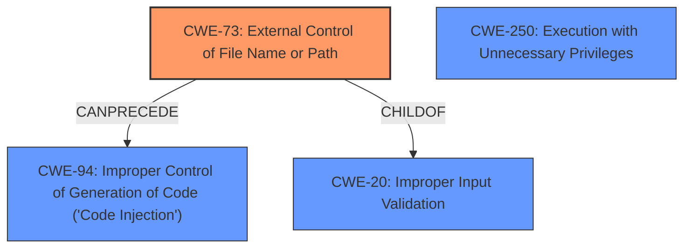

# Analysis for CVE-2021-34539

# Summary
| CWE ID | CWE Name | Confidence | CWE Abstraction Level | CWE Vulnerability Mapping Label | CWE-Vulnerability Mapping Notes |
|---|---|---|---|---|---|
| CWE-73 | External Control of File Name or Path | 0.9 | Base | Allowed | Primary CWE |
| CWE-94 | Improper Control of Generation of Code ('Code Injection') | 0.7 | Base | Allowed-with-Review | Secondary Candidate |
| CWE-250 | Execution with Unnecessary Privileges | 0.6 | Base | Allowed | Secondary Candidate |
| CWE-20 | Improper Input Validation | 0.5 | Class | Discouraged | Secondary Candidate |

## Evidence and Confidence

*   **Confidence Score:** 0.8
*   **Evidence Strength:** HIGH

## Relationship Analysis
The primary relationship influencing the selection is that CWE-73 can precede CWE-94, indicating a potential chain. CWE-73 is the root cause, and CWE-94 is a potential consequence. While CWE-20 (Improper Input Validation) is a parent of CWE-73 and CWE-1284, choosing CWE-73 provides more specificity regarding the external control of the filename or path. CWE-250 is a possible contributing factor if the application runs with unnecessary privileges, amplifying the impact of the vulnerability.

## Vulnerability Chain
The vulnerability chain starts with:
1.  **CWE-73:** External Control of File Name or Path due to the **lack of validation of Java Version setting**.
2.  Potentially leading to **CWE-94:** Improper Control of Generation of Code ('Code Injection') because the external controlled path is used to execute code.
3.  **CWE-250:** Execution with Unnecessary Privileges, if the application runs with elevated privileges, this will exacerbate the exploit.
4.  The root cause is **CWE-73**, leading to the impact of code execution.

## Summary of Analysis
The initial analysis identified the **lack of validation** of the Java Version setting as a critical point. The "CVE Reference Links Content Summary" highlights the "insufficient input validation" and "path manipulation" as key factors.

The final decision to prioritize **CWE-73** as the primary CWE is based on its direct relevance to the **root cause**. The vulnerability description explicitly mentions the ability to set an "unintended executable path" due to the **lack of validation**. This aligns precisely with CWE-73's description: "The product allows user input to control or influence paths or file names that are used in filesystem operations."

**CWE-94** (Improper Control of Generation of Code ('Code Injection')) is considered a secondary CWE because the externally controlled path is then used for code execution. However, the primary issue is the external control of the path itself, making CWE-73 the more accurate root cause.

**CWE-250** (Execution with Unnecessary Privileges) is added as a secondary CWE because the vulnerability’s impact is amplified if the application runs with elevated privileges. This elevates the severity of the code execution.

**CWE-20** (Improper Input Validation) is a broader category, and while applicable, it's less specific than CWE-73, which directly addresses the external control of the file path. MITRE discourages using CWE-20 when more specific CWEs are available.

The evidence from the vulnerability description and CVE summary strongly supports the selection of **CWE-73** as the primary root cause, with supporting roles for **CWE-94** and **CWE-250** to describe the full impact of the vulnerability.

Relevant CWE Information:

## CWE-73: External Control of File Name or Path
**CWE-73** is a Base level CWE that describes the vulnerability where a product allows user input to control or influence paths or filenames used in filesystem operations. In this case, the CubeCoders AMP application does not properly validate the Java Version setting, allowing a high-privileged user to specify an arbitrary executable path. This directly matches the CWE description. The security implication is that an attacker can gain capabilities (code execution) they would not normally have. The usage is ALLOWED and is at the Base level of abstraction which is the preferred level.

## CWE-94: Improper Control of Generation of Code ('Code Injection')
**CWE-94** is a Base level CWE, describing situations where a product constructs code segments using externally-influenced input without proper neutralization. In this case, the externally controlled file path (Java Version setting) is used to execute code, fitting this CWE. However, the code execution is a consequence of the path manipulation, making CWE-73 the primary issue. This CWE is ALLOWED-WITH-REVIEW because it's often misused.

## CWE-250: Execution with Unnecessary Privileges
**CWE-250** is a Base level CWE that identifies when a product performs an operation at a higher privilege level than necessary, which amplifies the consequences of other weaknesses. If CubeCoders AMP runs with elevated privileges, the impact of the code execution vulnerability (resulting from the path manipulation) is significantly increased.

## CWE-20: Improper Input Validation
**CWE-20** is a Class level CWE for cases where a product receives input but does not properly validate it. While the **lack of validation** in CubeCoders AMP technically falls under this, CWE-73 provides a more specific description of the vulnerability (external control of a file path). MITRE discourages using CWE-20 when lower-level, more specific CWEs are available.