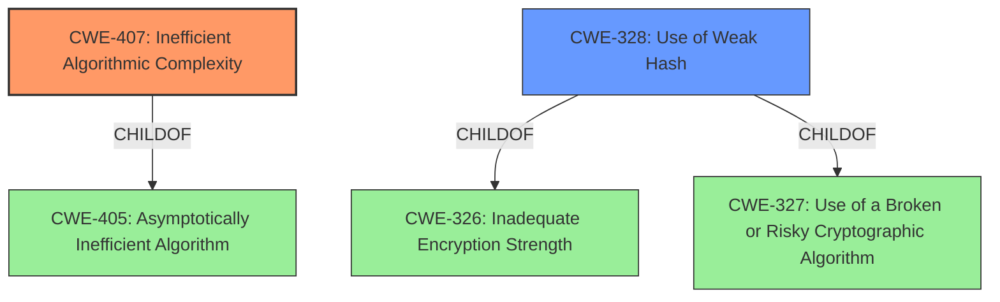

# Analysis Report for CVE-2021-34549

# Vulnerability Analysis Report: CVE-2021-34549

## Description


## Analysis (with Relationship Data)

# Summary
| CWE ID | CWE Name | Confidence | CWE Abstraction Level | CWE Vulnerability Mapping Label | CWE-Vulnerability Mapping Notes |
|---|---|---|---|---|---|
| CWE-407 | Inefficient Algorithmic Complexity | 0.9 | Class | Allowed-with-Review | Primary CWE |
| CWE-328 | Use of Weak Hash | 0.7 | Base | Allowed | Secondary Candidate |

## Evidence and Confidence

*   **Confidence Score:** 0.8
*   **Evidence Strength:** HIGH

## Relationship Analysis
The primary CWE is CWE-407, which is a Class-level CWE. It has a parent CWE-405. The secondary CWE is CWE-328, which is a Base-level CWE and a child of CWE-326 and CWE-327. The retriever results influenced the decision to include CWE-407 and CWE-328, as they had high scores.



## Vulnerability Chain
The vulnerability chain starts with the **mishandling of hashing** due to the usage of an unsafe hash function, which leads to hash collisions, and finally results in algorithm inefficiency and a denial-of-service.

## Summary of Analysis
The vulnerability description indicates that the root cause is the **mishandling of hashing** for certain retrieval of circuit data in Tor, leading to algorithm inefficiency. The CVE Reference Links Content Summary confirms this, stating that the `chanid_circid_entry_hash()` function employs an unsafe hash function, making it vulnerable to HashDoS attacks.

The primary weakness is CWE-407 (Inefficient Algorithmic Complexity). The vulnerability description and CVE summary indicate that the attacker can cause algorithm inefficiency by triggering the use of an attacker-chosen circuit ID. This aligns with the CWE-407 description, which mentions that an attacker can trigger the worst-case computational complexity of an algorithm.

The secondary weakness is CWE-328 (Use of Weak Hash). The CVE summary mentions that the hash function `chanid_circid_entry_hash()` does not use SipHash, which is designed to prevent HashDoS attacks, indicating a weak hash function. This aligns with the CWE-328 description, which refers to the use of an algorithm that produces a digest that does not meet security expectations for a hash function.

CWE-330 (Use of Insufficiently Random Values) was considered but not selected because the vulnerability is more related to the **weakness** of the hash function itself, rather than the randomness of the input values. CWE-916 (Use of Password Hash With Insufficient Computational Effort) was also considered, but it focuses specifically on password hashing, which is not the case in this vulnerability. CWE-327 (Use of a Broken or Risky Cryptographic Algorithm) was considered, but is too general, whereas CWE-328 is a child of it, and is more specific to this instance.

The selected CWEs are at the optimal level of specificity. CWE-407 captures the high-level algorithmic inefficiency, while CWE-328 captures the specific **weakness** in the hashing algorithm that leads to the inefficiency. The decision is based on the provided evidence, particularly the CVE summary's mention of an unsafe hash function and the potential for algorithm inefficiency.

Relevant CWE Information:
INSERT


## CWE Relationship Analysis

Current CWEs represent these abstraction levels: .


### Vulnerability Chain Analysis

**Chain starting from CWE-916:**
- 916 (Use of Password Hash With Insufficient Computational Effort) - ROOT


**Chain starting from CWE-330:**
- 330 (Use of Insufficiently Random Values) - ROOT


### CWE Relationship Diagram

```mermaid
graph TD
    classDef primary fill:#f96,stroke:#333,stroke-width:2px
    classDef secondary fill:#69f,stroke:#333
    classDef tertiary fill:#9e9,stroke:#333
```


*Report generated on 2025-04-02 09:49:51*
