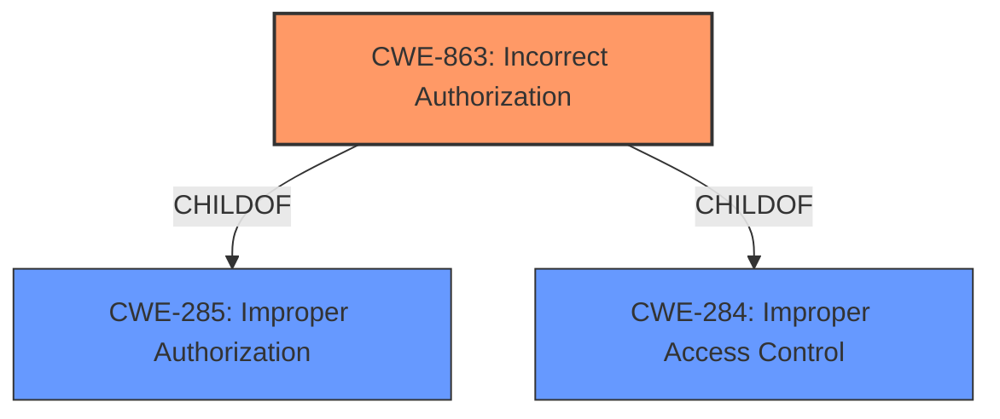

# Enhanced Analysis for CVE-2021-3457

# Summary
| CWE ID    | CWE Name                       | Confidence | CWE Abstraction Level | CWE Vulnerability Mapping Label | CWE-Vulnerability Mapping Notes |
| :-------- | :----------------------------- | :--------- | :-------------------- | :------------------------------ | :------------------------------ |
| CWE-863   | Incorrect Authorization        | 1          | Class                 | Primary CWE                     | Allowed-with-Review           |
| CWE-285   | Improper Authorization         | 0.7        | Class                 | Secondary Candidate             | Discouraged                     |
| CWE-284   | Improper Access Control        | 0.6        | Pillar                | Secondary Candidate             | Discouraged                     |

## Evidence and Confidence

*   **Confidence Score:** 0.8
*   **Evidence Strength:** HIGH

## Relationship Analysis
The primary relationship that impacted the decision was the hierarchical relationship between CWE-284, CWE-285, and CWE-863. CWE-863 is a child of both CWE-285 and CWE-284, making it a more specific classification for the **improper authorization handling** flaw.



## Vulnerability Chain
The vulnerability chain begins with an **improper authorization handling** flaw (CWE-863), leading to unauthorized access to resources, deletion of limited resources, and ultimately causing a denial of service on the Foreman server.

## Summary of Analysis
The initial assessment identified CWE-863 as the primary candidate based on the vulnerability description and the "CWE for similar CVE Descriptions" section. The description explicitly mentions an **"improper authorization handling"** flaw, aligning with CWE-863's definition: "The product performs an authorization check when an actor attempts to access a resource or perform an action, but it does not correctly perform the check."

The Retriever Results further support this selection, with CWE-863 being a top combined result.

The relationship analysis reinforces the selection of CWE-863 as the most specific and appropriate classification. While CWE-284 (Improper Access Control) and CWE-285 (Improper Authorization) are related, CWE-863 provides a more granular representation of the vulnerability.

The final decision is based on the direct evidence of an **improper authorization handling** flaw and the supporting information from similar CVE descriptions and Retriever Results. CWE-863 is at the optimal level of specificity, accurately representing the weakness.

Relevant CWE Information:
*   **CWE-863 (Incorrect Authorization):** The product performs an authorization check when an actor attempts to access a resource or perform an action, but it does not correctly perform the check. This perfectly matches the vulnerability description and the root cause analysis. The security implication is that an attacker can bypass intended access controls.
*   **CWE-285 (Improper Authorization):** The product does not perform or incorrectly performs an authorization check when an actor attempts to access a resource or perform an action. This is a broader classification than CWE-863, as it also encompasses cases where no authorization check is performed. While relevant, it's not as precise as CWE-863.
*   **CWE-284 (Improper Access Control):** The product does not restrict or incorrectly restricts access to a resource from an unauthorized actor. This is a very high-level (Pillar) classification and is less specific than CWE-863 and CWE-285. While access control is ultimately the goal, the vulnerability specifically involves an incorrect authorization check.

CWE-200 (Exposure of Sensitive Information to an Unauthorized Actor), CWE-201 (Insertion of Sensitive Information Into Sent Data), CWE-209 (Generation of Error Message Containing Sensitive Information), CWE-212 (Improper Removal of Sensitive Information Before Storage or Transfer), CWE-226 (Sensitive Information in Resource Not Removed Before Reuse) and other information exposure CWEs were considered but not selected because the root cause of the vulnerability is not related to exposure of sensitive information. The core issue is with **improper authorization handling**.
CWE-269 (Improper Privilege Management) was considered but not selected because it is too broad and the provided information points more specifically to authorization issues rather than general privilege management problems.
CWE-732 (Incorrect Permission Assignment for Critical Resource) was considered but not selected because the vulnerability is not about misconfigured permissions but about the application's logic **incorrectly** checking authorization.
CWE-862 (Missing Authorization) was considered but not selected because the vulnerability is due to **incorrect** authorization handling, not a complete lack of authorization checks.
CWE-1390 (Weak Authentication) was considered but not selected because the issue is not with the strength of authentication, but with the **improper authorization** process after a user is authenticated.


## CWE Relationship Analysis

Current CWEs represent these abstraction levels: .


### Vulnerability Chain Analysis

**Chain starting from CWE-732:**
- 732 (Incorrect Permission Assignment for Critical Resource) - ROOT


**Chain starting from CWE-862:**
- 862 (Missing Authorization) - ROOT


### CWE Relationship Diagram

```mermaid
graph TD
    classDef primary fill:#f96,stroke:#333,stroke-width:2px
    classDef secondary fill:#69f,stroke:#333
    classDef tertiary fill:#9e9,stroke:#333
```