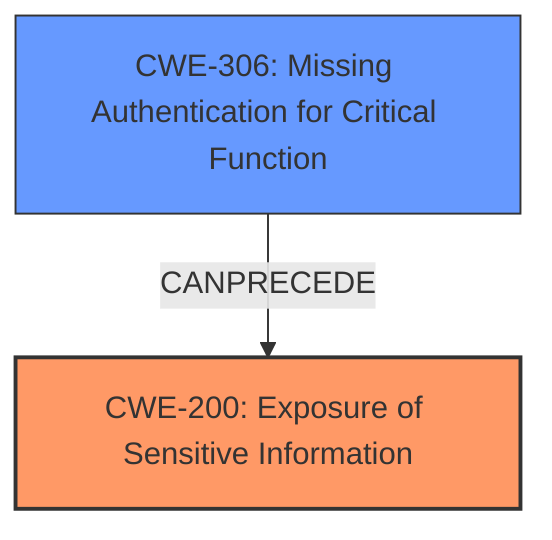

# Enhanced Analysis for CVE-2021-34589

# Summary
| CWE ID | CWE Name | Confidence | CWE Abstraction Level | CWE Vulnerability Mapping Label | CWE-Vulnerability Mapping Notes |
|---|---|---|---|---|---|
| CWE-200 | Exposure of Sensitive Information | 0.9 | Base | Allowed | Primary CWE |
| CWE-306 | Missing Authentication for Critical Function | 0.6 | Base | Allowed | Secondary Candidate |

## Evidence and Confidence

*   **Confidence Score:** 0.8
*   **Evidence Strength:** HIGH

## Relationship Analysis
The primary CWE, CWE-200 [Exposure of Sensitive Information], is a base-level CWE that directly addresses the vulnerability. The secondary CWE, CWE-306 [Missing Authentication for Critical Function], represents a potential contributing factor.



## Vulnerability Chain
The vulnerability chain involves a **lack of authentication** potentially (CWE-306), leading directly to the **exposure of sensitive information** (CWE-200).

## Summary of Analysis
The initial assessment strongly points to CWE-200 [Exposure of Sensitive Information] as the primary weakness, supported by the "CVE Reference Links Content Summary" which explicitly mentions "Exposure of Sensitive Information to an Unauthorized Actor (CWE-200)".

The vulnerability description states: "The RFID of the last charge event can be read without authentication via the web interface." This directly aligns with the description of CWE-200 [Exposure of Sensitive Information].

The retriever results listed CWE-306 [Missing Authentication for Critical Function] as a possibility. While authentication is "missing", the core issue is that sensitive information is exposed, making CWE-200 a more direct fit.

The selection of CWE-200 is at the optimal level of specificity, as it directly describes the exposure of sensitive RFID data.

Relevant CWE Information:

# Enhanced Context (25 CWEs)

## CWE-807: Reliance on Untrusted Inputs in a Security Decision
**Abstraction Level**: Base
**Similarity Score**: 0.80

## CWE-302: Authentication Bypass by Assumed-Immutable Data
**Abstraction Level**: Base
**Similarity Score**: 0.80

## CWE-288: Authentication Bypass Using an Alternate Path or Channel
**Abstraction Level**: Base
**Similarity Score**: 0.79

## CWE-41: Improper Resolution of Path Equivalence
**Abstraction Level**: Base
**Similarity Score**: 0.79

## CWE-1391: Use of Weak Credentials
**Abstraction Level**: Class
**Similarity Score**: 0.79

## CWE-303: Incorrect Implementation of Authentication Algorithm
**Abstraction Level**: Base
**Similarity Score**: 0.79

## CWE-345: Insufficient Verification of Data Authenticity
**Abstraction Level**: Class
**Similarity Score**: 0.79

## CWE-294: Authentication Bypass by Capture-replay
**Abstraction Level**: Base
**Similarity Score**: 0.79

## CWE-472: External Control of Assumed-Immutable Web Parameter
**Abstraction Level**: Base
**Similarity Score**: 0.78

## CWE-798: Use of Hard-coded Credentials
**Abstraction Level**: Base
**Similarity Score**: 0.78
**Description**:
The product contains **hard-coded credentials**, such as a password or cryptographic key.

## CWE-798: Use of Hard-coded Credentials
**Abstraction Level**: Base
**Similarity Score**: 4706.06

## CWE-22: Improper Limitation of a Pathname to a Restricted Directory ('Path Traversal')
**Abstraction Level**: Base
**Similarity Score**: 4649.39

## CWE-425: Direct Request ('Forced Browsing')
**Abstraction Level**: Base
**Similarity Score**: 4585.61

## CWE-23: Relative Path Traversal
**Abstraction Level**: Base
**Similarity Score**: 4578.71

## CWE-639: Authorization Bypass Through User-Controlled Key
**Abstraction Level**: Base
**Similarity Score**: 4564.37

## CWE-22: Improper Limitation of a Pathname to a Restricted Directory ('Path Traversal')
**Abstraction Level**: base
**Similarity Score**: 4.33

## CWE-471: Modification of Assumed-Immutable Data (MAID)
**Abstraction Level**: base
**Similarity Score**: 4.33

## CWE-73: External Control of File Name or Path
**Abstraction Level**: base
**Similarity Score**: 4.33

## CWE-59: Improper Link Resolution Before File Access ('Link Following')
**Abstraction Level**: base
**Similarity Score**: 4.33

## CWE-98: Improper Control of Filename for Include/Require Statement in PHP Program ('PHP Remote File Inclusion')
**Abstraction Level**: variant
**Similarity Score**: 3.75

## CWE-209: Generation of Error Message Containing Sensitive Information
**Abstraction Level**: base
**Similarity Score**: 3.64

## CWE-201: Insertion of Sensitive Information Into Sent Data
**Abstraction Level**: base
**Similarity Score**: 3.64

## CWE-202: Exposure of Sensitive Information Through Data Queries
**Abstraction Level**: base
**Similarity Score**: 3.64

## CWE-257: Storing Passwords in a Recoverable Format
**Abstraction Level**: base
**Similarity Score**: 3.64

## CWE-41: Improper Resolution of Path Equivalence
**Abstraction Level**: Base
**Similarity Score**: 2.91

**CWE-200: Exposure of Sensitive Information**
The product exposes sensitive information to an unauthorized actor. The RFID of the last charge event being readable without authentication directly matches this CWE's description.
Security Implications: Unauthorized access to sensitive data, potential privacy violations.
Relationship: CWE-200 is a parent of several more specific information exposure CWEs, but none are as fitting as the base class itself.
MITRE Mapping Guidance: The usage is ALLOWED.
Confidence: 0.9

**CWE-306: Missing Authentication for Critical Function**
The product does not perform any authentication for functionality that requires a provable user identity or consumes a significant amount of resources. While not explicitly stated, the ability to read the RFID without authentication suggests this.
Security Implications: Unauthorized access to functionality that should be protected.
Relationship: ChildOf CWE-287 (Improper Authentication).
MITRE Mapping Guidance: The usage is ALLOWED.
Confidence: 0.6


## CWE Relationship Analysis

Current CWEs represent these abstraction levels: .


### Vulnerability Chain Analysis

**Chain starting from CWE-288:**
- 288 (Authentication Bypass Using an Alternate Path or Channel) - ROOT


**Chain starting from CWE-294:**
- 294 (Authentication Bypass by Capture-replay) - ROOT


### CWE Relationship Diagram

```mermaid
graph TD
    classDef primary fill:#f96,stroke:#333,stroke-width:2px
    classDef secondary fill:#69f,stroke:#333
    classDef tertiary fill:#9e9,stroke:#333
```