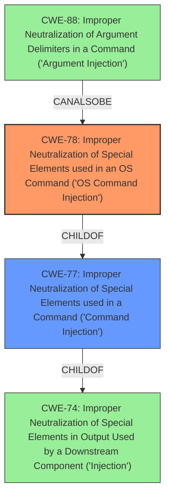

# Enhanced Analysis for CVE-2021-34592

# Summary
| CWE ID | CWE Name | Confidence | CWE Abstraction Level | CWE Vulnerability Mapping Label | CWE-Vulnerability Mapping Notes |
|---|---|---|---|---|---|
| CWE-78 | Improper Neutralization of Special Elements used in an OS Command ('OS Command Injection') | 1.0 | Base | Allowed | Primary CWE |
| CWE-77 | Improper Neutralization of Special Elements used in a Command ('Command Injection') | 0.7 | Class | Allowed-with-Review | Secondary Candidate |

## Evidence and Confidence

*   **Confidence Score:** 0.9
*   **Evidence Strength:** HIGH

## Relationship Analysis
The primary relationship influencing the CWE selection is the ChildOf relationship between CWE-78 (OS Command Injection) and CWE-77 (Command Injection). CWE-78 is a specific type of CWE-77. Since the vulnerability description explicitly mentions "shell commands," CWE-78 is preferred due to its specificity regarding OS commands. The description indicates that an authenticated attacker can inject shell commands into input fields of the web interface, meaning that the weakness involves a command language, OS shell invocation. Also, CWE-88 (Improper Neutralization of Argument Delimiters in a Command) is a peer of CWE-78 and can also be considered.



## Vulnerability Chain
The chain of events for this vulnerability can be described as follows:
1.  **Root Cause:** Improper Neutralization of Special Elements used in an OS Command (CWE-78) due to the product failing to properly sanitize input fields in the web interface.
2.  **Weakness:** This leads to the ability to inject arbitrary shell commands.
3.  **Impact:** An authenticated attacker can execute these commands, potentially escalating privileges to gain root access, and compromising the system.

## Summary of Analysis
The initial assessment identified **command injection** as the primary **weakness** based on the vulnerability description. The retriever results and complete CWE specifications were then reviewed to determine the most accurate CWE. The vulnerability description explicitly mentions that an authenticated attacker could enter shell commands into some input fields, making CWE-78 (Improper Neutralization of Special Elements used in an OS Command) the most appropriate primary CWE.

The "CVE Reference Links Content Summary" section supports this selection. It indicates that the root cause involves the execution of applications with unnecessary privileges. This, coupled with the ability to inject commands, directly aligns with the description of CWE-78.

The relationship analysis further solidified this decision. CWE-78 is a child of CWE-77 (Improper Neutralization of Special Elements used in a Command). While CWE-77 is a broader category, CWE-78 is more specific because it explicitly deals with OS commands. Since the vulnerability description specifies "shell commands," CWE-78 is the more precise and appropriate choice.

The selected CWE is at the optimal level of specificity because it directly reflects the root cause of the vulnerability (improper neutralization of OS command elements) and aligns with the provided evidence.

Relevant CWE Information:

# Enhanced Context (25 CWEs)
The following CWEs were identified as potentially relevant to this vulnerability:

## CWE-1236: Improper Neutralization of Formula Elements in a CSV File
**Abstraction Level**: Base
**Similarity Score**: 0.79
**Source**: dense

**Description**:
The product saves user-provided information into a Comma-Separated Value (CSV) file, but it does not neutralize or incorrectly neutralizes special elements that could be interpreted as a command when the file is opened by a spreadsheet product.

**Mapping Guidance**:
- Usage: Allowed
- Rationale: This CWE entry is at the Base level of abstraction, which is a preferred level of abstraction for mapping to the root causes of vulnerabilities.

This CWE is not relevant because the vulnerability description explicitly mentions **command injection** via the web interface, not CSV file manipulation.

## CWE-74: Improper Neutralization of Special Elements in Output Used by a Downstream Component ('Injection')
**Abstraction Level**: Class
**Similarity Score**: 0.77
**Source**: dense

**Description**:
The product constructs all or part of a command, data structure, or record using externally-influenced input from an upstream component, but it does not neutralize or incorrectly neutralizes special elements that could modify how it is parsed or interpreted when it is sent to a downstream component.

**Mapping Guidance**:
- Usage: Discouraged
- Rationale: CWE-74 is high-level and often misused when lower-level weaknesses are more appropriate.

CWE-74 is a high-level class, and more specific CWEs like CWE-78 and CWE-77 are more appropriate.

## CWE-80: Improper Neutralization of Script-Related HTML Tags in a Web Page (Basic XSS)
**Abstraction Level**: Variant
**Similarity Score**: 0.77
**Source**: dense

**Description**:
The product receives input from an upstream component, but it does not neutralize or incorrectly neutralizes special characters such as "<", ">", and "&" that could be interpreted as web-scripting elements when they are sent to a downstream component that processes web pages.

**Mapping Guidance**:
- Usage: Allowed
- Rationale: This CWE entry is at the Variant level of abstraction, which is a preferred level of abstraction for mapping to the root causes of vulnerabilities.

This CWE relates to Cross-Site Scripting (XSS), which is not mentioned or implied in the vulnerability description. The focus is on **command injection**, not script injection.

## CWE-116: Improper Encoding or Escaping of Output
**Abstraction Level**: Class
**Similarity Score**: 0.75
**Source**: dense

**Description**:
The product prepares a structured message for communication with another component, but encoding or escaping of the data is either missing or done incorrectly. As a result, the intended structure of the message is not preserved.

**Mapping Guidance**:
- Usage: Allowed-with-Review
- Rationale: This CWE entry is a Class and might have Base-level children that would be more appropriate

While improper encoding/escaping might contribute to the vulnerability, the core issue is the **command injection**. CWE-78 is a more direct representation of the **weakness**.

## CWE-138: Improper Neutralization of Special Elements
**Abstraction Level**: Class
**Similarity Score**: 0.75
**Source**: dense

**Description**:
The product receives input from an upstream component, but it does not neutralize or incorrectly neutralizes special elements that could be interpreted as control elements or syntactic markers when they are sent to a downstream component.

**Mapping Guidance**:
- Usage: Discouraged
- Rationale: This CWE entry is a level-1 Class (i.e., a child of a Pillar). It might have lower-level children that would be more appropriate

Similar to CWE-74, this is a high-level class. CWE-78 provides a more specific description of the vulnerability.

## CWE-943: Improper Neutralization of Special Elements in Data Query Logic
**Abstraction Level**: Class
**Similarity Score**: 0.74
**Source**: dense

**Description**:
The product generates a query intended to access or manipulate data in a data store such as a database, but it does not neutralize or incorrectly neutralizes special elements that can modify the intended logic of the query.

**Mapping Guidance**:
- Usage: Allowed-with-Review
- Rationale: This CWE entry is a Class and might have Base-level children that would be more appropriate

This CWE is specific to SQL injection, which is not relevant to the vulnerability description.

## CWE-917: Improper Neutralization of Special Elements used in an Expression Language Statement ('Expression Language Injection')
**Abstraction Level**: Base
**Similarity Score**: 0.74
**Source**: dense

**Description**:
The product constructs all or part of an expression language (EL) statement in a framework such as a Java Server Page (JSP) using externally-influenced input from an upstream component, but it does not neutralize or incorrectly neutralizes special elements that could modify the intended EL statement before it is executed.

**Mapping Guidance**:
- Usage: Allowed
- Rationale: This CWE entry is at the Base level of abstraction, which is a preferred level of abstraction for mapping to the root causes of vulnerabilities.

This


## CWE Relationship Analysis

Current CWEs represent these abstraction levels: .


### Vulnerability Chain Analysis

**Chain starting from CWE-88:**
- 88 (Improper Neutralization of Argument Delimiters in a Command ('Argument Injection')) - ROOT


**Chain starting from CWE-80:**
- 80 (Improper Neutralization of Script-Related HTML Tags in a Web Page (Basic XSS)) - ROOT


### CWE Relationship Diagram

```mermaid
graph TD
    classDef primary fill:#f96,stroke:#333,stroke-width:2px
    classDef secondary fill:#69f,stroke:#333
    classDef tertiary fill:#9e9,stroke:#333
```