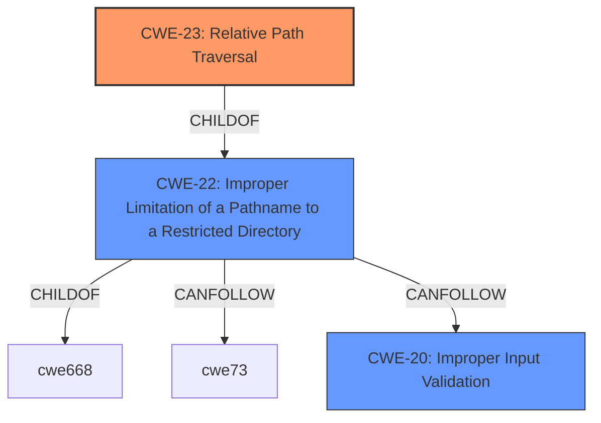

# Raw Analyzer Response for CVE-2021-34597

# Summary
| CWE ID | CWE Name | Confidence | CWE Abstraction Level | CWE Vulnerability Mapping Label | CWE-Vulnerability Mapping Notes |
|---|---|---|---|---|---|
| CWE-23 | Relative Path Traversal | 1 | Base | Primary | Allowed |
| CWE-20 | Improper Input Validation | 0.7 | Class | Secondary | Discouraged |

## Evidence and Confidence

*   **Confidence Score:** 0.85
*   **Evidence Strength:** HIGH

## Relationship Analysis
The primary CWE is CWE-23, which is a base-level weakness and a child of CWE-22 (Improper Limitation of a Pathname to a Restricted Directory). CWE-20 is a class-level weakness that represents a high-level view of the problem. CWE-23 is more specific and accurately captures the root cause of the vulnerability.

## Vulnerability Chain
The vulnerability chain starts with **improper input validation** (CWE-20), which leads to a **relative path traversal** (CWE-23). The attacker provides a manipulated project file, which, due to the lack of proper input validation, allows the unpacking of arbitrary files outside the selected project directory.

## Summary of Analysis
The initial assessment identified both CWE-20 and CWE-23 as potential candidates. However, after reviewing the details, CWE-23 (Relative Path Traversal) is the more appropriate primary CWE.

The vulnerability description states: "Improper Input Validation vulnerability in PC Worx Automation Suite of Phoenix Contact up to version 1.88 could allow an attacker with a manipulated project file to unpack arbitrary files outside of the selected project directory." The CVE Reference Links Content Summary further clarifies that the root cause is **improper input validation** when loading a project file, leading to a "zip slip" style vulnerability.

The evidence strongly supports CWE-23 as the primary CWE because the core issue is the ability to unpack files outside of the intended directory due to the **improper handling of pathnames** within the project file. The **improper input validation** (CWE-20) is the more general weakness that allows the path traversal to occur, but CWE-23 is the specific mechanism being exploited.

The final decision is based on prioritizing specificity. CWE-23 is at the optimal level of detail, as it accurately represents the vulnerability’s technical characteristics. The retriever results also show that CWE-23 is a strong candidate.

Relevant CWE Information:

# Enhanced Context (25 CWEs)
The following CWEs were identified as potentially relevant to this vulnerability:

## CWE-23: Relative Path Traversal
**Abstraction Level**: Base
**Similarity Score**: 0.78
**Source**: dense

**Description**:
The product uses external input to construct a pathname that should be within a restricted directory, but it does not properly neutralize sequences such as ".." that can resolve to a location that is outside of that directory.

**Mapping Guidance**:
- Usage: Allowed
- Rationale: This CWE entry is at the Base level of abstraction, which is a preferred level of abstraction for mapping to the root causes of vulnerabilities.

## CWE-20: Improper Input Validation
**Abstraction:** Class
**Status:** Stable

### Description
The product receives input or data, but it does
        not validate or incorrectly validates that the input has the
        properties that are required to process the data safely and
        correctly.

### Extended Description
Input validation is a frequently-used technique for checking potentially dangerous inputs in order to ensure that the inputs are safe for processing within the code, or when communicating with other components. When software does not validate input properly, an attacker is able to craft the input in a form that is not expected by the rest of the application. This will lead to parts of the system receiving unintended input, which may result in altered control flow, arbitrary control of a resource, or arbitrary code execution.

### Mapping Guidance
**Usage:** Discouraged
**Rationale:** CWE-20 is commonly misused in low-information vulnerability reports when lower-level CWEs could be used instead, or when more details about the vulnerability are available [REF-1287]. It is not useful for trend analysis. It is also a level-1 Class (i.e., a child of a Pillar).
**Comments:** Consider lower-level children such as Improper Use of Validation Framework (CWE-1173) or improper validation involving specific types or properties of input such as Specified Quantity (CWE-1284); Specified Index, Position, or Offset (CWE-1285); Syntactic Correctness (CWE-1286); Specified Type (CWE-1287); Consistency within Input (CWE-1288); or Unsafe Equivalence (CWE-1289).
**Reasons:**
- Frequent Misuse

## Technical Explanation for CWE-23 (Primary)
CWE-23 (Relative Path Traversal) describes a vulnerability where the product does not properly neutralize sequences like ".." in pathnames constructed from external input. In this case, a manipulated project file contains path traversal sequences that allow files to be unpacked outside of the intended project directory. This directly aligns with the vulnerability description. The impact is significant, as it allows an attacker to compromise the availability, integrity, or confidentiality of the application programming workstation. CWE-23 is a child of CWE-22 (Improper Limitation of a Pathname to a Restricted Directory) and represents the specific type of path traversal exploited in this vulnerability. The MITRE mapping guidance allows the use of CWE-23 because it is at the Base level of abstraction.

## Technical Explanation for CWE-20 (Secondary)
CWE-20 (Improper Input Validation) describes a general class of vulnerabilities where input is not properly validated. While the vulnerability description mentions **improper input validation**, CWE-20 is too general. The more specific weakness is the failure to validate the file paths within the manipulated project file, which leads to the path traversal. The MITRE mapping guidance discourages the use of CWE-20 when more specific CWEs are available.

## CWEs Considered But Not Used
- CWE-22: Improper Limitation of a Pathname to a Restricted Directory ('Path Traversal') - Considered but not used as CWE-23 is a more specific child that focuses on relative path traversal.
- CWE-73: External Control of File Name or Path - Considered but not used, as while the file name is controlled externally, the core issue is the path traversal rather than the external control itself.
- CWE-119: Improper Restriction of Operations within the Bounds of a Memory Buffer - This was considered because the impact of the vulnerability could lead to writing outside the intended buffer, but it's not the root cause of the vulnerability.
- CWE-285: Improper Authorization - Considered but not used as the issue isn't related to authorization but rather improper handling of file paths.
- CWE-807: Reliance on Untrusted Inputs in a Security Decision - Considered but not used, since the primary issue isn't reliance on untrusted inputs for security decisions, but rather a lack of proper input validation that enables path traversal.
- CWE-190: Integer Overflow or Wraparound - Considered but not used, as integer overflow is not mentioned or implied in the vulnerability description.
- CWE-923: Improper Restriction of Communication Channel to Intended Endpoints - Considered but not used as the vulnerability doesn't relate to communication channels.