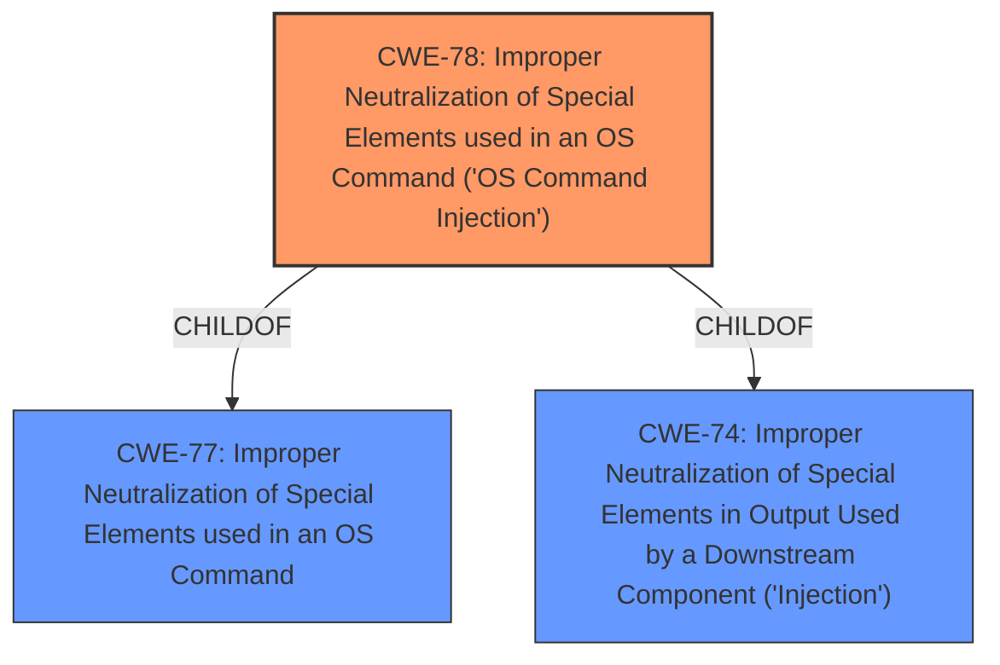

# Enhanced Analysis for CVE-2021-34610

# Summary
| CWE ID | CWE Name | Confidence | CWE Abstraction Level | CWE Vulnerability Mapping Label | CWE-Vulnerability Mapping Notes |
|---|---|---|---|---|---|
| CWE-78 | Improper Neutralization of Special Elements used in an OS Command ('OS Command Injection') | 1.0 | Base | Primary | Allowed |

## Evidence and Confidence

*   **Confidence Score:** 1.0
*   **Evidence Strength:** HIGH

## Relationship Analysis
The primary CWE, CWE-78, is a base-level CWE, making it suitably specific. It is a child of CWE-77 and CWE-74. The description of CWE-78 aligns well with the "remote arbitrary command execution" impact described in the vulnerability description. There are no other relationships that would affect the selection.



## Vulnerability Chain
The vulnerability chain starts with the **improper neutralization** of special elements in a command. This allows an attacker to inject commands, leading to remote arbitrary command execution.

## Summary of Analysis
The initial analysis strongly pointed towards CWE-78, which aligns directly with the vulnerability's impact of remote arbitrary command execution. The vulnerability description and the "CWE for similar CVE Descriptions" section both support this. The retriever results also listed CWE-78 as the top candidate. The final decision is based on the evidence provided, the relationships of CWE-78, and the mapping guidance that says CWE-78 is allowed.
The selected CWE, CWE-78, is at the optimal level of specificity, as it accurately captures the root cause of the vulnerability.

Relevant CWE Information:

# Enhanced Context (25 CWEs)
The following CWEs were identified as potentially relevant to this vulnerability:

## CWE-74: Improper Neutralization of Special Elements in Output Used by a Downstream Component ('Injection')
**Abstraction Level**: Class
**Similarity Score**: 0.76
**Source**: dense

**Description**:
The product constructs all or part of a command, data structure, or record using externally-influenced input from an upstream component, but it does not neutralize or incorrectly neutralizes special elements that could modify how it is parsed or interpreted when it is sent to a downstream component.

**Mapping Guidance**:
- Usage: Discouraged
- Rationale: CWE-74 is high-level and often misused when lower-level weaknesses are more appropriate.
- Not used because it is too high level. CWE-78 is a child of CWE-74 and is a better fit.

## CWE-22: Improper Limitation of a Pathname to a Restricted Directory ('Path Traversal')
**Abstraction Level**: Base
**Similarity Score**: 7660.81
**Source**: sparse

**Description**:
The product uses external input to construct a pathname that is intended to identify a file or directory that is located underneath a restricted parent directory, but the product does not properly neutralize special elements within the pathname that can cause the pathname to resolve to a location that is outside of the restricted directory.

**Mapping Guidance**:
- Usage: Allowed
- Rationale: This CWE entry is at the Base level of abstraction, which is a preferred level of abstraction for mapping to the root causes of vulnerabilities.
- Not used because this vulnerability description doesn't refer to a file path or restricted directory.

## CWE-78: Improper Neutralization of Special Elements used in an OS Command ('OS Command Injection')
**Abstraction Level**: base
**Similarity Score**: 5.03
**Source**: graph

**Description**:
CWE-78: Improper Neutralization of Special Elements used in an OS Command ('OS Command Injection')

**Mapping Guidance**:
- Usage: Allowed
- Rationale: This CWE entry is at the Base level of abstraction, which is a preferred level of abstraction for mapping to the root causes of vulnerabilities.

**Relationships**:
- CANFOLLOW -> CWE-184
- CANALSOBE -> CWE-88
- CHILDOF -> CWE-77
- CHILDOF -> CWE-77
- CHILDOF -> CWE-74
- Selected as the best fit.

The assigned CWE is **CWE-78 (Improper Neutralization of Special Elements used in an OS Command ('OS Command Injection'))**. The vulnerability description clearly states a "remote arbitrary command execution vulnerability," which directly corresponds to the characteristics of CWE-78. This weakness allows an attacker to inject and execute arbitrary OS commands due to **improper neutralization** of special elements in the command string. The potential impact is significant, leading to complete system compromise.


## CWE Relationship Analysis

Current CWEs represent these abstraction levels: .


### Vulnerability Chain Analysis

**Chain starting from CWE-88:**
- 88 (Improper Neutralization of Argument Delimiters in a Command ('Argument Injection')) - ROOT


**Chain starting from CWE-78:**
- 78 (Improper Neutralization of Special Elements used in an OS Command ('OS Command Injection')) - ROOT


### CWE Relationship Diagram

```mermaid
graph TD
    classDef primary fill:#f96,stroke:#333,stroke-width:2px
    classDef secondary fill:#69f,stroke:#333
    classDef tertiary fill:#9e9,stroke:#333
```