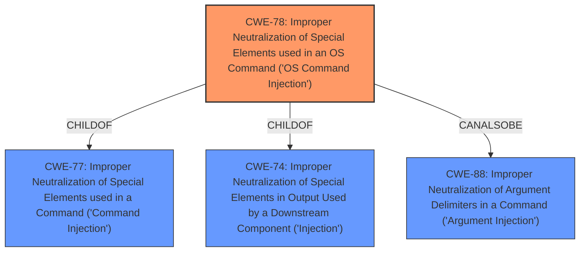

# Enhanced Analysis for CVE-2021-34611

# Summary
| CWE ID | CWE Name | Confidence | CWE Abstraction Level | CWE Vulnerability Mapping Label | CWE-Vulnerability Mapping Notes |
|---|---|---|---|---|---|
| CWE-78 | Improper Neutralization of Special Elements used in an OS Command ('OS Command Injection') | 1.0 | Base | Primary | Allowed |

## Evidence and Confidence

*   **Confidence Score:** 1.0
*   **Evidence Strength:** HIGH

## Relationship Analysis
The primary relationship that influenced the decision was the direct match of the vulnerability description to the characteristics of CWE-78, as supported by the Primary CWE Match and Top CWEs from similar CVE descriptions. Additionally, the retriever results listed CWE-78 as the top match.



## Vulnerability Chain
The vulnerability chain involves the **improper neutralization** of special elements within an OS command, leading to remote arbitrary command execution.
  - Root Cause: **Improper neutralization** of special elements used in an OS Command
  - Impact: Remote arbitrary command execution

## Summary of Analysis
The analysis strongly supports mapping this vulnerability to CWE-78 (Improper Neutralization of Special Elements used in an OS Command). The vulnerability description clearly states "remote arbitrary command execution," indicating that an attacker can execute commands on the system. The key phrase also identifies the **impact** as remote arbitrary command execution.

The "CWE for similar CVE Descriptions" section lists CWE-78 as the Primary CWE Match. Also, CWE-78 is the top CWE with a count of 42. The retriever results also lists CWE-78 as rank 1. This confirms that CWE-78 is the most appropriate CWE for this vulnerability.

The selected CWE is at the optimal level of specificity (Base), as it directly addresses the **root cause** of the vulnerability, which is the **improper neutralization** of special elements used in an OS command.

Relevant CWE Information:

# Enhanced Context (25 CWEs)
The following CWEs were identified as potentially relevant to this vulnerability:

## CWE-74: Improper Neutralization of Special Elements in Output Used by a Downstream Component ('Injection')
**Abstraction Level**: Class
**Similarity Score**: 0.76
**Source**: dense

**Description**:
The product constructs all or part of a command, data structure, or record using externally-influenced input from an upstream component, but it does not neutralize or incorrectly neutralizes special elements that could modify how it is parsed or interpreted when it is sent to a downstream component.

**Mapping Guidance**:
- Usage: Discouraged
- Rationale: CWE-74 is high-level and often misused when lower-level weaknesses are more appropriate.

## CWE-78: Improper Neutralization of Special Elements used in an OS Command ('OS Command Injection')
**Abstraction:** Base
**Status:** Stable

### Description
The product constructs all or part of an OS command using externally-influenced input from an upstream component, but it does not neutralize or incorrectly neutralizes special elements that could modify the intended OS command when it is sent to a downstream component.

### Extended Description


This weakness can lead to a vulnerability in environments in which the attacker does not have direct access to the operating system, such as in web applications. Alternately, if the weakness occurs in a privileged program, it could allow the attacker to specify commands that normally would not be accessible, or to call alternate commands with privileges that the attacker does not have. The problem is exacerbated if the compromised process does not follow the principle of least privilege, because the attacker-controlled commands may run with special system privileges that increases the amount of damage.

### Mapping Guidance
**Usage:** Allowed
**Rationale:** This CWE entry is at the Base level of abstraction, which is a preferred level of abstraction for mapping to the root causes of vulnerabilities.

### Observed Examples
- **CVE-2020-10987:** OS command injection in Wi-Fi router, as exploited in the wild per CISA KEV.
- **CVE-2020-10221:** Template functionality in network configuration management tool allows OS command injection, as exploited in the wild per CISA KEV.
- **CVE-2020-9054:** Chain: improper input validation (CWE-20) in username parameter, leading to OS command injection (CWE-78), as exploited in the wild per CISA KEV.

## CWE-22: Improper Limitation of a Pathname to a Restricted Directory ('Path Traversal')
**Abstraction:** Base
**Status:** Stable

### Description
The product uses external input to construct a pathname that is intended to identify a file or directory that is located underneath a restricted parent directory, but the product does not properly neutralize special elements within the pathname that can cause the pathname to resolve to a location that is outside of the restricted directory.

## CWE-23: Relative Path Traversal
**Abstraction:** Base
**Status:** Draft

### Description
The product uses external input to construct a pathname that should be within a restricted directory, but it does not properly neutralize sequences such as ".." that can resolve to a location that is outside of that directory.

## CWE-89: Improper Neutralization of Special Elements used in an SQL Command ('SQL Injection')
**Abstraction:** Base
**Status:** Stable

### Description
The product constructs all or part of an SQL command using externally-influenced input from an upstream component, but it does not neutralize or incorrectly neutralizes special elements that could modify the intended SQL command when it is sent to a downstream component. Without sufficient removal or quoting of SQL syntax in user-controllable inputs, the generated SQL query can cause those inputs to be interpreted as SQL instead of ordinary user data.

## CWE-863: Incorrect Authorization
**Abstraction:** Class
**Status:** Incomplete

### Description
The product performs an authorization check when an actor attempts to access a resource or perform an action, but it does not correctly perform the check.

## CWE-269: Improper Privilege Management
**Abstraction:** Class
**Status:** Draft

### Description
The product does not properly assign, modify, track, or check privileges for an actor, creating an unintended sphere of control for that actor.

## CWE-73: External Control of File Name or Path
**Abstraction:** Base
**Status:** Draft

### Description
The product allows user input to control or influence paths or file names that are used in filesystem operations.

## CWE-918: Server-Side Request Forgery (SSRF)
**Abstraction:** Base
**Status:** Incomplete

### Description
The web server receives a URL or similar request from an upstream component and retrieves the contents of this URL, but it does not sufficiently ensure that the request is being sent to the expected destination.

### Considered but not used CWEs:
- CWE-74: Improper Neutralization of Special Elements in Output Used by a Downstream Component ('Injection') was considered because it is a parent of CWE-78, but it is too general. The description specifies OS command injection, making CWE-78 a more precise fit.
- CWE-22: Improper Limitation of a Pathname to a Restricted Directory ('Path Traversal') and CWE-23: Relative Path Traversal were considered because they appeared in the retriever results, but they relate to file path manipulation, not command execution.
- CWE-89: Improper Neutralization of Special Elements used in an SQL Command ('SQL Injection') was considered because it involves **improper neutralization**, but it is specific to SQL commands, not OS commands.
- CWE-863: Incorrect Authorization and CWE-269: Improper Privilege Management were considered because they relate to access control issues, but the vulnerability description points to command execution, not authorization or privilege management.
- CWE-73: External Control of File Name or Path was considered, but it deals with file path manipulation, not command execution.
- CWE-918: Server-Side Request Forgery (SSRF) was considered but it deals with making requests to unexpected destinations, not command execution.


## CWE Relationship Analysis

Current CWEs represent these abstraction levels: .


### Vulnerability Chain Analysis

**Chain starting from CWE-88:**
- 88 (Improper Neutralization of Argument Delimiters in a Command ('Argument Injection')) - ROOT


**Chain starting from CWE-73:**
- 73 (External Control of File Name or Path) - ROOT


### CWE Relationship Diagram

```mermaid
graph TD
    classDef primary fill:#f96,stroke:#333,stroke-width:2px
    classDef secondary fill:#69f,stroke:#333
    classDef tertiary fill:#9e9,stroke:#333
```