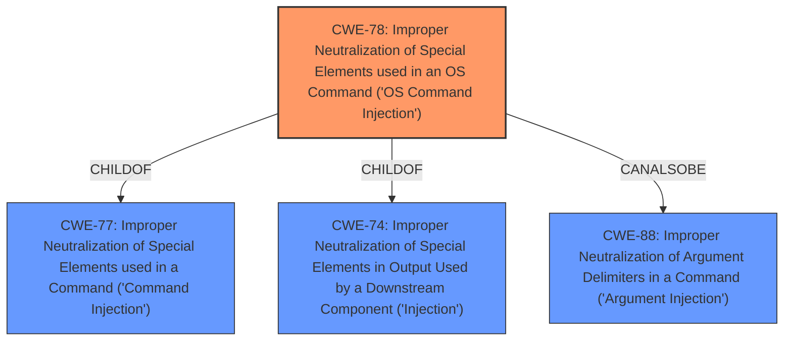

# Analysis Report for CVE-2021-34613

# Vulnerability Analysis Report: CVE-2021-34613

## Description


## Analysis (with Relationship Data)

# Summary
| CWE ID | CWE Name | Confidence | CWE Abstraction Level | CWE Vulnerability Mapping Label | CWE-Vulnerability Mapping Notes |
|---|---|---|---|---|---|
| CWE-78 | Improper Neutralization of Special Elements used in an OS Command ('OS Command Injection') | 1.0 | Base | Allowed | Primary CWE |

## Evidence and Confidence

*   **Confidence Score:** 1.0
*   **Evidence Strength:** HIGH

## Relationship Analysis
The primary relationship that influenced the decision was the direct match of the vulnerability description to the characteristics of CWE-78, including the ability to execute arbitrary commands on the system.



## Vulnerability Chain
The vulnerability chain for this vulnerability description is straightforward:
  - The **root cause** is the **improper neutralization** of special elements used in an OS command (CWE-78).
  - The **impact** is remote arbitrary command execution.

## Summary of Analysis
The initial analysis strongly suggested CWE-78 as the primary weakness, and further review of the evidence and relationships confirmed this assessment. The decision is primarily based on the **Vulnerability Description**, which explicitly states a remote arbitrary command execution vulnerability. This aligns directly with the characteristics of CWE-78.

The **CWE for similar CVE Descriptions** section lists CWE-78 as the **Primary CWE Match** and also the **Top CWE** from similar vulnerabilities.

The retriever results also listed CWE-78 first.

The selection of CWE-78 is at the optimal level of specificity, as it directly describes the **root cause** of the vulnerability, which is the **improper neutralization** of special elements leading to OS command injection.

Relevant CWE Information:

# Enhanced Context (25 CWEs)
The following CWEs were identified as potentially relevant to this vulnerability:

## CWE-74: Improper Neutralization of Special Elements in Output Used by a Downstream Component ('Injection')
**Abstraction Level**: Class
**Similarity Score**: 0.76
**Source**: dense

**Description**:
The product constructs all or part of a command, data structure, or record using externally-influenced input from an upstream component, but it does not neutralize or incorrectly neutralizes special elements that could modify how it is parsed or interpreted when it is sent to a downstream component.

**Mapping Guidance**:
- Usage: Discouraged
- Rationale: CWE-74 is high-level and often misused when lower-level weaknesses are more appropriate.

## CWE-78: Improper Neutralization of Special Elements used in an OS Command ('OS Command Injection')
**Abstraction Level**: base
**Similarity Score**: 5.03
**Source**: graph

**Description**:
CWE-78: Improper Neutralization of Special Elements used in an OS Command ('OS Command Injection')

**Mapping Guidance**:
- Usage: Allowed
- Rationale: This CWE entry is at the Base level of abstraction, which is a preferred level of abstraction for mapping to the root causes of vulnerabilities.

**Relationships**:
- CANFOLLOW -> CWE-184
- CANALSOBE -> CWE-88
- CHILDOF -> CWE-77
- CHILDOF -> CWE-77
- CHILDOF -> CWE-74

### Considered but not used:
- CWE-74: Considered but not selected because it is a more general class of injection vulnerabilities, and CWE-78 is a specific type of injection related to OS commands.
- CWE-22, CWE-23, CWE-73: Path Traversal related CWEs were considered, but the vulnerability description does not suggest any path manipulation or file access issues.
- CWE-89: SQL Injection was considered, but the vulnerability description does not indicate any database interactions or SQL command construction.
- CWE-863, CWE-269, CWE-285, CWE-284: Authorization and privilege management related CWEs were considered, but the description does not indicate that it is an authorization or privilege issue.
- CWE-918: Server-Side Request Forgery was considered, but the description does not indicate any URL or request handling issues.


## CWE Relationship Analysis

Current CWEs represent these abstraction levels: .


### Vulnerability Chain Analysis

**Chain starting from CWE-77:**
- 77 (Improper Neutralization of Special Elements used in a Command ('Command Injection')) - ROOT


**Chain starting from CWE-88:**
- 88 (Improper Neutralization of Argument Delimiters in a Command ('Argument Injection')) - ROOT


### CWE Relationship Diagram

```mermaid
graph TD
    classDef primary fill:#f96,stroke:#333,stroke-width:2px
    classDef secondary fill:#69f,stroke:#333
    classDef tertiary fill:#9e9,stroke:#333
```


*Report generated on 2025-04-01 21:35:01*
