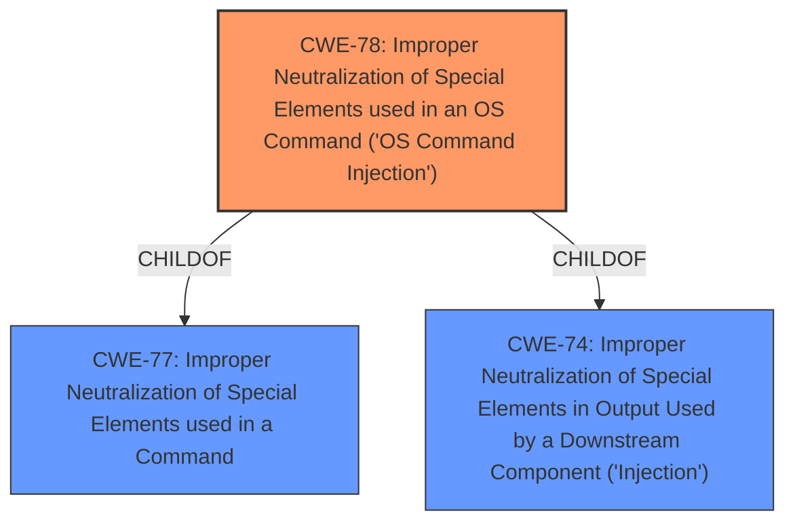

# Raw Analyzer Response for CVE-2021-34614

# Summary
| CWE ID | CWE Name | Confidence | CWE Abstraction Level | CWE Vulnerability Mapping Label | CWE-Vulnerability Mapping Notes |
|---|---|---|---|---|---|
| CWE-78 | Improper Neutralization of Special Elements used in an OS Command ('OS Command Injection') | 1.0 | Base | Allowed | Primary CWE |

## Evidence and Confidence

*   **Confidence Score:** 1.0
*   **Evidence Strength:** HIGH

## Relationship Analysis
The primary relationship that influenced my decision was the ChildOf relationship between CWE-78 and its parent CWEs, such as CWE-77 (Improper Neutralization of Special Elements used in a Command) and CWE-74 (Improper Neutralization of Special Elements in Output Used by a Downstream Component ('Injection')). While the vulnerability could potentially be categorized under these higher-level CWEs, CWE-78 provides a more specific and accurate description of the **root cause**, which involves the **improper neutralization** of special elements used in an OS command, leading to command injection. This specific nature of the weakness makes CWE-78 the most appropriate choice.

## Vulnerability Chain
The vulnerability chain starts with the **improper neutralization** of special elements within an OS command. This allows an attacker to inject arbitrary commands, leading to remote arbitrary command execution.

## Summary of Analysis
The analysis is based on the vulnerability description, which clearly states that a remote arbitrary command execution vulnerability exists in Aruba ClearPass Policy Manager due to **improper neutralization** of special elements used in an OS command. This directly aligns with the characteristics of CWE-78. The "CWE for similar CVE Descriptions" section also lists CWE-78 as the Primary CWE Match and the Top CWE. The "Retriever Results" list CWE-78 as the top result.

The decision to choose CWE-78 is primarily based on the direct evidence of **improper neutralization** of special elements in an OS command, leading to command injection. This aligns perfectly with the description of CWE-78. The hierarchical relationships support the choice of CWE-78 as the most specific and accurate representation of the vulnerability.

Relevant CWE Information:

# Enhanced Context (25 CWEs)
The following CWEs were identified as potentially relevant to this vulnerability:

## CWE-74: Improper Neutralization of Special Elements in Output Used by a Downstream Component ('Injection')
**Abstraction Level**: Class
**Similarity Score**: 0.76
**Source**: dense

**Description**:
The product constructs all or part of a command, data structure, or record using externally-influenced input from an upstream component, but it does not neutralize or incorrectly neutralizes special elements that could modify how it is parsed or interpreted when it is sent to a downstream component.

**Mapping Guidance**:
- Usage: Discouraged
- Rationale: CWE-74 is high-level and often misused when lower-level weaknesses are more appropriate.

## CWE-78: Improper Neutralization of Special Elements used in an OS Command ('OS Command Injection')
**Abstraction Level:** Base
**Status:** Stable

### Description
The product constructs all or part of an OS command using externally-influenced input from an upstream component, but it does not neutralize or incorrectly neutralizes special elements that could modify the intended OS command when it is sent to a downstream component.

### Extended Description
This weakness can lead to a vulnerability in environments in which the attacker does not have direct access to the operating system, such as in web applications. Alternately, if the weakness occurs in a privileged program, it could allow the attacker to specify commands that normally would not be accessible, or to call alternate commands with privileges that the attacker does not have. The problem is exacerbated if the compromised process does not follow the principle of least privilege, because the attacker-controlled commands may run with special system privileges that increases the amount of damage.

### Observed Examples
- **CVE-2020-10987:** OS command injection in Wi-Fi router, as exploited in the wild per CISA KEV.
- **CVE-2020-10221:** Template functionality in network configuration management tool allows OS command injection, as exploited in the wild per CISA KEV.
- **CVE-2020-9054:** Chain: improper input validation (CWE-20) in username parameter, leading to OS command injection (CWE-78), as exploited in the wild per CISA KEV.