# Enhanced Analysis for CVE-2021-34620

# Summary
| CWE ID | CWE Name | Confidence | CWE Abstraction Level | CWE Vulnerability Mapping Label | CWE-Vulnerability Mapping Notes |
|---|---|---|---|---|---|
| CWE-352 | Cross-Site Request Forgery (CSRF) | 1.0 | Compound | Allowed | Primary CWE. The vulnerability is primarily due to the **missing nonce check**, which is a classic symptom of CSRF. |
| CWE-79 | Improper Neutralization of Input During Web Page Generation ('Cross-site Scripting') | 0.9 | Base | Allowed | Secondary CWE. The CSRF leads to stored XSS, making this a relevant secondary weakness. |

## Evidence and Confidence

*   **Confidence Score:** 0.95
*   **Evidence Strength:** HIGH

## Relationship Analysis
The primary relationship that impacts the decision is that CSRF (CWE-352) can lead to XSS (CWE-79). CWE-352 is a compound weakness, meaning it's composed of several underlying issues. The **missing nonce check** is the root cause that allows the CSRF to occur. The CSRF then leads to the injection of malicious scripts, resulting in XSS.

```mermaid
graph TD
    cwe352["CWE-352: Cross-Site Request Forgery (CSRF)"]
    cwe79["CWE-79: Improper Neutralization of Input During Web Page Generation ('Cross-site Scripting')"]
    cwe613["CWE-613: Insufficient Session Expiration"]
    cwe346["CWE-346: Origin Validation Error"]
    
    cwe352 -->|CANFOLLOW| cwe79
    cwe352 -->|REQUIRES| cwe613
    cwe352 -->|REQUIRES| cwe346
    
    classDef primary fill:#f96,stroke:#333,stroke-width:2px
    classDef secondary fill:#69f,stroke:#333
    classDef tertiary fill:#9e9,stroke:#333
    class cwe352 primary
    class cwe79 secondary
    class cwe613,cwe346 tertiary
```



## Vulnerability Chain
The vulnerability chain starts with a **missing nonce check** that leads to CSRF, which allows for the injection of malicious scripts, ultimately resulting in stored XSS.
  - **Root Cause:** **Missing nonce check**
  - **Weakness:** Cross-Site Request Forgery (CWE-352)
  - **Impact:** Stored Cross-Site Scripting (CWE-79)

## Summary of Analysis
The initial analysis correctly identifies the key weakness as CSRF due to the **missing nonce check**. The description clearly states that the vulnerability leads to stored XSS. The evidence strongly supports mapping to CWE-352 as the primary weakness and CWE-79 as a secondary weakness resulting from the CSRF.

The provided description states, "The WP Fluent Forms plugin < 3.6.67 for WordPress is vulnerable to **Cross-Site Request Forgery** leading to stored Cross-Site Scripting and limited Privilege Escalation due to a **missing nonce check** in the access control function for administrative AJAX actions". This statement is direct evidence of the CSRF and its impact, with the root cause being the **missing nonce check**.

The "CVE Reference Links Content Summary" section states: "The `Acl::verify` method in the WP Fluent Forms plugin did not perform a nonce check, making AJAX actions vulnerable to Cross-Site Request Forgery (CSRF)."

CWE-352 is appropriately specific as it captures the essence of the CSRF vulnerability arising from the **missing nonce check**. CWE-79 is relevant as it represents the direct impact of the CSRF vulnerability, enabling the injection of malicious scripts and subsequent XSS attacks.

Relevant CWE Information:

# Enhanced Context (25 CWEs)
The following CWEs were identified as potentially relevant to this vulnerability:

## CWE-601: URL Redirection to Untrusted Site ('Open Redirect')
**Abstraction Level**: Base
**Similarity Score**: 0.80
**Source**: dense

**Description**:
The web application accepts a user-controlled input that specifies a link to an external site, and uses that link in a redirect.

**Mapping Guidance**:
- Usage: Allowed
- Rationale: This CWE entry is at the Base level of abstraction, which is a preferred level of abstraction for mapping to the root causes of vulnerabilities.


## CWE-472: External Control of Assumed-Immutable Web Parameter
**Abstraction Level**: Base
**Similarity Score**: 0.77
**Source**: dense

**Description**:
The web application does not sufficiently verify inputs that are assumed to be immutable but are actually externally controllable, such as hidden form fields.

**Mapping Guidance**:
- Usage: Allowed
- Rationale: This CWE entry is at the Base level of abstraction, which is a preferred level of abstraction for mapping to the root causes of vulnerabilities.


## CWE-41: Improper Resolution of Path Equivalence
**Abstraction Level**: Base
**Similarity Score**: 0.76
**Source**: dense

**Description**:
The product is vulnerable to file system contents disclosure through path equivalence. Path equivalence involves the use of special characters in file and directory names. The associated manipulations are intended to generate multiple names for the same object.

**Mapping Guidance**:
- Usage: Allowed
- Rationale: This CWE entry is at the Base level of abstraction, which is a preferred level of abstraction for mapping to the root causes of vulnerabilities.


## CWE-74: Improper Neutralization of Special Elements in Output Used by a Downstream Component ('Injection')
**Abstraction Level**: Class
**Similarity Score**: 0.76
**Source**: dense

**Description**:
The product constructs all or part of a command, data structure, or record using externally-influenced input from an upstream component, but it does not neutralize or incorrectly neutralizes special elements that could modify how it is parsed or interpreted when it is sent to a downstream component.

**Mapping Guidance**:
- Usage: Discouraged
- Rationale: CWE-74 is high-level and often misused when lower-level weaknesses are more appropriate.


## CWE-425: Direct Request ('Forced Browsing')
**Abstraction Level**: Base
**Similarity Score**: 0.76
**Source**: dense

**Description**:
The web application does not adequately enforce appropriate authorization on all restricted URLs, scripts, or files.

**Mapping Guidance**:
- Usage: Allowed
- Rationale: This CWE entry is at the Base level of abstraction, which is a preferred level of abstraction for mapping to the root causes of vulnerabilities.


## CWE-23: Relative Path Traversal
**Abstraction Level**: Base
**Similarity Score**: 0.76
**Source**: dense

**Description**:
The product uses external input to construct a pathname that should be within a restricted directory, but it does not properly neutralize sequences such as ".." that can resolve to a location that is outside of that directory.

**Mapping Guidance**:
- Usage: Allowed
- Rationale: This CWE entry is at the Base level of abstraction, which is a preferred level of abstraction for mapping to the root causes of vulnerabilities.


## CWE-610: Externally Controlled Reference to a Resource in Another Sphere
**Abstraction Level**: Class
**Similarity Score**: 0.76
**Source**: dense

**Description**:
The product uses an externally controlled name or reference that resolves to a resource that is outside of the intended control sphere.

**Mapping Guidance**:
- Usage: Discouraged
- Rationale: This CWE entry is a level-1 Class (i.e., a child of a Pillar). It might have lower-level children that would be more appropriate


## CWE-434: Unrestricted Upload of File with Dangerous Type
**Abstraction Level**: Base
**Similarity Score**: 0.75
**Source**: dense

**Description**:
The product allows the upload or transfer of dangerous file types that are automatically processed within its environment.

**Mapping Guidance**:
- Usage: Allowed
- Rationale: This CWE entry is at the Base level of abstraction, which is a preferred level of abstraction for mapping to the root causes of vulnerabilities.


## CWE-184: Incomplete List of Disallowed Inputs
**Abstraction Level**: Base
**Similarity Score**: 0.75
**Source**: dense

**Description**:
The product implements a protection mechanism that relies on a list of inputs (or properties of inputs) that are not allowed by policy or otherwise require other action to neutralize before additional processing takes place, but the list is incomplete.

**Mapping Guidance**:
- Usage: Allowed
- Rationale: This CWE entry is at the Base level of abstraction, which is a preferred level of abstraction for mapping to the root causes of vulnerabilities.


## CWE-451: User Interface (UI) Misrepresentation of Critical Information
**Abstraction Level**: Class
**Similarity Score**: 0.75
**Source**: dense

**Description**:
The user interface (UI) does not properly represent critical information to the user, allowing the information - or its source - to be obscured or spoofed. This is often a component in phishing attacks.

**Mapping Guidance**:
- Usage: Allowed-with-Review
- Rationale:


## CWE Relationship Analysis

Current CWEs represent these abstraction levels: .


### Vulnerability Chain Analysis

**Chain starting from CWE-79:**
- 79 (Improper Neutralization of Input During Web Page Generation ('Cross-site Scripting')) - ROOT


**Chain starting from CWE-41:**
- 41 (Improper Resolution of Path Equivalence) - ROOT


### CWE Relationship Diagram

```mermaid
graph TD
    classDef primary fill:#f96,stroke:#333,stroke-width:2px
    classDef secondary fill:#69f,stroke:#333
    classDef tertiary fill:#9e9,stroke:#333
```