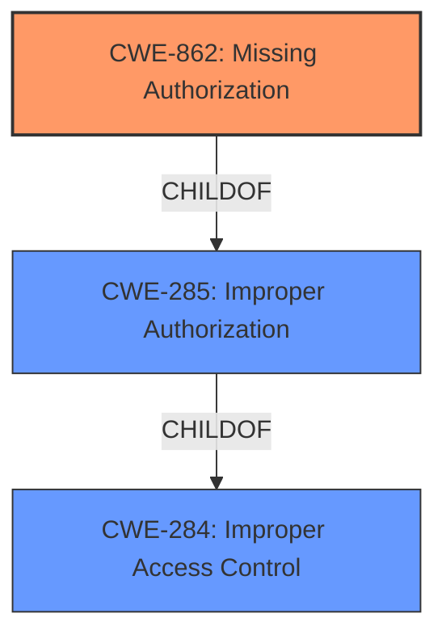

# Analysis Report for CVE-2021-34626

# Vulnerability Analysis Report: CVE-2021-34626

## Description


## Analysis (with Relationship Data)

# Summary
| CWE ID    | CWE Name                       | Confidence | CWE Abstraction Level | CWE Vulnerability Mapping Label | CWE-Vulnerability Mapping Notes |
| :-------- | :----------------------------- | :--------- | :-------------------- | :------------------------------ | :---------------------------- |
| CWE-862   | Missing Authorization          | 1.0        | Class                 | Primary                         | Allowed-with-Review           |

## Evidence and Confidence

*   **Confidence Score:** 1.0
*   **Evidence Strength:** HIGH

## Relationship Analysis
The primary CWE, CWE-862 [CWE-862: Missing Authorization], is a child of the broader CWE-284 [CWE-284: Improper Access Control]. This parent-child relationship guided the selection, ensuring that the chosen CWE was specific to the authorization aspect of access control. CWE-862 [CWE-862: Missing Authorization] is a class-level CWE, and the description indicates a **missing access control**, so a more specific base CWE could exist. However, given the provided information, CWE-862 [CWE-862: Missing Authorization] is the most accurate and well-supported classification.



## Vulnerability Chain
The vulnerability chain starts with the **missing authorization** check in the `deleteCustomType` function. This leads directly to low-level authenticated users being able to delete custom extensions.

## Summary of Analysis
The analysis is based on the provided vulnerability description and the CVE reference links content summary. The key phrase "Missing Access Control in deleteCustomType function" from the CVE summary directly supports the selection of CWE-862 [CWE-862: Missing Authorization]. The description states that low-level authenticated users can delete custom extensions added by administrators, which clearly indicates a **lack of proper authorization**.

The retriever results listed several potential CWEs, including CWE-434 [CWE-434: Unrestricted Upload of File with Dangerous Type], CWE-863 [CWE-863: Incorrect Authorization], and CWE-352 [CWE-352: Cross-Site Request Forgery (CSRF)]. However, these were not selected because the vulnerability is primarily about **missing authorization**, not file type restrictions, incorrect authorization logic, or cross-site request forgery. The most relevant CWE, based on the provided evidence, is CWE-862 [CWE-862: Missing Authorization].

The selected CWE is at the optimal level of specificity because it directly addresses the root cause of the vulnerability which is the **missing authorization** check.


## CWE Relationship Analysis

Current CWEs represent these abstraction levels: .


### Vulnerability Chain Analysis

**Chain starting from CWE-862:**
- 862 (Missing Authorization) - ROOT


**Chain starting from CWE-284:**
- 284 (Improper Access Control) - ROOT


### CWE Relationship Diagram

```mermaid
graph TD
    classDef primary fill:#f96,stroke:#333,stroke-width:2px
    classDef secondary fill:#69f,stroke:#333
    classDef tertiary fill:#9e9,stroke:#333
```


*Report generated on 2025-04-01 21:56:36*
