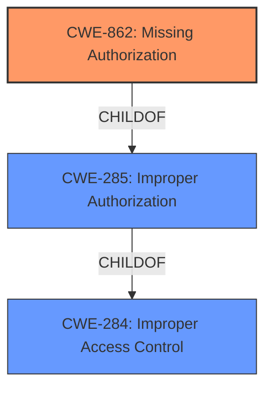

# Analysis Report for CVE-2021-34627

# Vulnerability Analysis Report: CVE-2021-34627

## Description


## Analysis (with Relationship Data)

# Summary

| CWE ID | CWE Name | Confidence | CWE Abstraction Level | CWE Vulnerability Mapping Label | CWE-Vulnerability Mapping Notes |
|---|---|---|---|---|---|
| **CWE-862** | **Missing Authorization** | 0.9 | Class | Primary | Allowed-with-Review |
| CWE-285 | Improper Authorization | 0.7 | Class | Secondary | Discouraged |
| CWE-284 | Improper Access Control | 0.6 | Pillar | Secondary | Discouraged |

## Evidence and Confidence

*   **Confidence Score:** 0.9
*   **Evidence Strength:** HIGH

## Relationship Analysis

The primary CWE selected is CWE-862 **[Missing Authorization]**, which is a child of the broader CWE-285 **[Improper Authorization]**, which in turn is a child of CWE-284 **[Improper Access Control]**. We chose CWE-862 because the vulnerability stems from the **lack of an authorization check** within the `getSelectedMimeTypesByRole` function, making it more specific than its parents.



## Vulnerability Chain

The chain of events is as follows:

1.  **ROOT CAUSE:** **Missing Authorization** in the `getSelectedMimeTypesByRole` function (CWE-862).
2.  **WEAKNESS:** Low-level authenticated users can access sensitive data.
3.  **IMPACT:** Information Disclosure (view custom extensions added by administrators).

## Summary of Analysis

The initial assessment pointed towards a clear **missing authorization** issue. The vulnerability description and CVE details confirm the **lack of access control** in the specified function, allowing unauthorized access to sensitive information.

Evidence: "The vulnerability stems from a **lack of access control** in the `getSelectedMimeTypesByRole` function within the "WP Upload Restriction" plugin"

The retriever results listed CWE-862 **[Missing Authorization]** as a candidate. The CVE Reference Links Content Summary states that there is insufficient access control in the `getSelectedMimeTypesByRole` function, which allows unauthenticated users to retrieve approved mime types for any given role.

The relationships influenced the selection by guiding towards the most specific CWE. While CWE-285 **[Improper Authorization]** and CWE-284 **[Improper Access Control]** are applicable, CWE-862 **[Missing Authorization]** directly addresses the **root cause** of the vulnerability.

The selected CWE is at the optimal level of specificity because it accurately reflects the **missing authorization check**, which is the core issue enabling unauthorized access.

Relevant CWE Information:
- CWE-862 **[Missing Authorization]**
- CWE-285 **[Improper Authorization]**
- CWE-284 **[Improper Access Control]**


## CWE Relationship Analysis

Current CWEs represent these abstraction levels: .


### Vulnerability Chain Analysis

**Chain starting from CWE-285:**
- 285 (Improper Authorization) - ROOT


**Chain starting from CWE-862:**
- 862 (Missing Authorization) - ROOT


### CWE Relationship Diagram

```mermaid
graph TD
    classDef primary fill:#f96,stroke:#333,stroke-width:2px
    classDef secondary fill:#69f,stroke:#333
    classDef tertiary fill:#9e9,stroke:#333
```


*Report generated on 2025-04-02 00:13:05*
