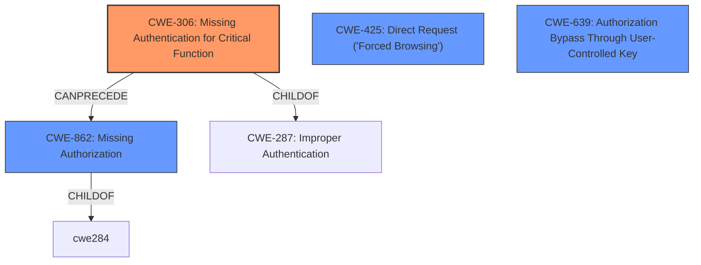

# Analysis Report for CVE-2021-34675

# Vulnerability Analysis Report: CVE-2021-34675

## Description


## Analysis (with Relationship Data)

# Summary
| CWE ID    | CWE Name                                                                        | Confidence | CWE Abstraction Level | CWE Vulnerability Mapping Label | CWE-Vulnerability Mapping Notes |
| --------- | ------------------------------------------------------------------------------- | ---------- | ----------------------- | ------------------------------- | ------------------------------- |
| CWE-306   | Missing Authentication for Critical Function                                    | 1          | Base                    | Primary                         | Allowed                       |
| CWE-862   | Missing Authorization                                                           | 0.8        | Class                   | Secondary                       | Allowed-with-Review           |
| CWE-425   | Direct Request ('Forced Browsing')                                              | 0.7        | Base                    | Secondary                       | Allowed                       |
| CWE-639   | Authorization Bypass Through User-Controlled Key                                | 0.6        | Base                    | Secondary                       | Allowed                       |

## Evidence and Confidence

*   **Confidence Score:** 0.9
*   **Evidence Strength:** HIGH

## Relationship Analysis

The primary relationship that impacts the CWE selection is that CWE-306 [Missing Authentication for Critical Function] can lead to CWE-862 [Missing Authorization], as the absence of authentication means that any authorization checks are effectively bypassed. CWE-306 is a child of CWE-287 [Improper Authentication]. CWE-862 is a class-level CWE and has more specific base-level children. CWE-425 [Direct Request] relates to accessing resources without proper authorization, and CWE-639 [Authorization Bypass Through User-Controlled Key] covers scenarios where user-controlled keys are used to bypass authorization. The mermaid diagram below illustrates these relationships.



## Vulnerability Chain

The vulnerability chain starts with the **lack of authentication** (CWE-306) for accessing stored PDF reports. This leads to **missing authorization** (CWE-862), allowing unauthenticated users to directly request and access these files, resulting in information disclosure. The report files being stored in a public directory exacerbates the issue.

## Summary of Analysis

The initial assessment focused on the **authentication bypass** for stored PDF reports in Basix NEX-Forms.

The "CVE Reference Links Content Summary" section provides sufficient evidence for the root cause, stating, "The root cause of this vulnerability lies in the **insufficient access controls** for PDF reports generated by the NEX-Forms WordPress plugin...The plugin stores generated PDF reports in the `/wp-content/uploads/` directory, which is a public directory accessible to anyone without authentication."

This statement directly supports the selection of CWE-306 [Missing Authentication for Critical Function] as the primary CWE, with high confidence. Storing the PDFs in a public directory and the **lack of authentication** are key indicators. The fix, "not storing the file in a public directory and instead delivering it as a server response upon request," further confirms this assessment.

CWE-862 [Missing Authorization] is considered a secondary CWE because while authorization is also missing, the root cause is the **lack of authentication** preceding it. Without authentication, any authorization mechanisms are irrelevant.

CWE-425 [Direct Request ('Forced Browsing')] and CWE-639 [Authorization Bypass Through User-Controlled Key] are also considered as they describe aspects of the vulnerability, but are less directly representative of the root cause than CWE-306.

The selected CWEs are at the optimal level of specificity, with CWE-306 being a Base-level CWE and accurately representing the **lack of authentication**. While CWE-862 [Missing Authorization] is a Class, the evidence strongly supports CWE-306 as the primary issue.

The other CWEs considered but not used include:

*   CWE-1392 [Use of Default Credentials]: Not applicable as the issue isn't about default credentials but a **complete lack of authentication**.
*   CWE-434 [Unrestricted Upload of File with Dangerous Type]: Irrelevant as the vulnerability is not about uploading files but about accessing existing report files.
*   CWE-522 [Insufficiently Protected Credentials]: Not relevant since the vulnerability is not about transmitting or storing credentials insecurely, but rather a **lack of authentication**.
*   CWE-289 [Authentication Bypass by Alternate Name]: Does not apply because there is no alternate name being used to bypass authentication, authentication is simply missing.
*   CWE-73 [External Control of File Name or Path]: Not applicable as the attacker is not controlling the file path, but rather accessing a known public file path.
*   CWE-291 [Reliance on IP Address for Authentication]: Irrelevant as IP addresses are not involved in the authentication process.
*   CWE-352 [Cross-Site Request Forgery (CSRF)]: Not applicable as the issue isn't about forging requests but about accessing files without authentication.
*   CWE-41 [Improper Resolution of Path Equivalence]: Does not apply as the issue is not related to path equivalence.
*   CWE-472 [External Control of Assumed-Immutable Web Parameter]: Does not apply as the issue is not related to externally controlled immutable parameters.
*   CWE-799 [Improper Control of Interaction Frequency]: Does not apply as the issue is not related to interaction frequency.
*   CWE-807 [Reliance on Untrusted Inputs in a Security Decision]: Does not apply as the issue is not related to untrusted inputs.
*   CWE-74 [Improper Neutralization of Special Elements in Output Used by a Downstream Component ('Injection')]: Does not apply as the issue is not related to injection.
*   CWE-610 [Externally Controlled Reference to a Resource in Another Sphere]: Does not apply as the issue is not related to externally controlled references.
*   CWE-113 [Improper Neutralization of CRLF Sequences in HTTP Headers ('HTTP Request/Response Splitting')]: Does not apply as the issue is not related to CRLF injection.
*   CWE-1289 [Improper Validation of Unsafe Equivalence in Input]: Does not apply as the issue is not related to unsafe equivalence.
*   CWE-184 [Incomplete List of Disallowed Inputs]: Does not apply as the issue is not related to disallowed inputs.
*   CWE-183 [Permissive List of Allowed Inputs]: Does not apply as the issue is not related to allowed inputs.
*   CWE-613 [Insufficient Session Expiration]: Does not apply as the issue is not related to session expiration.
*   CWE-59 [Improper Link Resolution Before File Access ('Link Following')]: Does not apply as the issue is not related to link following.
*   CWE-430 [Deployment of Wrong Handler]: Does not apply as the issue is not related to wrong handler.
*   CWE-471 [Modification of Assumed-Immutable Data (MAID)]: Does not apply as the issue is not related to immutable data modification.
*   CWE-98 [Improper Control of Filename for Include/Require Statement in PHP Program ('PHP Remote File Inclusion')]: Does not apply as the issue is not related to PHP remote file inclusion.
*   CWE-351 [Insufficient Type Distinction]: Does not apply as the issue is not related to type distinction.


## CWE Relationship Analysis

Current CWEs represent these abstraction levels: .


### Vulnerability Chain Analysis

**Chain starting from CWE-862:**
- 862 (Missing Authorization) - ROOT


**Chain starting from CWE-434:**
- 434 (Unrestricted Upload of File with Dangerous Type) - ROOT


### CWE Relationship Diagram

```mermaid
graph TD
    classDef primary fill:#f96,stroke:#333,stroke-width:2px
    classDef secondary fill:#69f,stroke:#333
    classDef tertiary fill:#9e9,stroke:#333
```


*Report generated on 2025-04-01 17:46:48*
