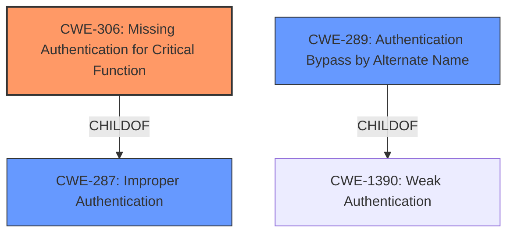

# Analysis for CVE-2021-34676

# Summary
| CWE ID | CWE Name | Confidence | CWE Abstraction Level | CWE Vulnerability Mapping Label | CWE-Vulnerability Mapping Notes |
|---|---|---|---|---|---|
| CWE-306 | Missing Authentication for Critical Function | 1.0 | Base | Allowed | Primary CWE |
| CWE-289 | Authentication Bypass by Alternate Name | 0.7 | Base | Allowed | Secondary Candidate |

## Evidence and Confidence

*   **Confidence Score:** 0.9
*   **Evidence Strength:** HIGH

## Relationship Analysis
The primary CWE is CWE-306, which is a base-level CWE indicating a **missing authentication** issue. CWE-306 is a child of CWE-287, Improper Authentication, which is a class-level CWE. CWE-289, Authentication Bypass by Alternate Name, is also considered, and it is a child of CWE-1390, Weak Authentication. The relationship analysis indicates that the vulnerability is best represented by the most specific base-level CWE available.

## Vulnerability Chain
The chain of events is as follows:
1.  **Root Cause:** **Missing authentication** check for accessing exported Excel reports.
2.  **Weakness:** Unauthenticated users can access the reports via a specific GET parameter.
3.  **Impact:** Information disclosure of sensitive data contained within the reports.

## Summary of Analysis
The initial analysis and resulting conclusion are based on the provided evidence, primarily the "CVE Reference Links Content Summary". The vulnerability description clearly states that there is **missing access control checks** in the `export_csv` plugin handler, allowing unauthenticated users to access exported Excel reports. This aligns directly with the description of CWE-306, Missing Authentication for Critical Function.

The "CVE Reference Links Content Summary" states:
- **Root Cause:** Missing access control checks in the `export_csv` plugin handler of the NEX-Forms WordPress plugin. The plugin fails to verify if the user is authenticated before allowing access to exported Excel reports.
- **Weaknesses/Vulnerabilities:** Authentication Bypass: Unauthenticated users can access exported Excel reports by sending a request with the `export_csv` GET parameter set to `true`. No prior authentication is required for the request to be successful.

The graph relationships influenced the final selection by providing context on the hierarchical structure of the CWEs. CWE-306 is a child of CWE-287, making it a more specific and appropriate choice than the more general CWE-287.

The selected CWEs are at the optimal level of specificity because CWE-306 directly describes the **missing authentication** issue, while CWE-289 can be considered as a secondary factor as the access happens through an alternate means (the `export_csv` parameter).

Relevant CWE Information:

# Enhanced Context (25 CWEs)
The following CWEs were identified as potentially relevant to this vulnerability:

## CWE-776: Improper Restriction of Recursive Entity References in DTDs ('XML Entity Expansion')
**Abstraction Level**: Base
**Similarity Score**: 0.80

## CWE-611: Improper Restriction of XML External Entity Reference
**Abstraction Level**: Base
**Similarity Score**: 0.79

## CWE-74: Improper Neutralization of Special Elements in Output Used by a Downstream Component ('Injection')
**Abstraction Level**: Class
**Similarity Score**: 0.75

## CWE-41: Improper Resolution of Path Equivalence
**Abstraction Level**: Base
**Similarity Score**: 0.75

## CWE-668: Exposure of Resource to Wrong Sphere
**Abstraction Level**: Class
**Similarity Score**: 0.74

## CWE-1289: Improper Validation of Unsafe Equivalence in Input
**Abstraction Level**: Base
**Similarity Score**: 0.74

## CWE-472: External Control of Assumed-Immutable Web Parameter
**Abstraction Level**: Base
**Similarity Score**: 0.74

## CWE-23: Relative Path Traversal
**Abstraction Level**: Base
**Similarity Score**: 0.74

## CWE-610: Externally Controlled Reference to a Resource in Another Sphere
**Abstraction Level**: Class
**Similarity Score**: 0.74

## CWE-138: Improper Neutralization of Special Elements
**Abstraction Level**: Class
**Similarity Score**: 0.74

## CWE-1336: Improper Neutralization of Special Elements Used in a Template Engine
**Abstraction Level**: Base
**Similarity Score**: 4853.48

## CWE-472: External Control of Assumed-Immutable Web Parameter
**Abstraction Level**: Base
**Similarity Score**: 4799.74

## CWE-1236: Improper Neutralization of Formula Elements in a CSV File
**Abstraction Level**: Base
**Similarity Score**: 4663.43

## CWE-306: Missing Authentication for Critical Function
**Abstraction Level**: Base
**Similarity Score**: 4617.69

## CWE-863: Incorrect Authorization
**Abstraction Level**: Class
**Similarity Score**: 4611.79

## CWE-613: Insufficient Session Expiration
**Abstraction Level**: base
**Similarity Score**: 4.33

## CWE-79: Improper Neutralization of Input During Web Page Generation ('Cross-site Scripting')
**Abstraction Level**: base
**Similarity Score**: 3.72

## CWE-1336: Improper Neutralization of Special Elements Used in a Template Engine
**Abstraction Level**: base
**Similarity Score**: 3.64

## CWE-471: Modification of Assumed-Immutable Data (MAID)
**Abstraction Level**: base
**Similarity Score**: 3.49

## CWE-94: Improper Control of Generation of Code ('Code Injection')
**Abstraction Level**: base
**Similarity Score**: 3.14

## CWE-1282: Assumed-Immutable Data is Stored in Writable Memory
**Abstraction Level**: base
**Similarity Score**: 2.87

## CWE-494: Download of Code Without Integrity Check
**Abstraction Level**: base
**Similarity Score**: 2.87

## CWE-425: Direct Request ('Forced Browsing')
**Abstraction Level**: base
**Similarity Score**: 2.73

## CWE-178: Improper Handling of Case Sensitivity
**Abstraction Level**: base
**Similarity Score**: 2.70

## CWE-942: Permissive Cross-domain Policy with Untrusted Domains
**Abstraction Level**: variant
**Similarity Score**: 2.68

### CWE Considerations

*   **CWE-287: Improper Authentication**: While related, this is a higher-level class. CWE-306 is more specific because it highlights the **absence** of authentication rather than a flawed implementation. The usage notes for CWE-287 also suggest considering CWE-306 as an alternative.
*   **CWE-289: Authentication Bypass by Alternate Name**: This is considered as a secondary weakness because the vulnerability allows access through a specific parameter (`export_csv`), effectively bypassing the intended authentication mechanism.
*   **CWE-613: Insufficient Session Expiration**: This CWE is not directly relevant because the vulnerability does not involve session management issues but rather a complete lack of authentication for the critical function.
*   **CWE-1336: Improper Neutralization of Special Elements Used in a Template Engine**: This CWE is not relevant as the vulnerability is not related to template engine injection.
*   **CWE-472: External Control of Assumed-Immutable Web Parameter**: This CWE is not the primary issue, although the `export_csv` parameter is being externally controlled. The main issue is the **lack of authentication** to control who is allowed to set this parameter.