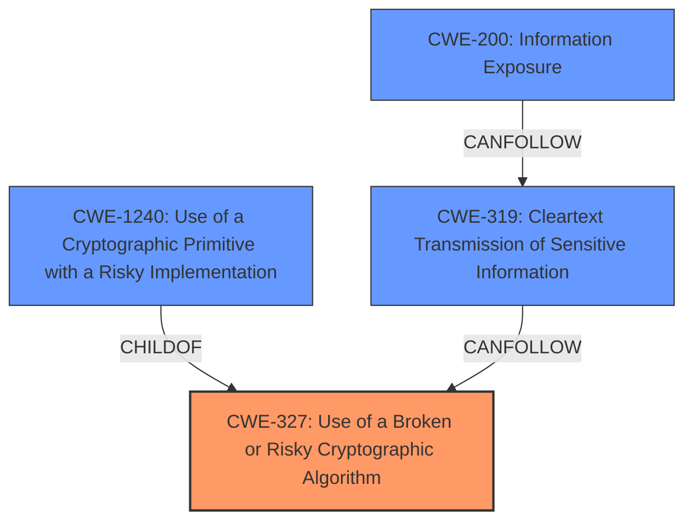

# Analysis Report for CVE-2021-34687

# Vulnerability Analysis Report: CVE-2021-34687

## Description


## Analysis (with Relationship Data)

# Summary
| CWE ID  | CWE Name                                                        | Confidence | CWE Abstraction Level | CWE Vulnerability Mapping Label | CWE-Vulnerability Mapping Notes |
| ------- | --------------------------------------------------------------- | ---------- | --------------------- | ------------------------------- | ------------------------------- |
| CWE-327 | Use of a Broken or Risky Cryptographic Algorithm | 0.9  | Class                 | Primary                         | Allowed-with-Review              |
| CWE-1240 | Use of a Cryptographic Primitive with a Risky Implementation                                                         | 0.8  | Base                  | Secondary                       | Allowed              |
| CWE-319 | Cleartext Transmission of Sensitive Information | 0.7  | Base                  | Secondary                       | Allowed              |
| CWE-200 | Information Exposure          | 0.6  | Class                  | Secondary                       | Generic              |

## Evidence and Confidence

*   **Confidence Score:** 0.8
*   **Evidence Strength:** HIGH

## Relationship Analysis
The primary CWE is CWE-327, which is a Class-level CWE. CWE-1240 is a child of CWE-327 and more specific, representing the use of a risky cryptographic implementation. CWE-319 represents the cleartext transmission of sensitive information, which is a consequence of using a weak cipher. CWE-200 is a very general information exposure weakness and is a downstream effect.



## Vulnerability Chain
The vulnerability chain starts with the **root cause**, a **Personal Key encrypted with substitution cipher only**. This leads to **CWE-327 Use of a Broken or Risky Cryptographic Algorithm** and **CWE-1240 Use of a Cryptographic Primitive with a Risky Implementation**. Because the key is weakly encrypted, it is effectively transmitted in the clear (**CWE-319 Cleartext Transmission of Sensitive Information**), leading to the **impact** of **information disclosure** (**CWE-200 Information Exposure**).

## Summary of Analysis
Initially, the analysis focused on identifying the most specific CWE that captures the root cause of the vulnerability. The vulnerability description and CVE details clearly indicate that the **Personal Key is encrypted with substitution cipher only**, which is the **rootcause**. The Retriever Results suggested CWE-1240 (Use of a Cryptographic Primitive with a Risky Implementation), CWE-321 (Use of Hard-coded Cryptographic Key), and CWE-319 (Cleartext Transmission of Sensitive Information). However, after further analysis and relationship considerations, CWE-327 (Use of a Broken or Risky Cryptographic Algorithm) was determined to be a more appropriate primary CWE, with CWE-1240 as a related weakness.

The final decision is based on the following evidence:

*   **Vulnerability Description Key Phrases:** "**rootcause:** **Personal Key encrypted with substitution cipher only**"
*   **CVE Reference Links Content Summary:** "The Personal Key is only lightly, and reversibly, obfuscated before being transmitted over the network during a LAN connection attempt."

CWE-327 is at the Class level, but it encompasses the overall issue of using weak cryptography. CWE-1240 is a child of CWE-327 and represents the specific implementation detail of using a risky cryptographic implementation (the substitution cipher). CWE-319 captures the fact that the sensitive information is transmitted in a way that can be easily intercepted due to the weak encryption. CWE-200 is the general impact of the vulnerability.

Relevant CWE Information:

# Enhanced Context (25 CWEs)

## CWE-1240: Use of a Cryptographic Primitive with a Risky Implementation
**Abstraction Level**: Base
**Similarity Score**: 0.83
**Source**: dense

**Description**:
To fulfill the need for a cryptographic primitive, the product implements a cryptographic algorithm using a non-standard, unproven, or disallowed/non-compliant cryptographic implementation.

**Mapping Guidance**:
- Usage: Allowed
- Rationale: This CWE entry is at the Base level of abstraction, which is a preferred level of abstraction for mapping to the root causes of vulnerabilities.

## CWE-321: Use of Hard-coded Cryptographic Key
**Abstraction Level**: Variant
**Similarity Score**: 0.76
**Source**: dense

**Description**:
The use of a hard-coded cryptographic key significantly increases the possibility that encrypted data may be recovered.

**Mapping Guidance**:
- Usage: Allowed
- Rationale: This CWE entry is at the Variant level of abstraction, which is a preferred level of abstraction for mapping to the root causes of vulnerabilities.

## CWE-319: Cleartext Transmission of Sensitive Information
**Abstraction Level**: Base
**Similarity Score**: 0.77
**Source**: dense

**Description**:
The product transmits sensitive or security-critical data in cleartext in a communication channel that can be sniffed by unauthorized actors.

**Mapping Guidance**:
- Usage: Allowed
- Rationale: This CWE entry is at the Base level of abstraction, which is a preferred level of abstraction for mapping to the root causes of vulnerabilities.

## CWE-327: Use of a Broken or Risky Cryptographic Algorithm
**Abstraction Level**: Class
**Similarity Score**: 0.76
**Source**: dense

**Description**:
The product uses a broken or risky cryptographic algorithm or protocol.

**Mapping Guidance**:
- Usage: Allowed-with-Review
- Rationale: This CWE entry is a Class and might have Base-level children that would be more appropriate


## CWE Relationship Analysis

Current CWEs represent these abstraction levels: .


### Vulnerability Chain Analysis

**Chain starting from CWE-200:**
- 200 (Exposure of Sensitive Information to an Unauthorized Actor) - ROOT


**Chain starting from CWE-319:**
- 319 (Cleartext Transmission of Sensitive Information) - ROOT


### CWE Relationship Diagram

```mermaid
graph TD
    classDef primary fill:#f96,stroke:#333,stroke-width:2px
    classDef secondary fill:#69f,stroke:#333
    classDef tertiary fill:#9e9,stroke:#333
```


*Report generated on 2025-04-02 12:54:21*
