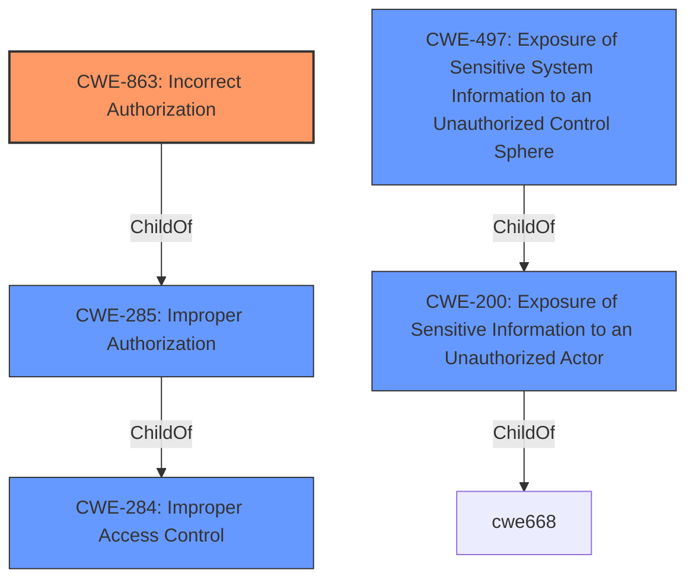

# Raw Analyzer Response for CVE-2021-34702

# Summary
| CWE ID | CWE Name | Confidence | CWE Abstraction Level | CWE Vulnerability Mapping Label | CWE-Vulnerability Mapping Notes |
|---|---|---|---|---|---|
| CWE-863 | Incorrect Authorization | 1.0 | Class | Primary | Allowed-with-Review |
| CWE-200 | Exposure of Sensitive Information to an Unauthorized Actor | 0.7 | Class | Secondary | Discouraged |
| CWE-497 | Exposure of Sensitive System Information to an Unauthorized Control Sphere | 0.6 | Base | Secondary | Allowed |

## Evidence and Confidence

*   **Confidence Score:** 0.8
*   **Evidence Strength:** HIGH

## Relationship Analysis
The primary relationship influencing the selection is the hierarchical relationship between CWE-863 (Incorrect Authorization) and its parent CWE-285 (Improper Authorization) and CWE-284 (Improper Access Control). While CWE-285 and CWE-284 are too abstract, CWE-863 represents the specific error in the authorization check. CWE-200 (Exposure of Sensitive Information) is also related but represents the impact rather than the root cause. CWE-497 is a more specific type of information exposure, which could be considered.

## Vulnerability Chain
The vulnerability chain starts with the **improper enforcement of administrator privilege levels** (CWE-863), which leads to low-value sensitive data being accessible to unauthorized actors. This, in turn, results in the exposure of sensitive information (CWE-200) regarding the system's configuration, potentially enabling further attacks.

## Summary of Analysis
The initial analysis identified CWE-863 as the primary candidate due to the **improper enforcement of administrator privilege levels** being the root cause. The "CVE Reference Links Content Summary" section confirms this by stating "The vulnerability stems from the improper enforcement of administrator privilege levels."

The "Retriever Results" also list CWE-863 as a potential match, reinforcing this choice. While CWE-200 is listed as the CWE in the CVE details, it is considered an impact rather than the root cause according to CWE guidance. CWE-497 is a potential candidate as it describes exposure of system information and is more specific than CWE-200.

The final decision is based on prioritizing the root cause (authorization) over the impact (information exposure) and selecting the most specific CWE that matches the identified weakness.

Relevant CWE Information:

# Enhanced Context (25 CWEs)

## CWE-497: Exposure of Sensitive System Information to an Unauthorized Control Sphere
**Abstraction Level**: Base
**Similarity Score**: 0.78
**Source**: dense

**Description**:
The product does not properly prevent sensitive system-level information from being accessed by unauthorized actors who do not have the same level of access to the underlying system as the product does.

**Mapping Guidance**:
- Usage: Allowed
- Rationale: This CWE entry is at the Base level of abstraction, which is a preferred level of abstraction for mapping to the root causes of vulnerabilities.

## CWE-863: Incorrect Authorization
**Abstraction Level:** Class
**Similarity Score**: 8641.79
**Source**: sparse

**Description**:
The product performs an authorization check when an actor attempts to access a resource or perform an action, but it does not correctly perform the check.

**Mapping Guidance**:
- Usage: Allowed-with-Review
- Rationale: This CWE entry is a Class and might have Base-level children that would be more appropriate

## CWE-200: Exposure of Sensitive Information to an Unauthorized Actor
**Abstraction Level:** Class
**Similarity Score**: 8508.17
**Source**: sparse

**Description**:
The product exposes sensitive information to an actor that is not explicitly authorized to have access to that information.

**Mapping Guidance**:
- Usage: Discouraged
- Rationale: CWE-200 is commonly misused to represent the loss of confidentiality in a vulnerability, but confidentiality loss is a technical impact - not a root cause error. As of CWE 4.9, over 400 CWE entries can lead to a loss of confidentiality. Other options are often available. [REF-1287].

### CWE Selection Details:

*   **CWE-863: Incorrect Authorization**
    *   **Match:** The vulnerability description explicitly states "**improper enforcement of administrator privilege levels**," which aligns with the definition of incorrect authorization. The vulnerability allows read-only administrators to access sensitive data that they should not have access to.
    *   **Security Implications:** This weakness can lead to unauthorized access to sensitive information, potentially allowing attackers to gather configuration data and plan further attacks.
    *   **Relationships:** CWE-863 is a child of CWE-285 (Improper Authorization) and CWE-284 (Improper Access Control), but it's more specific than its parents and represents the core issue.
    *   **Mapping Guidance:** The usage is "Allowed-with-Review" because it's a Class, but no more specific child entries are available.
    *   **Confidence:** 1.0
*   **CWE-200: Exposure of Sensitive Information to an Unauthorized Actor**
    *   **Match:** The vulnerability results in an attacker being able to "obtain sensitive information regarding the configuration of the system."
    *   **Security Implications:** This weakness leads to the exposure of sensitive data, which can be used to compromise the system.
    *   **Relationships:** CWE-200 is a child of CWE-668 (Exposure of Resource to Wrong Sphere) and is a general class of weakness.
    *   **Mapping Guidance:** The usage is "Discouraged" because it represents the impact and not the root cause.
    *   **Confidence:** 0.7
*   **CWE-497: Exposure of Sensitive System Information to an Unauthorized Control Sphere**
    *   **Match:** This CWE is more specific than CWE-200, focusing on the exposure of system-level information.
    *   **Security Implications:** Similar to CWE-200, this can allow attackers to learn about the system and plan attacks.
    *   **Relationships:** CWE-497 is a child of CWE-200.
    *   **Mapping Guidance:** The usage is "Allowed" and is at the Base level of abstraction.
    *   **Confidence:** 0.6

### CWEs Considered But Not Used:

*   CWE-285: Improper Authorization, CWE-284: Improper Access Control, CWE-269: Improper Privilege Management - These are higher-level classes that are less specific than CWE-863.
*   CWE-306: Missing Authentication for Critical Function - Authentication is present, but authorization is incorrect.
*   CWE-425: Direct Request ('Forced Browsing') - Not applicable as the vulnerability is not about bypassing navigation paths.
*   CWE-22: Improper Limitation of a Pathname to a Restricted Directory ('Path Traversal') - Not related to path manipulation.
*   CWE-73: External Control of File Name or Path - Not related to file path control.
*   CWE-20: Improper Input Validation - The core issue is not input validation, but incorrect authorization.
*   CWE-770: Allocation of Resources Without Limits or Throttling, CWE-190: Integer Overflow or Wraparound, CWE-184: Incomplete List of Disallowed Inputs, CWE-471: Modification of Assumed-Immutable Data (MAID), CWE-201: Insertion of Sensitive Information Into Sent Data, CWE-178: Improper Handling of Case Sensitivity, CWE-98: Improper Control of Filename for Include/Require Statement in PHP Program ('PHP Remote File Inclusion') - These CWEs are not related to the vulnerability description.
*   CWE-538: Insertion of Sensitive Information into Externally-Accessible File or Directory, CWE-807: Reliance on Untrusted Inputs in a Security Decision, CWE-668: Exposure of Resource to Wrong Sphere, CWE-226: Sensitive