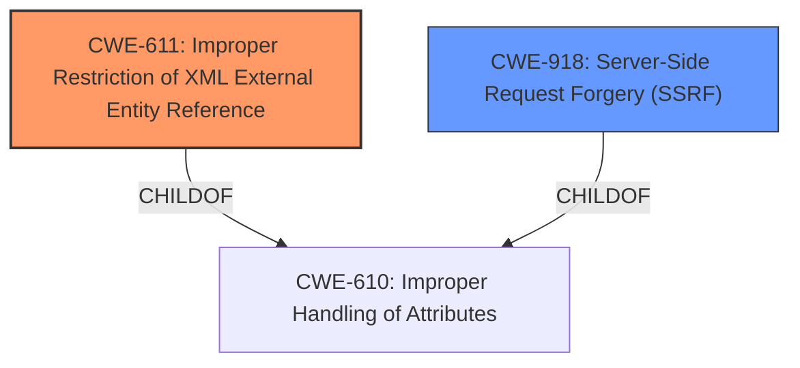

# Enhanced Analysis for CVE-2021-34706

# Summary
| CWE ID | CWE Name | Confidence | CWE Abstraction Level | CWE Vulnerability Mapping Label | CWE-Vulnerability Mapping Notes |
|---|---|---|---|---|---|
| CWE-611 | Improper Restriction of XML External Entity Reference | 1.0 | Base | Allowed | Primary CWE |
| CWE-918 | Server-Side Request Forgery (SSRF) | 0.9 | Base | Allowed | Secondary Candidate |

## Evidence and Confidence

*   **Confidence Score:** 0.95
*   **Evidence Strength:** HIGH

## Relationship Analysis
The primary CWE is CWE-611 (Improper Restriction of XML External Entity Reference), which is a Base level CWE. CWE-611 is related to CWE-918 (Server-Side Request Forgery) as both can lead to outbound requests to unexpected destinations. However, XXE can be client-side, while SSRF is server-side. The vulnerability description indicates that a crafted XML file could cause the web application to perform arbitrary HTTP requests, suggesting the possibility of SSRF. Therefore, CWE-918 is a secondary candidate due to the potential for the XXE to be leveraged into a SSRF.



## Vulnerability Chain
The vulnerability chain starts with the **improper handling of XML External Entity (XXE)** entries (CWE-611) when parsing XML files. This leads to the possibility of retrieving local files and disclosure of sensitive information. Furthermore, the XXE can be exploited to make the web application perform arbitrary HTTP requests, leading to a Server-Side Request Forgery (SSRF) attack (CWE-918).

## Summary of Analysis
The primary weakness is the **improper handling of XML External Entity (XXE)** entries, which directly matches CWE-611. The vulnerability description states, "This vulnerability is due to **improper handling of XML External Entity (XXE)** entries when parsing certain XML files." The CVE Reference Links Content Summary confirms this, stating, "The vulnerability is due to **improper handling of XML External Entity (XXE)** entries when parsing certain XML files." This aligns with the description of CWE-611, which states, "The product processes an XML document that can contain XML entities with URIs that resolve to documents outside of the intended sphere of control, causing the product to embed incorrect documents into its output."

The potential for SSRF is also present, as the vulnerability description mentions, "A successful exploit could allow the attacker to retrieve files from the local system, resulting in the disclosure of sensitive information, or cause the web application to perform arbitrary HTTP requests on behalf of the attacker." This aligns with CWE-918, which states, "The web server receives a URL or similar request from an upstream component and retrieves the contents of this URL, but it does not sufficiently ensure that the request is being sent to the expected destination."

CWE-20 (Improper Input Validation) and CWE-138 (Improper Neutralization of Special Elements) were considered but deemed less specific than CWE-611. While input validation is a general concern, the specific weakness lies in the **improper handling of XXE**. Similarly, while neutralization of special elements is relevant, CWE-611 captures the specific type of special element (**XML External Entities**) that is not being handled correctly. The retriever results listed many CWEs but the presence of **XXE** in the vulnerability title makes it obvious that CWE-611 is the best fit and the retriever result confirm this.

The selection of CWE-611 as the primary CWE and CWE-918 as a secondary candidate is based on the evidence provided in the vulnerability description and the CVE Reference Links Content Summary. The abstraction level of Base for both CWEs is appropriate, as they represent the specific root causes of the vulnerability.


## CWE Relationship Analysis

Current CWEs represent these abstraction levels: .


### Vulnerability Chain Analysis

**Chain starting from CWE-138:**
- 138 (Improper Neutralization of Special Elements) - ROOT


**Chain starting from CWE-918:**
- 918 (Server-Side Request Forgery (SSRF)) - ROOT


### CWE Relationship Diagram

```mermaid
graph TD
    classDef primary fill:#f96,stroke:#333,stroke-width:2px
    classDef secondary fill:#69f,stroke:#333
    classDef tertiary fill:#9e9,stroke:#333
```