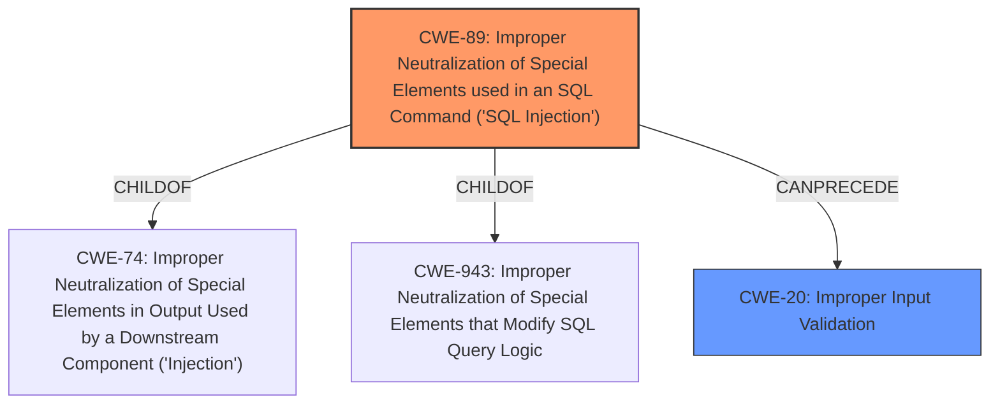

# Analysis for CVE-2021-34712

# Summary
| CWE ID | CWE Name | Confidence | CWE Abstraction Level | CWE Vulnerability Mapping Label | CWE-Vulnerability Mapping Notes |
|---|---|---|---|---|---|
| CWE-89 | Improper Neutralization of Special Elements used in an SQL Command ('SQL Injection') | 1 | Base | Primary | Allowed |
| CWE-20 | Improper Input Validation | 0.7 | Class | Secondary | Discouraged |

## Evidence and Confidence

*   **Confidence Score:** 0.9
*   **Evidence Strength:** HIGH

## Relationship Analysis
The primary CWE, CWE-89, is a base-level CWE that accurately reflects the SQL injection vulnerability. It is a child of CWE-74 (Improper Neutralization of Special Elements in Output Used by a Downstream Component ('Injection')) and CWE-943 (Improper Neutralization of Special Elements that Modify SQL Query Logic). The secondary CWE, CWE-20, is a class-level CWE representing improper input validation, which is a broader category. While input validation is the root cause, the more specific CWE-89 is preferred.

## Vulnerability Chain
The vulnerability chain starts with **insufficient input validation** (CWE-20), which leads to the possibility of **SQL injection** (CWE-89). The impact of successful exploitation is the ability to obtain sensitive information.

## Summary of Analysis
The initial analysis pointed towards CWE-89 (SQL Injection) due to the presence of "cypher query language injection attacks." The vulnerability description highlights the **insufficient input validation** as the root cause. The "CVE Reference Links Content Summary" confirms these findings, emphasizing the **root cause** as **insufficient input validation** and the presence of a Cypher Query Language Injection **weakness**.

CWE-20 was considered as a potential primary mapping due to the **insufficient input validation**. However, the presence of SQL injection makes CWE-89 a more specific and appropriate choice. CWE-20 is kept as a secondary mapping, acknowledging that the root cause is a lack of proper input validation.

The selection of CWE-89 is based on its direct relevance to SQL injection, as evidenced by the vulnerability description and confirmed by the "CVE Reference Links Content Summary." While CWE-20 (Improper Input Validation) is a relevant contributing factor, CWE-89 provides a more precise classification of the vulnerability. The evidence strongly supports the identification of an SQL injection vulnerability due to the **insufficient input validation**.

Relevant CWE Information:

# Enhanced Context (25 CWEs)

## CWE-807: Reliance on Untrusted Inputs in a Security Decision
**Abstraction Level**: Base
**Similarity Score**: 0.76
**Source**: dense
This CWE was not selected because it is not the primary issue. The primary issue is the SQL injection.

## CWE-1289: Improper Validation of Unsafe Equivalence in Input
**Abstraction Level**: Base
**Similarity Score**: 0.76
**Source**: dense
This CWE was not selected because it is not the primary issue. The primary issue is the SQL injection.

## CWE-653: Improper Isolation or Compartmentalization
**Abstraction Level**: Class
**Similarity Score**: 0.76
**Source**: dense
This CWE was not selected because it is not the primary issue. The primary issue is the SQL injection.

## CWE-74: Improper Neutralization of Special Elements in Output Used by a Downstream Component ('Injection')
**Abstraction Level**: Class
**Similarity Score**: 0.75
**Source**: dense
This CWE was not selected because it is more general than CWE-89.

## CWE-274: Improper Handling of Insufficient Privileges
**Abstraction Level**: Base
**Similarity Score**: 0.75
**Source**: dense
This CWE was not selected because it is not the primary issue. The primary issue is the SQL injection.

## CWE-184: Incomplete List of Disallowed Inputs
**Abstraction Level**: Base
**Similarity Score**: 0.75
**Source**: dense
This CWE was not selected because it is not the primary issue. The primary issue is the SQL injection.

## CWE-691: Insufficient Control Flow Management
**Abstraction Level**: Pillar
**Similarity Score**: 0.75
**Source**: dense
This CWE was not selected because it is not the primary issue. The primary issue is the SQL injection.

## CWE-183: Permissive List of Allowed Inputs
**Abstraction Level**: Base
**Similarity Score**: 0.75
**Source**: dense
This CWE was not selected because it is not the primary issue. The primary issue is the SQL injection.

## CWE-280: Improper Handling of Insufficient Permissions or Privileges
**Abstraction Level**: Base
**Similarity Score**: 0.74
**Source**: dense
This CWE was not selected because it is not the primary issue. The primary issue is the SQL injection.

## CWE-1220: Insufficient Granularity of Access Control
**Abstraction Level**: Base
**Similarity Score**: 0.74
**Source**: dense
This CWE was not selected because it is not the primary issue. The primary issue is the SQL injection.

## CWE-119: Improper Restriction of Operations within the Bounds of a Memory Buffer
**Abstraction Level**: Class
**Similarity Score**: 8463.66
**Source**: sparse
This CWE was not selected because it is not the primary issue. The primary issue is the SQL injection.

## CWE-22: Improper Limitation of a Pathname to a Restricted Directory ('Path Traversal')
**Abstraction Level**: Base
**Similarity Score**: 8437.36
**Source**: sparse
This CWE was not selected because it is not the primary issue. The primary issue is the SQL injection.

## CWE-116: Improper Encoding or Escaping of Output
**Abstraction Level**: Class
**Similarity Score**: 8273.62
**Source**: sparse
This CWE was not selected because it is not the primary issue. The primary issue is the SQL injection.

## CWE-125: Out-of-bounds Read
**Abstraction Level**: Base
**Similarity Score**: 8271.21
**Source**: sparse
This CWE was not selected because it is not the primary issue. The primary issue is the SQL injection.

## CWE-1284: Improper Validation of Specified Quantity in Input
**Abstraction Level**: Base
**Similarity Score**: 8266.79
**Source**: sparse
This CWE was not selected because it is not the primary issue. The primary issue is the SQL injection.

## CWE-78: Improper Neutralization of Special Elements used in an OS Command ('OS Command Injection')
**Abstraction Level**: base
**Similarity Score**: 4.59
**Source**: graph
This CWE was not selected because it is not the primary issue. The primary issue is the SQL injection.

## CWE-120: Buffer Copy without Checking Size of Input ('Classic Buffer Overflow')
**Abstraction Level**: base
**Similarity Score**: 4.33
**Source**: graph
This CWE was not selected because it is not the primary issue. The primary issue is the SQL injection.

## CWE-73: External Control of File Name or Path
**Abstraction Level**: base
**Similarity Score**: 4.33
**Source**: graph
This CWE was not selected because it is not the primary issue. The primary issue is the SQL injection.

## CWE-123: Write-what-where Condition
**Abstraction Level**: base
**Similarity Score**: 4.33
**Source**: graph
This CWE was not selected because it is not the primary issue. The primary issue is the SQL injection.

## CWE-770: Allocation of Resources Without Limits or Throttling
**Abstraction Level**: base
**Similarity Score**: 4.33
**Source**: graph
This CWE was not selected because it is not the primary issue. The primary issue is the SQL injection.

## CWE-22: Improper Limitation of a Pathname to a Restricted Directory ('Path Traversal')
**Abstraction Level**: base
**Similarity Score**: 4.33
**Source**: graph
This CWE was not selected because it is not the primary issue. The primary issue is the SQL injection.

## CWE-190: Integer Overflow or Wraparound
**Abstraction