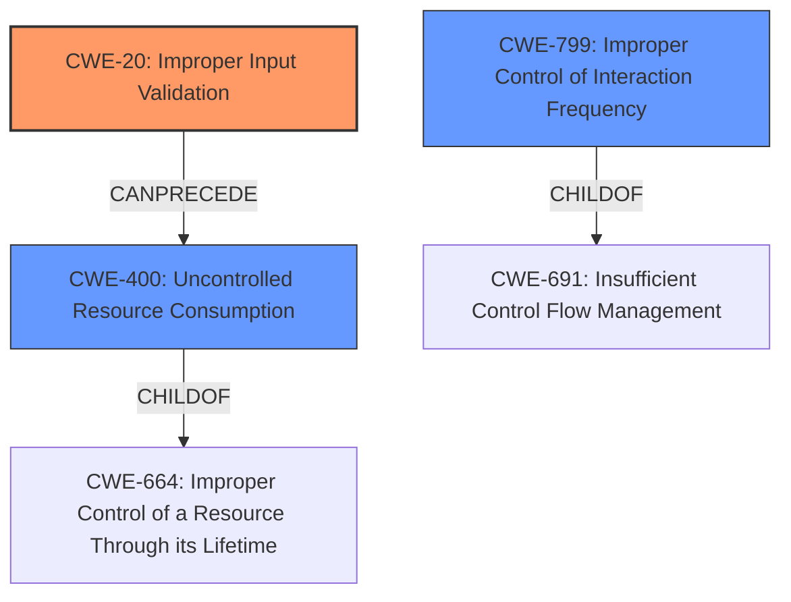

# Analysis for CVE-2021-34714

# Summary
| CWE ID | CWE Name | Confidence | CWE Abstraction Level | CWE Vulnerability Mapping Label | CWE-Vulnerability Mapping Notes |
|---|---|---|---|---|---|
| CWE-20 | Improper Input Validation | 0.9 | Class | Primary CWE | Discouraged |
| CWE-400 | Uncontrolled Resource Consumption | 0.5 | Class | Secondary Candidate | Discouraged |
| CWE-799 | Improper Control of Interaction Frequency | 0.3 | Class | Secondary Candidate | Allowed-with-Review |

## Evidence and Confidence

*   **Confidence Score:** 0.9
*   **Evidence Strength:** HIGH

## Relationship Analysis
The primary CWE selected is CWE-20, which is a Class-level weakness. While it is generally discouraged to map to Class-level CWEs, the provided information strongly indicates that the **improper input validation** is the root cause. CWE-20 has a child relationship with CWE-119 (Improper Restriction of Operations within the Bounds of a Memory Buffer), but buffer overflows are not explicitly mentioned in the vulnerability description. CWE-20 can also precede CWE-770 (Allocation of Resources Without Limits or Throttling), which is related to resource consumption issues.

## Vulnerability Chain
The vulnerability chain starts with **improper input validation** (CWE-20) of UDLD packets, leading to a device reload and a denial-of-service (DoS) condition. While not explicitly stated, it's possible that the lack of throttling or resource management contributes to the DoS, which would link to CWE-400.
  - Root Cause: **Improper Input Validation** (CWE-20)
  - Impact: Denial of Service (DoS)

## Summary of Analysis
The primary weakness is **improper input validation** (CWE-20) of UDLD packets. The vulnerability description explicitly states, "This vulnerability is due to **improper input validation** of the UDLD packets." The CVE Reference Links Content Summary also confirms this root cause: "The vulnerability is due to **improper input validation** of the UDLD packets." This leads to a denial-of-service (DoS) condition, where the affected device reloads.

While CWE-20 is a Class-level CWE and discouraged for direct mapping, the lack of specific details about *how* the input validation is improper prevents mapping to a more specific Base or Variant CWE. The high retriever score (0.974) for CWE-20 further supports this decision.
CWE-400 (Uncontrolled Resource Consumption) and CWE-799 (Improper Control of Interaction Frequency) are considered as secondary CWEs due to the DoS impact, but the primary root cause is still **improper input validation**.
CWE-119 (Improper Restriction of Operations within the Bounds of a Memory Buffer) was considered but not selected because there is no explicit mention of buffer overflows in the vulnerability description.

Relevant CWE Information:

# Enhanced Context (25 CWEs)

## CWE-667: Improper Locking
**Abstraction Level**: Class
**Similarity Score**: 0.76
**Source**: dense

**Description**:
The product does not properly acquire or release a lock on a resource, leading to unexpected resource state changes and behaviors.

**Mapping Guidance**:
- Usage: Allowed-with-Review
- Rationale: This CWE entry is a Class and might have Base-level children that would be more appropriate

*Not Selected*: Not related to the described vulnerability.

## CWE-799: Improper Control of Interaction Frequency
**Abstraction Level**: Class
**Similarity Score**: 0.75
**Source**: dense

**Description**:
The product does not properly limit the number or frequency of interactions that it has with an actor, such as the number of incoming requests.

**Mapping Guidance**:
- Usage: Allowed-with-Review
- Rationale: This CWE entry is a Class and might have Base-level children that would be more appropriate

*Considered*: This could be a contributing factor to the DoS.
*Selected*: As a secondary candidate.

## CWE-404: Improper Resource Shutdown or Release
**Abstraction Level**: Class
**Similarity Score**: 0.75
**Source**: dense

**Description**:
The product does not release or incorrectly releases a resource before it is made available for re-use.

**Mapping Guidance**:
- Usage: Allowed-with-Review
- Rationale: This CWE entry is a Class and might have Base-level children that would be more appropriate

*Not Selected*: Not directly related to the vulnerability description.

## CWE-664: Improper Control of a Resource Through its Lifetime
**Abstraction Level**: Pillar
**Similarity Score**: 0.75
**Source**: dense

**Description**:
The product does not maintain or incorrectly maintains control over a resource throughout its lifetime of creation, use, and release.

**Mapping Guidance**:
- Usage: Discouraged
- Rationale: This CWE entry is high-level when lower-level children are available.

*Not Selected*: Too high-level.

## CWE-606: Unchecked Input for Loop Condition
**Abstraction Level**: Base
**Similarity Score**: 0.74
**Source**: dense

**Description**:
The product does not properly check inputs that are used for loop conditions, potentially leading to a denial of service or other consequences because of excessive looping.

**Mapping Guidance**:
- Usage: Allowed
- Rationale: This CWE entry is at the Base level of abstraction, which is a preferred level of abstraction for mapping to the root causes of vulnerabilities.

*Not Selected*: Not directly applicable.

## CWE-1289: Improper Validation of Unsafe Equivalence in Input
**Abstraction Level**: Base
**Similarity Score**: 0.73
**Source**: dense

**Description**:
The product receives an input value that is used as a resource identifier or other type of reference, but it does not validate or incorrectly validates that the input is equivalent to a potentially-unsafe value.

**Mapping Guidance**:
- Usage: Allowed
- Rationale: This CWE entry is at the Base level of abstraction, which is a preferred level of abstraction for mapping to the root causes of vulnerabilities.

*Not Selected*: Not applicable.

## CWE-691: Insufficient Control Flow Management
**Abstraction Level**: Pillar
**Similarity Score**: 0.73
**Source**: dense

**Description**:
The code does not sufficiently manage its control flow during execution, creating conditions in which the control flow can be modified in unexpected ways.

**Mapping Guidance**:
- Usage: Discouraged
- Rationale: This CWE entry is extremely high-level, a Pillar. However, classification research is limited for weaknesses of this type, so there can be gaps or organizational difficulties within CWE that force use of this weakness, even at such a high level of abstraction.

*Not Selected*: Too high-level.

## CWE-754: Improper Check for Unusual or Exceptional Conditions
**Abstraction Level**: Class
**Similarity Score**: 0.73
**Source**: dense

**Description**:
The product does not check or incorrectly checks for unusual or exceptional conditions that are not expected to occur frequently during day to day operation of the product.

**Mapping Guidance**:
- Usage: Allowed-with-Review
- Rationale: This CWE entry is a Class and might have Base-level children that would be more appropriate

*Not Selected*: Not specific enough.

## CWE-662: Improper Synchronization
**Abstraction Level**: Class
**Similarity Score**: 0.73
**Source**: dense

**Description**:
The product utilizes multiple threads or processes to allow temporary access to a shared resource that can only be exclusive to one process at a time, but it does not properly synchronize these actions, which might cause simultaneous accesses of this resource by multiple threads or processes.

**Mapping Guidance**:
- Usage: Discouraged
- Rationale: This CWE entry is a level-1 Class (i.e., a child of a Pillar). It might have lower-level children that would be more appropriate

*Not Selected*: Not related to synchronization issues.

## CWE-226: Sensitive Information in Resource Not Removed Before Reuse
**Abstraction Level**: Base
**Similarity Score**: 0.73
**Source**: dense

**Description**:
The product releases a resource such as memory or a file so that it can be made available for reuse, but it does not clear or "zeroize"