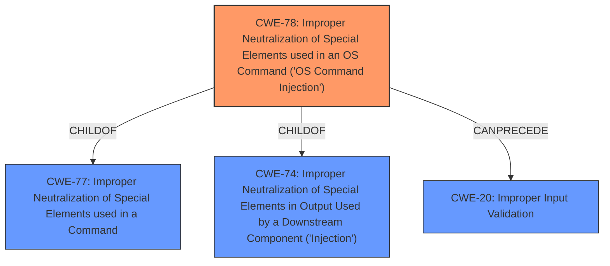

# Enhanced Analysis for CVE-2021-34729

# Summary
| CWE ID  | CWE Name | Confidence | CWE Abstraction Level | CWE Vulnerability Mapping Label | CWE-Vulnerability Mapping Notes |
|-----------------|----------------------------------------------------------------------------------------------------|----------------|-------------------------|------------------------------------|------------------------------------|
| CWE-78 | Improper Neutralization of Special Elements used in an OS Command ('OS Command Injection') | 1.0 | Base | Primary | Allowed |
| CWE-20 | Improper Input Validation | 0.8 | Class | Secondary | Discouraged |

## Evidence and Confidence

*   **Confidence Score:** 0.9
*   **Evidence Strength:** HIGH

## Relationship Analysis
The primary CWE is CWE-78, which is a base-level CWE that describes **improper neutralization of special elements** leading to OS command injection. It's a child of CWE-77 (Improper Neutralization of Special Elements used in a Command) and CWE-74 (Improper Neutralization of Special Elements in Output Used by a Downstream Component ('Injection')). CWE-20 (Improper Input Validation) is a class-level CWE. While input validation is often a factor in command injection vulnerabilities, CWE-78 more specifically captures the **root cause** related to **insufficient neutralization of special elements** when constructing OS commands.



## Vulnerability Chain
The vulnerability chain starts with **insufficient validation of arguments** (CWE-20). This leads to the **improper neutralization of special elements** in OS commands (CWE-78), which finally allows the attacker to execute arbitrary commands with elevated privileges on the underlying operating system.

## Summary of Analysis
The initial analysis identified **insufficient validation of arguments** as a potential root cause. However, the core issue is that the CLI command is not properly handling special elements, which allows for command injection. The evidence supporting this is in the "Vulnerability Description Key Phrases" section, which states the **rootcause** as "**insufficient validation of arguments**" and the "CVE Reference Links Content Summary," which states, "Insufficient validation of arguments passed to certain CLI commands within Cisco IOS XE SD-WAN Software and Cisco IOS XE Software." The summary also mentions, "Command Injection: Malicious input in the argument of an affected command can lead to arbitrary command execution."

Given the detailed information available and the specific nature of the vulnerability, CWE-78 (Improper Neutralization of Special Elements used in an OS Command) is the most appropriate primary CWE. CWE-20 is a secondary CWE since it contributes to the root cause. The final selection is based on the principle of selecting the most specific CWE that accurately represents the weakness, which in this case is CWE-78. The abundance of details and clear indication of command injection contribute to a high confidence level.

Relevant CWE Information:
- CWE-78: This is the primary weakness. It is well-aligned with the **insufficient neutralization of special elements** in the CLI command arguments, which allows for arbitrary command execution.
- CWE-20: This is a secondary weakness. The **insufficient validation** of input contributes to the overall vulnerability, but it's not the most precise classification.


## CWE Relationship Analysis

Current CWEs represent these abstraction levels: .


### Vulnerability Chain Analysis

**Chain starting from CWE-78:**
- 78 (Improper Neutralization of Special Elements used in an OS Command ('OS Command Injection')) - ROOT


**Chain starting from CWE-74:**
- 74 (Improper Neutralization of Special Elements in Output Used by a Downstream Component ('Injection')) - ROOT


### CWE Relationship Diagram

```mermaid
graph TD
    classDef primary fill:#f96,stroke:#333,stroke-width:2px
    classDef secondary fill:#69f,stroke:#333
    classDef tertiary fill:#9e9,stroke:#333
```