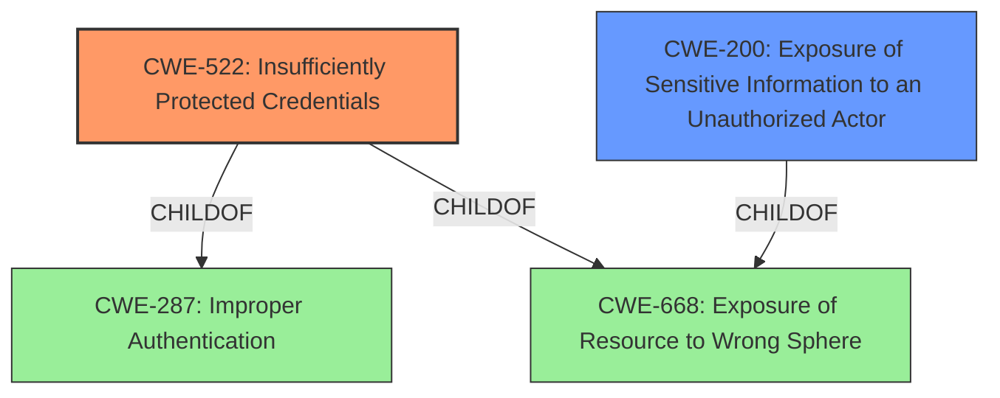

# Enhanced Analysis for CVE-2021-34733

# Summary
| CWE ID | CWE Name | Confidence | CWE Abstraction Level | CWE Vulnerability Mapping Label | CWE-Vulnerability Mapping Notes |
|---|---|---|---|---|---|
| CWE-522 | Insufficiently Protected Credentials | 0.9 | Class | Primary | Allowed-with-Review |
| CWE-200 | Exposure of Sensitive Information to an Unauthorized Actor | 0.7 | Class | Secondary | Discouraged |

## Evidence and Confidence

*   **Confidence Score:** 0.8
*   **Evidence Strength:** HIGH

## Relationship Analysis
The primary relationship influencing the choice of CWE-522 is its membership in the hierarchy rooted in CWE-668 (Exposure of Resource to Wrong Sphere). While CWE-200 (Exposure of Sensitive Information to an Unauthorized Actor) is also a parent, CWE-522 directly addresses the **insufficient protection of credentials**, which aligns more precisely with the vulnerability's root cause. The relationship between CWE-522 and its parent CWE-287 (Improper Authentication) further supports this selection. While both CWE-200 and CWE-522 are classes, the additional specificity of CWE-522 makes it more suitable.



## Vulnerability Chain
The vulnerability chain starts with **insufficiently secured storage of sensitive information** (CWE-522), leading to potential unauthorized access to this information (CWE-200). This access enables the attacker to create forged authentication requests and gain unauthorized access to the affected system.

## Summary of Analysis
The initial assessment focused on identifying the root cause weakness described in the vulnerability description. The key phrase "**sensitive information is not sufficiently secured when it is stored**" pointed to issues related to credential protection and information exposure. The CVE Reference Links Content Summary further reinforced this direction, highlighting "**CWE-522: Insufficiently protected credentials/sensitive information leading to information disclosure**" and "**Sensitive data is not properly secured when stored on the file system**".

The Retriever Results provided a list of candidate CWEs, with CWE-522 (Insufficiently Protected Credentials) and CWE-200 (Exposure of Sensitive Information to an Unauthorized Actor) among the top matches.

The final decision to classify the vulnerability as CWE-522 was based on the following considerations:
*   **Root Cause Identification:** The vulnerability's root cause lies in the **insufficient protection of credentials**, which aligns directly with the description of CWE-522.
*   **Specificity:** While CWE-200 (Exposure of Sensitive Information to an Unauthorized Actor) is also relevant, it represents a broader class of vulnerabilities related to information exposure. CWE-522 is more specific, focusing on the **improper handling of credentials**.
*   **Mapping Guidance:** The MITRE mapping guidance for CWE-522 recommends examining its children for a better fit, which was considered. No child entries provided a more precise match.
*   **Evidence:** The evidence from the vulnerability description and CVE Reference Links Content Summary strongly supports the classification as CWE-522.

CWE-200 was considered but ultimately deemed a secondary concern, as it represents the potential impact of the **insufficiently protected credentials** rather than the root cause itself. The selection of CWE-522 as the primary CWE provides the optimal level of specificity, focusing on the core weakness that leads to the vulnerability.


## CWE Relationship Analysis

Current CWEs represent these abstraction levels: .


### Vulnerability Chain Analysis

**Chain starting from CWE-287:**
- 287 (Improper Authentication) - ROOT


**Chain starting from CWE-200:**
- 200 (Exposure of Sensitive Information to an Unauthorized Actor) - ROOT


### CWE Relationship Diagram

```mermaid
graph TD
    classDef primary fill:#f96,stroke:#333,stroke-width:2px
    classDef secondary fill:#69f,stroke:#333
    classDef tertiary fill:#9e9,stroke:#333
```