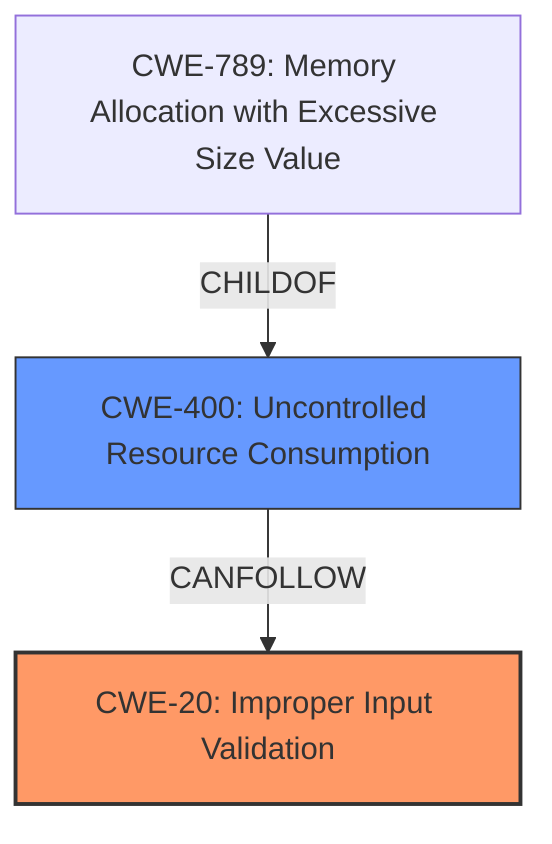

# Analysis for CVE-2021-34736

# Summary
| CWE ID | CWE Name | Confidence | CWE Abstraction Level | CWE Vulnerability Mapping Label | CWE-Vulnerability Mapping Notes |
|---|---|---|---|---|---|
| CWE-20 | Improper Input Validation | 1.0 | Class | Primary | Discouraged |
| CWE-400 | Uncontrolled Resource Consumption | 0.5 | Class | Secondary | Discouraged |

## Evidence and Confidence

*   **Confidence Score:** 0.8
*   **Evidence Strength:** HIGH

## Relationship Analysis
The primary relationship influencing the CWE selection is the parent-child relationship, where CWE-20 [CWE-20: Improper Input Validation] is a high-level class. While it is discouraged to map to this level, the provided information doesn't allow for a more specific classification. There is also a potential chain relationship where CWE-20 [CWE-20: Improper Input Validation] can precede CWE-400 [CWE-400: Uncontrolled Resource Consumption], as **insufficient input validation** can lead to resource exhaustion.

## Vulnerability Chain
The vulnerability chain starts with the **insufficient input validation** (CWE-20 [CWE-20: Improper Input Validation]) in the web-based management interface. This allows an attacker to send a crafted HTTP request. The crafted request causes the interface to restart, resulting in a denial of service (DoS) condition, potentially represented by uncontrolled resource consumption (CWE-400 [CWE-400: Uncontrolled Resource Consumption]).

## Summary of Analysis
The initial assessment, based on the **Vulnerability Description Key Phrases**, identifies "**insufficient input validation**" as the **rootcause**. The CVE Reference Links Content Summary confirms this, stating, "Insufficient input validation on the web-based management interface." This directly aligns with CWE-20 [CWE-20: Improper Input Validation].

The Retriever Results also lists CWE-20 [CWE-20: Improper Input Validation] as the top match. However, the mapping guidance for CWE-20 [CWE-20: Improper Input Validation] discourages its use due to its high-level nature. It suggests considering lower-level children. However, without more detailed information about *what* input is not being validated and *how* it leads to the restart, a more specific CWE cannot be selected.

CWE-400 [CWE-400: Uncontrolled Resource Consumption] is considered as a secondary weakness. The vulnerability description states that the successful exploit results in a denial of service (DoS) condition because the interface restarts. While a restart does not necessarily imply resource exhaustion, it is a plausible consequence, especially if the restarts can be triggered repeatedly and quickly, consuming resources. This is a potential impact following CWE-20 [CWE-20: Improper Input Validation] and caused by the **insufficient input validation**.

The selection of CWE-20 [CWE-20: Improper Input Validation] is justified because the vulnerability description explicitly mentions **insufficient input validation** as the root cause. The high-level nature of CWE-20 [CWE-20: Improper Input Validation] is acknowledged, but a more specific CWE cannot be selected without further details about the vulnerability.

Other CWEs considered but not used:

*   CWE-119 [CWE-119: Improper Restriction of Operations within the Bounds of a Memory Buffer]: While the crafted HTTP request *could* potentially lead to a buffer overflow, there is no direct evidence to support this.
*   CWE-80 [CWE-80: Improper Neutralization of Script-Related HTML Tags in a Web Page (Basic XSS)]: There is no indication that the crafted HTTP request involves script-related HTML tags or cross-site scripting.
*   CWE-1284 [CWE-1284: Improper Validation of Specified Quantity in Input]: This is more specific than CWE-20 [CWE-20: Improper Input Validation] as it is about quantities. There is no evidence that the **insufficient input validation** is related to a quantity.
*   CWE-807 [CWE-807: Reliance on Untrusted Inputs in a Security Decision]: While the web-based management interface relies on inputs, the core issue is the **insufficient validation**, not necessarily the reliance on untrusted inputs for a security decision.
*   CWE-190 [CWE-190: Integer Overflow or Wraparound]: There is no indication that an integer overflow is involved.
*   CWE-401 [CWE-401: Missing Release of Memory after Effective Lifetime]: A restart isn't necessarily a memory leak, so this doesn't fit.
*   CWE-287 [CWE-287: Improper Authentication]: The vulnerability can be triggered by an unauthenticated attacker, but the root cause is not related to authentication itself.
Relevant CWE Information: