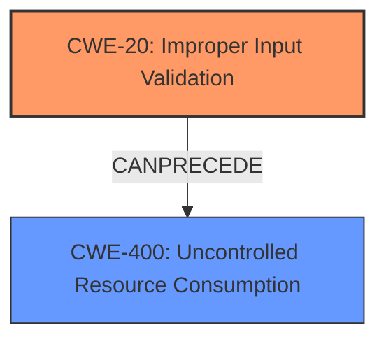

# Analysis for CVE-2021-34741

# Summary
| CWE ID  | CWE Name                                              | Confidence | CWE Abstraction Level | CWE Vulnerability Mapping Label | CWE-Vulnerability Mapping Notes |
| :-------- | :---------------------------------------------------- | :--------- | :---------------------- | :------------------------------ | :---------------------------- |
| CWE-20   | Improper Input Validation                             | 0.85       | Class                   | Primary                       | Discouraged                   |
| CWE-400 | Uncontrolled Resource Consumption | 0.75       | Class                   | Secondary                       | Discouraged                   |

## Evidence and Confidence

*   **Confidence Score:** 0.80
*   **Evidence Strength:** HIGH

## Relationship Analysis
The primary CWE, CWE-20 [Improper Input Validation], is a class-level CWE. While it's generally discouraged to map to class-level CWEs, in this case, the provided information strongly points to **insufficient input validation** as the root cause. The vulnerability leads to a denial-of-service condition due to the exhaustion of CPU resources. CWE-400 [Uncontrolled Resource Consumption] is a class-level CWE and is a result of the **insufficient input validation**. The relationship between CWE-20 and CWE-400 is that the former can precede the latter.



## Vulnerability Chain
The vulnerability chain starts with the **insufficient input validation** (CWE-20), which leads to a scenario where a crafted email can exhaust CPU resources, resulting in uncontrolled resource consumption (CWE-400) and ultimately causing a denial-of-service.

## Summary of Analysis
The initial assessment identified **insufficient input validation** as the root cause, aligning with CWE-20 [Improper Input Validation]. The follow-on effect is the exhaustion of CPU resources (CWE-400), leading to a denial of service.

The analysis is heavily based on the provided evidence, specifically the "Vulnerability Description Key Phrases" and "CVE Reference Links Content Summary," which both explicitly state **insufficient input validation** as the root cause.

The graph relationships support the selection of CWE-20 as the primary weakness, as it can precede CWE-400. The selection of CWE-20 is made despite the discouraged usage because the evidence clearly points to this as the initial flaw.

```
"root_cause": "Insufficient input validation of incoming emails.",
"weaknesses": [
  "Insufficient input validation"
],
"impact": "An attacker could exhaust all the available CPU resources on an affected device for an extended period of time, preventing other emails from being processed and resulting in a DoS condition.",
```
The selected CWEs are at the optimal level of specificity given the available information. While more specific variants of CWE-20 might exist, the current description does not provide enough detail to narrow it down further.

Relevant CWE Information:

# Enhanced Context (25 CWEs)
The following CWEs were identified as potentially relevant to this vulnerability:

## CWE-405: Asymmetric Resource Consumption (Amplification)
**Abstraction Level**: Class
**Similarity Score**: 0.74

**Description**:
The product does not properly control situations in which an adversary can cause the product to consume or produce excessive resources without requiring the adversary to invest equivalent work or otherwise prove authorization, i.e., the adversary's influence is "asymmetric."
## CWE-664: Improper Control of a Resource Through its Lifetime
**Abstraction Level**: Pillar
**Similarity Score**: 0.73

**Description**:
The product does not maintain or incorrectly maintains control over a resource throughout its lifetime of creation, use, and release.
## CWE-404: Improper Resource Shutdown or Release
**Abstraction Level**: Class
**Similarity Score**: 0.72

**Description**:
The product does not release or incorrectly releases a resource before it is made available for re-use.
## CWE-226: Sensitive Information in Resource Not Removed Before Reuse
**Abstraction Level**: Base
**Similarity Score**: 0.71

**Description**:
The product releases a resource such as memory or a file so that it can be made available for reuse, but it does not clear or "zeroize" the information contained in the resource before the product performs a critical state transition or makes the resource available for reuse by other entities.
## CWE-1325: Improperly Controlled Sequential Memory Allocation
**Abstraction Level**: Base
**Similarity Score**: 0.71

**Description**:
The product manages a group of objects or resources and performs a separate memory allocation for each object, but it does not properly limit the total amount of memory that is consumed by all of the combined objects.
## CWE-799: Improper Control of Interaction Frequency
**Abstraction Level**: Class
**Similarity Score**: 0.70

**Description**:
The product does not properly limit the number or frequency of interactions that it has with an actor, such as the number of incoming requests.
## CWE-772: Missing Release of Resource after Effective Lifetime
**Abstraction Level**: Base
**Similarity Score**: 0.70

**Description**:
The product does not release a resource after its effective lifetime has ended, i.e., after the resource is no longer needed.
## CWE-789: Memory Allocation with Excessive Size Value
**Abstraction Level**: Variant
**Similarity Score**: 0.69

**Description**:
The product allocates memory based on an untrusted, large size value, but it does not ensure that the size is within expected limits, allowing arbitrary amounts of memory to be allocated.
## CWE-668: Exposure of Resource to Wrong Sphere
**Abstraction Level**: Class
**Similarity Score**: 0.69

**Description**:
The product exposes a resource to the wrong control sphere, providing unintended actors with inappropriate access to the resource.
## CWE-410: Insufficient Resource Pool
**Abstraction Level**: Base
**Similarity Score**: 0.69

**Description**:
The product's resource pool is not large enough to handle peak demand, which allows an attacker to prevent others from accessing the resource by using a (relatively) large number of requests for resources.
## CWE-190: Integer Overflow or Wraparound
**Abstraction Level**: Base
**Similarity Score**: 8687.72

**Description**:
The product performs a calculation that can
         produce an integer overflow or wraparound when the logic
         assumes that the resulting value will always be larger than
         the original value. This occurs when an integer value is
         incremented to a value that is too large to store in the
         associated representation. When this occurs, the value may
         become a very small or negative number.
## CWE-1284: Improper Validation of Specified Quantity in Input
**Abstraction Level**: Base
**Similarity Score**: 8602.98

**Description**:
The product receives input that is expected to specify a quantity (such as size or length), but it does not validate or incorrectly validates that the quantity has the required properties.
## CWE-770: Allocation of Resources Without Limits or Throttling
**Abstraction Level**: Base
**Similarity Score**: 8501.52

**Description**:
The product allocates a reusable resource or group of resources on behalf of an actor without imposing any restrictions on the size or number of resources that can be allocated, in violation of the intended security policy for that actor.
## CWE-789: Memory Allocation with Excessive Size Value
**Abstraction Level**: Variant
**Similarity Score**: 8458.54

**Description**:
The product allocates memory based on an untrusted, large size value, but it does not ensure that the size is within expected limits, allowing arbitrary amounts of memory to be allocated.
## CWE-119: Improper Restriction of Operations within the Bounds of a Memory Buffer
**Abstraction Level**: Class
**Similarity Score**: 8141.75

**Description**:
The product performs operations on a memory buffer, but it reads from or writes to a memory location outside the buffer's intended boundary. This may result in read or write operations on unexpected memory locations that could be linked to other variables, data structures, or internal program data.
## CWE-41: Improper Resolution of Path Equivalence
**Abstraction Level**: base
**Similarity Score**: 5.03

**Description**:
CWE-41: Improper Resolution of Path Equivalence
## CWE-22: Improper Limitation of a Pathname to a Restricted Directory ('Path Traversal')
**Abstraction Level**: base
**Similarity Score**: 4.33

**Description**:
CWE-22: Improper Limitation of a Pathname to a Restricted Directory ('Path Traversal')
## CWE-770: Allocation of Resources Without Limits or Throttling
**Abstraction Level**: base
**Similarity Score**: 4.33

**Description**: