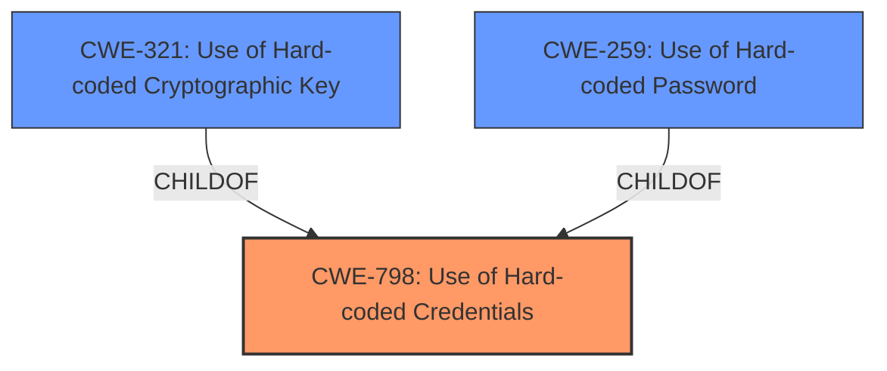

# Analysis Report for CVE-2021-34744

# Vulnerability Analysis Report: CVE-2021-34744

## Description


## Analysis (with Relationship Data)

# Summary
| CWE ID  | CWE Name                       | Confidence | CWE Abstraction Level | CWE Vulnerability Mapping Label | CWE-Vulnerability Mapping Notes |
|---------|--------------------------------|------------|-----------------------|---------------------------------|---------------------------------|
| CWE-798 | Use of Hard-coded Credentials | 1          | Base                  | Primary CWE                     | Allowed                         |
| CWE-321 | Use of Hard-coded Cryptographic Key | 0.75       | Variant               | Secondary Candidate             | Allowed                         |
| CWE-259 | Use of Hard-coded Password      | 0.75       | Variant               | Secondary Candidate             | Allowed                         |

## Evidence and Confidence

*   **Confidence Score:** 0.9
*   **Evidence Strength:** HIGH

## Relationship Analysis
The primary CWE is CWE-798, which represents the **use of hard-coded credentials**. CWE-321 (Use of Hard-coded Cryptographic Key) and CWE-259 (Use of Hard-coded Password) are both variants (more specific types) of CWE-798. The vulnerability description mentions both static cryptographic keys and static passwords, which align with these variants. Since the description contains specific details about both passwords and cryptographic keys, mapping to the variants is more appropriate.



## Vulnerability Chain
The vulnerability chain involves the **use of hard-coded credentials**, specifically a static cryptographic key and a static password, which leads to an attacker with administrator privileges being able to access sensitive login credentials and reconfigure passwords.

Root Cause: **Use of static cryptographic key** and **use of static password** (CWE-321 and CWE-259).
Weakness: **Use of Hard-coded Credentials** (CWE-798).
Impact: Access sensitive login credentials and reconfigure passwords on the user account.

## Summary of Analysis
The analysis is based on the provided evidence, primarily the CVE Reference Links Content Summary, which explicitly mentions the **use of a static cryptographic key** (CVE-2021-34744) and the **use of a static password** (CVE-2021-34757) as the root causes of the vulnerabilities.

> "The vulnerability is due to the **use of a static cryptographic key** in all Cisco Business 220 Series Smart Switches firmware images."

> "The vulnerability is due to the **use of a static password** in all Cisco Business 220 Series Smart Switches firmware."

The primary CWE is CWE-798 (Use of Hard-coded Credentials), as this is a general description of the issue. However, since the description specifically mentions the use of both cryptographic keys and passwords, it is more appropriate to also include CWE-321 (Use of Hard-coded Cryptographic Key) and CWE-259 (Use of Hard-coded Password) as secondary CWEs. These are variants of CWE-798 and provide a more specific classification of the vulnerability.

The Retriever Results also support this classification, with CWE-259 and CWE-321 being highly ranked.

The selected CWEs are at the optimal level of specificity, as they accurately represent the root causes of the vulnerabilities and provide sufficient detail for understanding the issue. Other CWEs, such as CWE-20 (Improper Input Validation) and CWE-287 (Improper Authentication), were considered but deemed less relevant as they do not directly address the root cause of the vulnerability, which is the **use of hard-coded credentials**.

# Relevant CWE Information:

# Enhanced Context (25 CWEs)

## CWE-1220: Insufficient Granularity of Access Control
**Abstraction Level**: Base
**Similarity Score**: 0.75
**Source**: dense

**Description**:
The product implements access controls via a policy or other feature with the intention to disable or restrict accesses (reads and/or writes) to assets in a system from untrusted agents. However, implemented access controls lack required granularity, which renders the control policy too broad because it allows accesses from unauthorized agents to the security-sensitive assets.

**Mapping Guidance**:
- Usage: Allowed
- Rationale: This CWE entry is at the Base level of abstraction, which is a preferred level of abstraction for mapping to the root causes of vulnerabilities.

**Why Not Used**: This CWE is about access control granularity. The described vulnerability is caused by **hardcoded credentials**, which is a different issue.

## CWE-664: Improper Control of a Resource Through its Lifetime
**Abstraction Level**: Pillar
**Similarity Score**: 0.75
**Source**: dense

**Description**:
The product does not maintain or incorrectly maintains control over a resource throughout its lifetime of creation, use, and release.

**Mapping Guidance**:
- Usage: Discouraged
- Rationale: This CWE entry is high-level when lower-level children are available.

**Why Not Used**: Too general of a weakness.

## CWE-807: Reliance on Untrusted Inputs in a Security Decision
**Abstraction Level**: Base
**Similarity Score**: 0.75
**Source**: dense

**Description**:
The product uses a protection mechanism that relies on the existence or values of an input, but the input can be modified by an untrusted actor in a way that bypasses the protection mechanism.

**Mapping Guidance**:
- Usage: Allowed
- Rationale: This CWE entry is at the Base level of abstraction, which is a preferred level of abstraction for mapping to the root causes of vulnerabilities.

**Why Not Used**: This vulnerability is not about security decisions based on untrusted inputs, but rather about **hardcoded credentials**.

## CWE-799: Improper Control of Interaction Frequency
**Abstraction Level**: Class
**Similarity Score**: 0.75
**Source**: dense

**Description**:
The product does not properly limit the number or frequency of interactions that it has with an actor, such as the number of incoming requests.

**Mapping Guidance**:
- Usage: Allowed-with-Review
- Rationale: This CWE entry is a Class and might have Base-level children that would be more appropriate

**Why Not Used**: Not relevant to the described vulnerability. This is about limiting frequency of interactions.

## CWE-653: Improper Isolation or Compartmentalization
**Abstraction Level**: Class
**Similarity Score**: 0.75
**Source**: dense

**Description**:
The product does not properly compartmentalize or isolate functionality, processes, or resources that require different privilege levels, rights, or permissions.

**Mapping Guidance**:
- Usage: Allowed
- Rationale: This CWE entry is at the Base level of abstraction, which is a preferred level of abstraction for mapping to the root causes of vulnerabilities.

**Why Not Used**: The vulnerability is not caused by a lack of isolation or compartmentalization, but rather by **hardcoded credentials**.

## CWE-274: Improper Handling of Insufficient Privileges
**Abstraction Level**: Base
**Similarity Score**: 0.75
**Source**: dense

**Description**:
The product does not handle or incorrectly handles when it has insufficient privileges to perform an operation, leading to resultant weaknesses.

**Mapping Guidance**:
- Usage: Discouraged
- Rationale: This CWE entry could be deprecated in a future version of CWE.

**Why Not Used**: The vulnerability isn't about the handling of insufficient privileges.

## CWE-280: Improper Handling of Insufficient Permissions or Privileges
**Abstraction Level**: Base
**Similarity Score**: 0.75
**Source**: dense

**Description**:
The product does not handle or incorrectly handles when it has insufficient privileges to access resources or functionality as specified by their permissions. This may cause it to follow unexpected code paths that may leave the product in an invalid state.

**Mapping Guidance**:
- Usage: Allowed
- Rationale: This CWE entry is at the Base level of abstraction, which is a preferred level of abstraction for mapping to the root causes of vulnerabilities.

**Why Not Used**: The vulnerability is not about handling insufficient permissions.

## CWE-1289: Improper Validation of Unsafe Equivalence in Input
**Abstraction Level**: Base
**Similarity Score**: 0.74
**Source**: dense

**Description**:
The product receives an input value that is used as a resource identifier or other type of reference, but it does not validate or incorrectly validates that the input is equivalent to a potentially-unsafe value.

**Mapping Guidance**:
- Usage: Allowed
- Rationale: This CWE entry is at the Base level of abstraction, which is a preferred level of abstraction for mapping to the root causes of vulnerabilities.

**Why Not Used**: This weakness is not related to input validation of unsafe equivalence.

## CWE-4


## CWE Relationship Analysis

Current CWEs represent these abstraction levels: .


### Vulnerability Chain Analysis

**Chain starting from CWE-664:**
- 664 (Improper Control of a Resource Through its Lifetime) - ROOT


**Chain starting from CWE-653:**
- 653 (Improper Isolation or Compartmentalization) - ROOT


### CWE Relationship Diagram

```mermaid
graph TD
    classDef primary fill:#f96,stroke:#333,stroke-width:2px
    classDef secondary fill:#69f,stroke:#333
    classDef tertiary fill:#9e9,stroke:#333
```


*Report generated on 2025-04-02 07:11:44*
