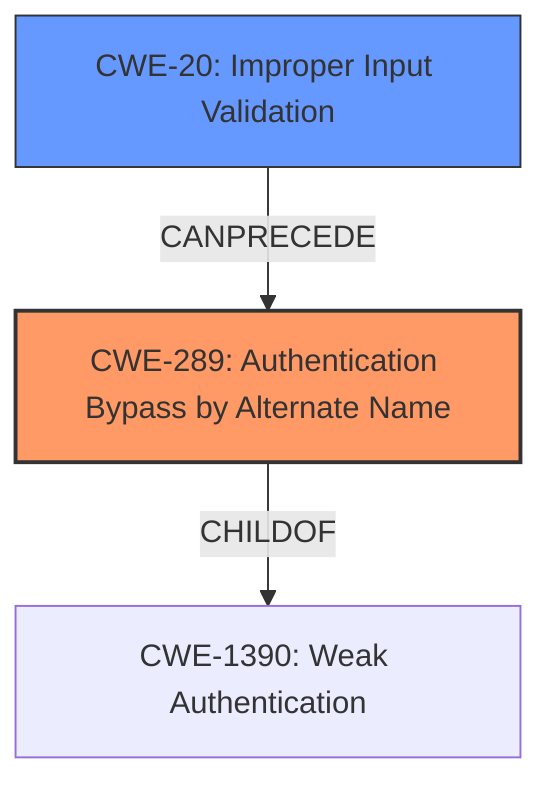

# Raw Analyzer Response for CVE-2021-34746

# Summary
| CWE ID   | CWE Name                                                                 | Confidence | CWE Abstraction Level | CWE Vulnerability Mapping Label | CWE-Vulnerability Mapping Notes |
| :------- | :----------------------------------------------------------------------- | :--------- | :-------------------- | :------------------------------ | :------------------------------ |
| CWE-289  | Authentication Bypass by Alternate Name                                 | 0.9        | Base                  | Primary                         | Allowed                       |
| CWE-20   | Improper Input Validation                                                | 0.7        | Class                 | Secondary                       | Discouraged                   |

## Evidence and Confidence

*   **Confidence Score:** 0.8
*   **Evidence Strength:** HIGH

## Relationship Analysis
The primary CWE selected is CWE-289, Authentication Bypass by Alternate Name, which is a Base level CWE. This choice is influenced by the vulnerability allowing an attacker to bypass authentication via parameter injection, effectively using an "alternate name" or method to gain access. CWE-289 is a child of CWE-1390 (Weak Authentication), indicating a broader category of authentication flaws. CWE-20 (Improper Input Validation) is considered a related issue, as the incomplete validation is the root cause that enables the bypass. Although CWE-20 is a class level CWE and discouraged, it is included since it's the root cause.

## Vulnerability Chain
The vulnerability chain starts with **incomplete validation of user-supplied input** (CWE-20) which leads to the ability to inject parameters into an authentication request. This parameter injection then allows the attacker to bypass authentication and log in as an administrator (CWE-289). The final impact is unauthorized access to the affected device.

## Summary of Analysis
The initial assessment pointed towards an authentication bypass due to **incomplete validation of user-supplied input**. The primary focus was to identify the CWE that best represents how the authentication was bypassed.

The vulnerability description states: "This vulnerability is due to **incomplete validation of user-supplied input** that is passed to an authentication script. An attacker could exploit this vulnerability by injecting parameters into an authentication request. A successful exploit could allow the attacker to bypass authentication and log in as an administrator to the affected device." The CVE Reference Links Content Summary further confirms: "Incomplete validation of user-supplied input passed to an authentication script."

Given the ability to bypass authentication through parameter injection, CWE-289 (Authentication Bypass by Alternate Name) was chosen as the primary CWE. Although CWE-20 is a class level CWE and discouraged, it is included since it's the root cause. This is at the optimal level of specificity since it directly addresses how the authentication mechanism is circumvented. The evidence strongly supports this classification, and the relationship analysis confirms its alignment within the broader context of authentication weaknesses.

Relevant CWE Information:

# Enhanced Context (25 CWEs)

## CWE-23: Relative Path Traversal
CWE-23 was considered but is not applicable as the vulnerability does not involve path manipulation.

## CWE-41: Improper Resolution of Path Equivalence
CWE-41 was considered but is not applicable as the vulnerability does not involve path equivalence issues.

## CWE-1289: Improper Validation of Unsafe Equivalence in Input
CWE-1289 was considered but is not applicable as the vulnerability does not involve unsafe equivalence in input.

## CWE-73: External Control of File Name or Path
CWE-73 was considered but is not applicable as the vulnerability does not involve external control of file names or paths.

## CWE-184: Incomplete List of Disallowed Inputs
CWE-184 was considered but is not applicable as the vulnerability does not involve an incomplete list of disallowed inputs.

## CWE-303: Incorrect Implementation of Authentication Algorithm
CWE-303 was considered but is not the primary issue. The authentication algorithm itself may be correctly implemented, but the input validation is missing.

## CWE-807: Reliance on Untrusted Inputs in a Security Decision
CWE-807 was considered but does not fully capture the mechanism of bypassing authentication through parameter injection.

## CWE-59: Improper Link Resolution Before File Access ('Link Following')
CWE-59 was considered but is not applicable as the vulnerability does not involve link resolution.

## CWE-36: Absolute Path Traversal
CWE-36 was considered but is not applicable as the vulnerability does not involve path manipulation.

## CWE-74: Improper Neutralization of Special Elements in Output Used by a Downstream Component ('Injection')
CWE-74 was considered but is too general and does not specifically address the authentication bypass.

## CWE-22: Improper Limitation of a Pathname to a Restricted Directory ('Path Traversal')
CWE-22 was considered but is not applicable as the vulnerability does not involve path manipulation.

## CWE-863: Incorrect Authorization
CWE-863 was considered but authentication is bypassed, not authorization.

## CWE-1390: Weak Authentication
CWE-1390 is a parent of CWE-289 and thus is more general.

## CWE-287: Improper Authentication
CWE-287 is a parent of CWE-289 and thus is more general.

## CWE-289: Authentication Bypass by Alternate Name
CWE-289 is the best fit as explained above.

## CWE-770: Allocation of Resources Without Limits or Throttling
CWE-770 was considered but is not applicable as the vulnerability does not involve resource allocation issues.

## CWE-190: Integer Overflow or Wraparound
CWE-190 was considered but is not applicable as the vulnerability does not involve integer overflows.

## CWE-46: Path Equivalence: 'filename ' (Trailing Space)
CWE-46 was considered but is not applicable as the vulnerability does not involve path equivalence issues.

## CWE-471: Modification of Assumed-Immutable Data (MAID)
CWE-471 was considered but is not applicable as the vulnerability does not involve modification of immutable data.

## CWE-1284: Improper Validation of Specified Quantity in Input
CWE-1284 was considered but is not applicable as the vulnerability does not involve validation of specified quantities.

## CWE-41: Improper Resolution of Path Equivalence
CWE-41 was considered but is not applicable as the vulnerability does not involve path equivalence issues.

## CWE-290: Authentication Bypass by Spoofing
CWE-290 was considered but is not the primary mechanism, as the vulnerability involves parameter injection rather than spoofing.

## CWE-73: External Control of File Name or Path
CWE-73 was considered but is not applicable as the vulnerability does not involve path manipulation.