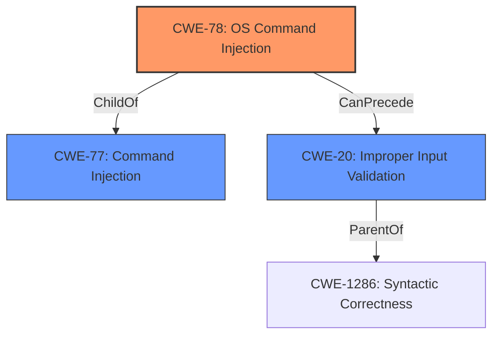

# Analysis for CVE-2021-34748

# Summary
| CWE ID  | CWE Name  | Confidence | CWE Abstraction Level | CWE Vulnerability Mapping Label | CWE-Vulnerability Mapping Notes |
|------------------|--------------------------------------------------------------------------------------------------|------------|-----------------------|-----------------------------------|-----------------------------------------------------------------------------------------------------------------------------------------------------------------|
| CWE-78 | Improper Neutralization of Special Elements used in an OS Command ('OS Command Injection') | 1  | Base  | Primary CWE | Allowed  |
| CWE-20 | Improper Input Validation | 0.7 | Class | Secondary Candidate | Discouraged |

## Evidence and Confidence

*   **Confidence Score:** 0.9
*   **Evidence Strength:** HIGH

## Relationship Analysis
The primary weakness is CWE-78, which is a base-level CWE describing **improper neutralization of special elements** used in an OS command. This is a child of CWE-77, which is a more general class describing improper neutralization in any command. CWE-78 is preferred because it is more specific to OS commands, aligning with the vulnerability description of command injection. The vulnerability also involves **insufficient input validation**, which is a high-level class (CWE-20) and a parent of CWE-1286 which describes syntactic correctness. Given the root cause is **insufficient input validation** leading to **command injection**, both CWE-78 and CWE-20 are related, but CWE-78 is the more direct and descriptive weakness.

## Vulnerability Chain
The vulnerability chain starts with **insufficient input validation** (CWE-20), which then leads to **command injection** (CWE-78). An attacker crafts malicious input, bypassing the **insufficient input validation**, and injects OS commands, which are then executed with root-level privileges.

## Summary of Analysis
The initial assessment identified the primary weakness as CWE-78, based on the vulnerability description of command injection and the **insufficient input validation** root cause. The retriever results also highlighted CWE-78 as a top candidate, along with CWE-20, which is the root cause for the command injection. The graph relationships confirm that CWE-78 is a specific type of command injection (child of CWE-77) and that **insufficient input validation** (CWE-20) can precede command injection.

The selection of CWE-78 is justified because it directly reflects the **command injection** vulnerability. While CWE-20 is the root cause, it is a high-level class and is therefore a less optimal choice than CWE-78. The evidence from the vulnerability description, including the phrases "**command injection**" and "**insufficient input validation**," supports this decision. The retriever scores also support the selection of CWE-78, with a high score of 0.7.

Relevant CWE Information:

# Enhanced Context (25 CWEs)
The following CWEs were identified as potentially relevant to this vulnerability:

## CWE-74: Improper Neutralization of Special Elements in Output Used by a Downstream Component ('Injection')
**Abstraction Level**: Class
**Similarity Score**: 0.75
**Source**: dense

**Description**:
The product constructs all or part of a command, data structure, or record using externally-influenced input from an upstream component, but it does not neutralize or incorrectly neutralizes special elements that could modify how it is parsed or interpreted when it is sent to a downstream component.

**Mapping Guidance**:
- Usage: Discouraged
- Rationale: CWE-74 is high-level and often misused when lower-level weaknesses are more appropriate.

*This CWE was considered but not selected because the vulnerability is specifically about command injection rather than a more general injection.*

## CWE-1289: Improper Validation of Unsafe Equivalence in Input
**Abstraction Level**: Base
**Similarity Score**: 0.74
**Source**: dense

**Description**:
The product receives an input value that is used as a resource identifier or other type of reference, but it does not validate or incorrectly validates that the input is equivalent to a potentially-unsafe value.

**Mapping Guidance**:
- Usage: Allowed
- Rationale: This CWE entry is at the Base level of abstraction, which is a preferred level of abstraction for mapping to the root causes of vulnerabilities.

*This CWE was considered, but it is more specific than what the vulnerability description provides, and the **insufficient input validation** does not seem to target "equivalence".*

## CWE-184: Incomplete List of Disallowed Inputs
**Abstraction Level**: Base
**Similarity Score**: 0.74
**Source**: dense

**Description**:
The product implements a protection mechanism that relies on a list of inputs (or properties of inputs) that are not allowed by policy or otherwise require other action to neutralize before additional processing takes place, but the list is incomplete.

**Mapping Guidance**:
- Usage: Allowed
- Rationale: This CWE entry is at the Base level of abstraction, which is a preferred level of abstraction for mapping to the root causes of vulnerabilities.

*This CWE was considered, but the vulnerability is better represented by the broader **improper input validation** issue.*

## CWE-73: External Control of File Name or Path
**Abstraction Level**: Base
**Similarity Score**: 0.74
**Source**: dense

**Description**:
The product allows user input to control or influence paths or file names that are used in filesystem operations.

**Mapping Guidance**:
- Usage: Allowed
- Rationale: This CWE entry is at the Base level of abstraction, which is a preferred level of abstraction for mapping to the root causes of vulnerabilities.

*This CWE was considered, but this vulnerability is about command injection and not about file paths.*

## CWE-99: Improper Control of Resource Identifiers ('Resource Injection')
**Abstraction Level**: Class
**Similarity Score**: 0.74
**Source**: dense

**Description**:
The product receives input from an upstream component, but it does not restrict or incorrectly restricts the input before it is used as an identifier for a resource that may be outside the intended sphere of control.

**Mapping Guidance**:
- Usage: Allowed-with-Review
- Rationale: This CWE entry is a Class and might have Base-level children that would be more appropriate

*This CWE was considered, but the **insufficient input validation** is not specific to resources.*

## CWE-470: Use of Externally-Controlled Input to Select Classes or Code ('Unsafe Reflection')
**Abstraction Level**: Base
**Similarity Score**: 0.73
**Source**: dense

**Description**:
The product uses external input with reflection to select which classes or code to use, but it does not sufficiently prevent the input from selecting improper classes or code.

**Mapping Guidance**:
- Usage: Allowed
- Rationale: This CWE entry is at the Base level of abstraction, which is a preferred level of abstraction for mapping to the root causes of vulnerabilities.

*This CWE was considered, but this vulnerability is about command injection, not about selecting classes or code using reflection.*

## CWE-917: Improper Neutralization of Special Elements used in an Expression Language Statement ('Expression Language Injection')
**Abstraction Level**: Base
**Similarity Score**: 0.73
**Source**: dense

**Description**:
The product constructs all or part of an expression language (EL) statement in a framework such as a Java Server Page (JSP) using externally-influenced input from an upstream component, but it does not neutralize or incorrectly neutralizes special elements that could modify the intended EL statement before it is executed.

**Mapping Guidance**:
- Usage: Allowed
- Rationale: This CWE entry is at the Base level of abstraction, which is a preferred level of abstraction for mapping to the root causes of vulnerabilities.

*This CWE was considered, but the vulnerability is specifically about command injection, not expression language injection.*

## CWE-807: Reliance on Untrusted Inputs in a Security Decision
**Abstraction Level**: Base
**Similarity Score**: 0.73
**Source**: dense

**Description**:
The product uses a protection mechanism that relies on the existence or values of an input, but the input can be modified by an untrusted actor in a way that bypasses the protection mechanism.

**Mapping Guidance**:
- Usage: Allowed
- Rationale: This CWE entry is at the Base level of abstraction, which is a preferred level of abstraction for mapping to the root causes of vulnerabilities.

*This CWE was considered, but the issue stems from **improper input validation** leading to code injection rather than a reliance on untrusted inputs for security decisions.*

## CWE-138: Improper Neutralization of Special Elements