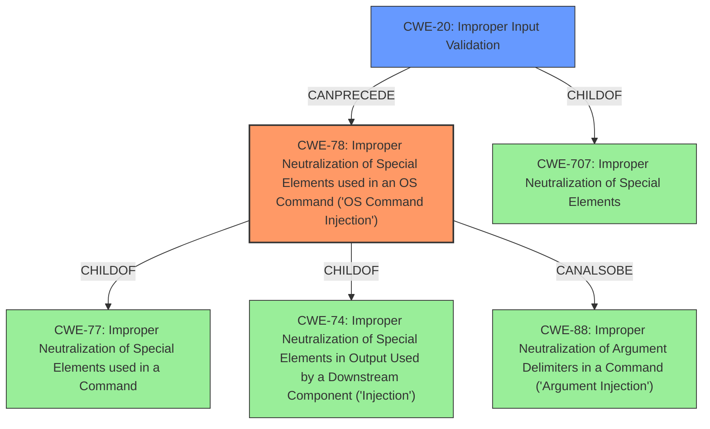

# Analysis Report for CVE-2021-34756

# Vulnerability Analysis Report: CVE-2021-34756

## Description


## Analysis (with Relationship Data)

# Summary
| CWE ID  | CWE Name                                                                                  | Confidence | CWE Abstraction Level | CWE Vulnerability Mapping Label | CWE-Vulnerability Mapping Notes |
| :-------- | :------------------------------------------------------------------------------------------ | :--------- | :---------------------- | :------------------------------ | :------------------------------ |
| CWE-78  | Improper Neutralization of Special Elements used in an OS Command ('OS Command Injection') | 1          | Base                    | Primary CWE                     | Allowed                       |
| CWE-20  | Improper Input Validation                                                                 | 0.75       | Class                   | Secondary Candidate             | Discouraged                   |

## Evidence and Confidence

*   **Confidence Score:** 0.9
*   **Evidence Strength:** HIGH

## Relationship Analysis
The primary relationship is that CWE-78 [Improper Neutralization of Special Elements used in an OS Command ('OS Command Injection')] is a child of CWE-77 (Improper Neutralization of Special Elements used in a Command) and CWE-74 (Improper Neutralization of Special Elements in Output Used by a Downstream Component ('Injection')). CWE-78 can also be related to CWE-88 (Improper Neutralization of Argument Delimiters in a Command ('Argument Injection')). CWE-20 (Improper Input Validation) is a broad class-level CWE that can often precede other more specific weaknesses. It is a child of CWE-707 (Improper Neutralization of Special Elements).



## Vulnerability Chain
The vulnerability chain starts with **insufficient validation** of user-supplied command arguments, leading to **command injection**, which allows an attacker to **execute commands with root privileges**.
- **Root Cause:** Insufficient Validation of User-Supplied Command Arguments
- **Weakness:** Command Injection (CWE-78)
- **Impact:** Execute commands with root privileges

## Summary of Analysis
The primary weakness is **CWE-78 [Improper Neutralization of Special Elements used in an OS Command ('OS Command Injection')]**. The vulnerability description states that "the vulnerability is due to **insufficient validation** of user-supplied command arguments," which leads to "Command Injection". A successful exploit allows the attacker to "execute commands with *root* privileges on the underlying operating system." This aligns directly with the characteristics of CWE-78, where externally-influenced input is used to construct an OS command without proper neutralization of special elements. The CVE Reference Links Content Summary confirms this. The "CWE for similar CVE Descriptions" section lists CWE-78 as the Primary CWE Match and the Top CWE.

CWE-20 [Improper Input Validation] was considered because the root cause involves **insufficient validation** of user-supplied command arguments. However, CWE-20 is a broad class-level CWE, and CWE-78 provides a more specific description of the vulnerability. While **insufficient validation** is a contributing factor, the core issue is the resulting command injection. Therefore, CWE-78 is the more appropriate primary mapping, and CWE-20 can be considered as a secondary weakness. The Mapping Guidance for CWE-20 recommends considering lower-level children.

CWE-77 [Improper Neutralization of Special Elements used in a Command] was not selected because CWE-78 is a direct child of CWE-77 and describes the specific case of OS command injection, making it a more precise fit.

Other CWEs such as CWE-22, CWE-119, CWE-190, CWE-61, CWE-755, CWE-23, and CWE-770 were considered but deemed less relevant as they don't directly address the command injection aspect of the vulnerability.

The final selection of CWE-78 is based on the evidence of command injection due to **insufficient validation** and its alignment with the CWE description. The abstraction level is appropriate because CWE-78 is a Base-level CWE, providing sufficient specificity.


## CWE Relationship Analysis

Current CWEs represent these abstraction levels: .


### Vulnerability Chain Analysis

**Chain starting from CWE-88:**
- 88 (Improper Neutralization of Argument Delimiters in a Command ('Argument Injection')) - ROOT


**Chain starting from CWE-770:**
- 770 (Allocation of Resources Without Limits or Throttling) - ROOT


### CWE Relationship Diagram

```mermaid
graph TD
    classDef primary fill:#f96,stroke:#333,stroke-width:2px
    classDef secondary fill:#69f,stroke:#333
    classDef tertiary fill:#9e9,stroke:#333
```


*Report generated on 2025-04-01 18:03:13*
