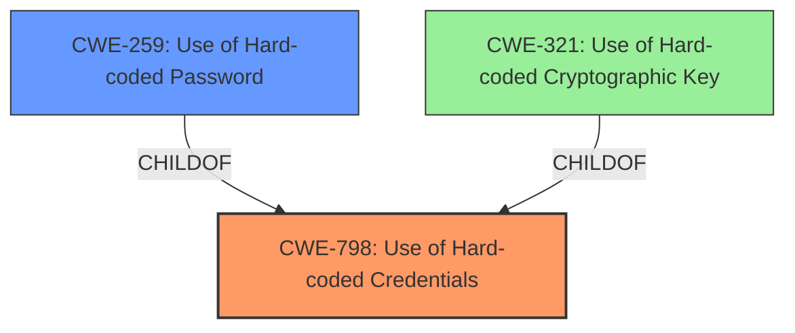

# Raw Analyzer Response for CVE-2021-34757

# Summary
| CWE ID | CWE Name | Confidence | CWE Abstraction Level | CWE Vulnerability Mapping Label | CWE-Vulnerability Mapping Notes |
|---|---|---|---|---|---|
| CWE-798 | Use of Hard-coded Credentials | 1 | Base | Allowed | Primary CWE |
| CWE-259 | Use of Hard-coded Password | 0.75 | Variant | Allowed | Secondary Candidate |
| CWE-321 | Use of Hard-coded Cryptographic Key | 0.5 | Variant | Allowed | Secondary Candidate |

## Evidence and Confidence

*   **Confidence Score:** 0.85
*   **Evidence Strength:** HIGH

## Relationship Analysis
The primary CWE is CWE-798, a **Base** level CWE. CWE-259 and CWE-321 are both **Variant** level CWEs that are children of CWE-798. The vulnerability description and the CVE Reference Links Content Summary both point to the use of a **hardcoded/static password**, which is best captured by CWE-798. CWE-259 is more specific to passwords, while CWE-321 relates to cryptographic keys. Since the evidence specifically mentions a password and not a key, CWE-259 is a more appropriate secondary candidate than CWE-321.



## Vulnerability Chain
The vulnerability chain starts with the **hardcoded credentials** (CWE-798), specifically a **static password**. This allows an attacker with administrator privileges to access sensitive login credentials or reconfigure passwords, leading to privilege escalation and unauthorized access.

## Summary of Analysis
The initial assessment identified CWE-798 as the primary candidate, based on the "CWE for similar CVE Descriptions" section and the "CVE Reference Links Content Summary". The content summary states that "The vulnerability is due to the use of a **static password** in all Cisco Business 220 Series Smart Switches firmware" and that "The primary weakness is the inclusion of a static password within the device firmware". This aligns directly with the description of CWE-798: "The product contains hard-coded credentials, such as a password or cryptographic key."

The retriever results also ranked CWE-259 and CWE-321 highly. Both are variants of CWE-798. Given the specific mention of a password in the vulnerability description, CWE-259 becomes a strong secondary candidate, while CWE-321 is less likely because it involves cryptographic keys.

The final decision is to assign CWE-798 as the primary CWE because it accurately captures the **root cause**, which is the use of **hard-coded credentials**. CWE-259, a variant of CWE-798, is considered a secondary candidate since the credentials in question are specifically passwords. CWE-321, is less relevant as it deals with cryptographic keys. This selection is at the optimal level of specificity because it identifies the specific type of **hard-coded** information.

Relevant CWE Information:

## CWE-798: Use of Hard-coded Credentials
**Abstraction:** Base
**Status:** Stable

### Description
The product contains hard-coded credentials, such as a password or cryptographic key.

### Extended Description
Not provided

### Alternative Terms
None

### Relationships
None

### Mapping Guidance
**Usage:** Allowed
**Rationale:** This CWE entry is at the Base level of abstraction, which is a preferred level of abstraction for mapping to the root causes of vulnerabilities.
**Comments:** Carefully read both the name and description to ensure that this mapping is an appropriate fit. Do not try to 'force' a mapping to a lower-level Base/Variant simply to comply with this preferred level of abstraction.
**Reasons:**
- Acceptable-Use

### Additional Notes
None

### Observed Examples
- **CVE-2021-34757:** Cisco Business 220 Series Smart Switches contain a hard-coded password that could allow an attacker with Administrator privileges to access sensitive login credentials or reconfigure the passwords on the user account.
- **CVE-2021-34728:** Multiple vulnerabilities in the web-based management interface of Cisco Small Business Smart Switches could allow an unauthenticated, remote attacker to conduct a cross-site scripting (XSS) attack or a command injection attack.
- **CVE-2021-1479:** A vulnerability in the web-based management interface of Cisco Small Business Smart Switches could allow an unauthenticated, remote attacker to conduct a command injection attack.

## CWE-259: Use of Hard-coded Password
**Abstraction:** Variant
**Status:** Draft

### Description
The product contains a hard-coded password, which it uses for its own inbound authentication or for outbound communication to external components.

### Extended Description


A hard-coded password typically leads to a significant authentication failure that can be difficult for the system administrator to detect. Once detected, it can be difficult to fix, so the administrator may be forced into disabling the product entirely. There are two main variations:

```
        Inbound: the product contains an authentication mechanism that checks for a hard-coded password.
        Outbound: the product connects to another system or component, and it contains hard-coded password for connecting to that component.
```
In the Inbound variant, a default administration account is created, and a simple password is hard-coded into the product and associated with that account. This hard-coded password is the same for each installation of the product, and it usually cannot be changed or disabled by system administrators without manually modifying the program, or otherwise patching the product. If the password is ever discovered or published (a common occurrence on the Internet), then anybody with knowledge of this password can access the product. Finally, since all installations of the product will have the same password, even across different organizations, this enables massive attacks such as worms to take place.

The Outbound variant applies to front-end systems that authenticate with a back-end service. The back-end service may require a fixed password which can be easily discovered. The programmer may simply hard-code those back-end credentials into the front-end product. Any user of that program may be able to extract the password. Client-side systems with hard-coded passwords pose even more of a threat, since the extraction of a password from a binary is usually very simple.


### Alternative Terms
None

### Relationships
ChildOf -> CWE-798
ChildOf -> CWE-798
ChildOf -> CWE-798
PeerOf -> CWE-321
PeerOf -> CWE-257

### Mapping Guidance
**Usage:** Allowed
**Rationale:** This CWE entry is at the Variant level of abstraction, which is a preferred level of abstraction for mapping to the root causes of vulnerabilities.
**Comments:** Carefully read both the name and description to ensure that this mapping is an appropriate fit. Do not try to 'force' a mapping to a lower-level Base/Variant simply to comply with this preferred level of abstraction.
**Reasons:**
- Acceptable-Use


### Additional Notes
**[Maintenance]** This entry could be split into multiple variants: an inbound variant (as seen in the second demonstrative example) and an outbound variant (as seen in the first demonstrative example). These variants are likely to have different consequences, detectability, etc. More importantly, from a vulnerability theory perspective, they could be characterized as different behaviors.


### Observed Examples
- **CVE-2022-29964:** Distributed Control System (DCS) has hard-coded passwords for local shell access
- **CVE-2021-37555:** Telnet service for IoT feeder for dogs and cats has hard-coded password [REF-1288]
- **CVE-2021-35033:** Firmware for a WiFi router uses a hard-coded password for a BusyBox shell, allowing bypass of authentication through the UART port

## CWE-321: Use of Hard-coded Cryptographic Key
**Abstraction:** Variant
**Status:** Draft

### Description
The use of a hard-coded cryptographic key significantly increases the possibility that encrypted data may be recovered.

### Extended Description
Not provided

### Alternative Terms
None

### Relationships
ChildOf -> CWE-798
ChildOf -> CWE-798
ChildOf -> CWE-798

### Mapping Guidance
**Usage:** Allowed
**Rationale:** This CWE entry is at the Variant level of abstraction, which is a preferred level of abstraction for mapping to the root causes of vulnerabilities.
**Comments:** Carefully read both the name and description to ensure that this mapping is an appropriate fit. Do not try to