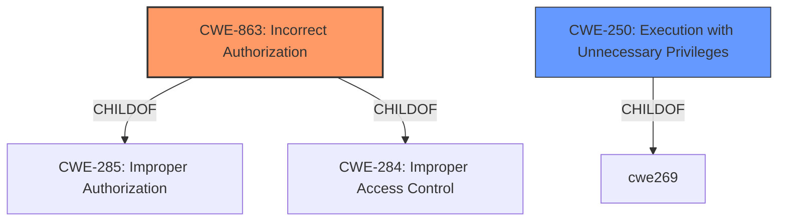

# Enhanced Analysis for CVE-2021-34771

# Summary
| CWE ID | CWE Name | Confidence | CWE Abstraction Level | CWE Vulnerability Mapping Label | CWE-Vulnerability Mapping Notes |
|---|---|---|---|---|---|
| CWE-863 | Incorrect Authorization | 0.8 | Class | Allowed-with-Review | Primary CWE |
| CWE-250 | Execution with Unnecessary Privileges | 0.5 | Base | Allowed | Secondary Candidate |

## Evidence and Confidence

*   **Confidence Score:** 0.8
*   **Evidence Strength:** HIGH

## Relationship Analysis
The primary CWE selected is CWE-863, Incorrect Authorization, which is a Class-level CWE and a child of CWE-285 and CWE-284. This relationship indicates that the authorization issue is a specific type of access control problem. CWE-250, Execution with Unnecessary Privileges, is also considered because the vulnerability allows an attacker to view sensitive configuration information that their privileges should not normally allow.



## Vulnerability Chain
The vulnerability chain starts with the **insufficient application of restrictions** (root cause), which leads to **incorrect authorization**, ultimately allowing an attacker to **view sensitive configuration information**.

## Summary of Analysis
The initial assessment focuses on the **insufficient application of restrictions** during the execution of a command. The primary candidate, CWE-863 (Incorrect Authorization), aligns well with the vulnerability description, as it involves an authorization check that is not correctly performed. The description states, "This vulnerability is due to **insufficient application of restrictions** during the execution of a specific command. An attacker could exploit this vulnerability by running a specific command. A successful exploit could allow the attacker to view sensitive configuration information that their privileges might not otherwise allow them to access."

The relationship analysis shows that CWE-863 is a child of CWE-285 (Improper Authorization) and CWE-284 (Improper Access Control), indicating a hierarchical structure. However, CWE-863 is more specific and directly addresses the authorization aspect of the vulnerability.

CWE-250 (Execution with Unnecessary Privileges) was also considered, as the attacker is able to view sensitive information, implying that the command is running with privileges that it should not have. However, this is a secondary consideration, as the root cause is more directly related to the **incorrect authorization** check.

The final decision is to map the vulnerability to CWE-863 (Incorrect Authorization) as the primary CWE, with a confidence score of 0.8, because it directly reflects the **insufficient application of restrictions** during command execution, leading to unauthorized access to sensitive information. CWE-250 could be a secondary mapping, but its applicability is less direct.

Other CWEs Considered and Rejected:

*   CWE-20 (Improper Input Validation): While input might be involved, the core issue is not about validating input but about enforcing privileges.
*   CWE-269 (Improper Privilege Management): This is a higher-level class, and CWE-863 provides a more specific description of the problem.
*   CWE-284 (Improper Access Control): Too high-level; CWE-863 is more specific.
*   CWE-285 (Improper Authorization): CWE-863 is a child of this and thus more specific.
*   CWE-73 (External Control of File Name or Path): Not applicable, as the vulnerability does not involve file paths.
*   CWE-201 (Insertion of Sensitive Information Into Sent Data), CWE-497 (Exposure of Sensitive System Information to an Unauthorized Control Sphere), CWE-532 (Insertion of Sensitive Information into Log File): These CWEs describe information exposure but do not address the root cause of **incorrect authorization**.


## CWE Relationship Analysis

Current CWEs represent these abstraction levels: .


### Vulnerability Chain Analysis

**Chain starting from CWE-497:**
- 497 (Exposure of Sensitive System Information to an Unauthorized Control Sphere) - ROOT


**Chain starting from CWE-284:**
- 284 (Improper Access Control) - ROOT


### CWE Relationship Diagram

```mermaid
graph TD
    classDef primary fill:#f96,stroke:#333,stroke-width:2px
    classDef secondary fill:#69f,stroke:#333
    classDef tertiary fill:#9e9,stroke:#333
```