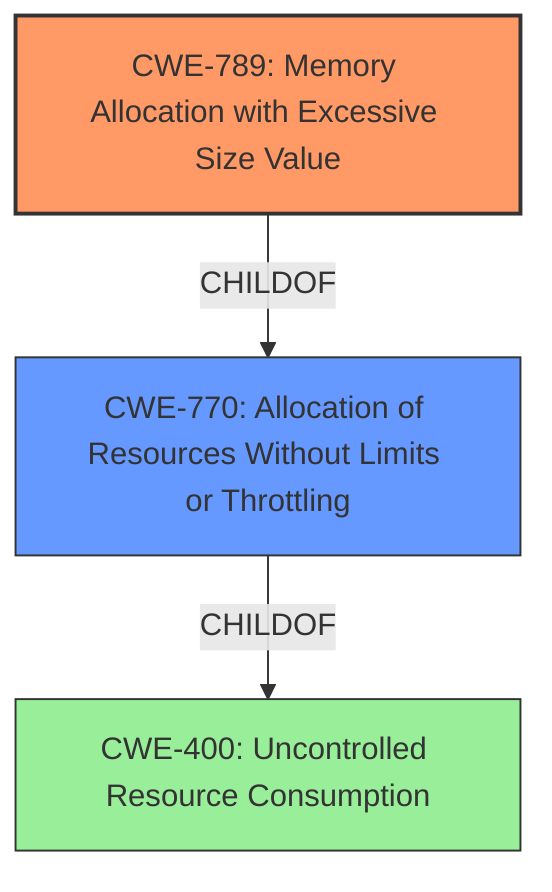

# Analysis for CVE-2021-3478

# Summary
| CWE ID    | CWE Name                                        | Confidence | CWE Abstraction Level | CWE Vulnerability Mapping Label | CWE-Vulnerability Mapping Notes |
| :--------- | :---------------------------------------------- | :--------- | :---------------------- | :------------------------------ | :------------------------------ |
| CWE-789   | Memory Allocation with Excessive Size Value   | 0.9        | Variant                 | Allowed                         | Primary CWE                     |
| CWE-770   | Allocation of Resources Without Limits or Throttling | 0.7        | Base                    | Allowed                         | Secondary Candidate             |

## Evidence and Confidence

*   **Confidence Score:** 0.8
*   **Evidence Strength:** HIGH

## Relationship Analysis
The primary CWE, CWE-789 (Memory Allocation with Excessive Size Value), is a variant of CWE-770 (Allocation of Resources Without Limits or Throttling), indicating a more specific case where the excessive allocation stems from a large size value. CWE-770 is a child of CWE-400 (Uncontrolled Resource Consumption) which is a more general class of resource consumption issues. Choosing CWE-789 provides a more precise characterization of the vulnerability, focusing on the size-related aspect of the memory allocation.

## Vulnerability Chain
The vulnerability chain begins with a crafted file submitted by an attacker. The OpenEXR software processes this file, and due to a **missing** check for `_data->linesInBuffer`, large `lineOffset` and `bytesPerLine` tables cause **excessive memory allocation**, leading to a denial of service. The root cause is the **missing** input validation/check, which then triggers the excessive memory allocation.

## Summary of Analysis
The analysis strongly suggests that CWE-789 (Memory Allocation with Excessive Size Value) is the most appropriate primary CWE, as the vulnerability involves allocating memory based on a large, untrusted size value without proper validation. This aligns directly with the CWE's description. The secondary CWE, CWE-770 (Allocation of Resources Without Limits or Throttling), captures the broader issue of resource allocation without limits, but CWE-789 provides more specific context regarding the size of the allocated memory.

Evidence from "CVE Reference Links Content Summary":
-   "In ImfScanLineInputFile.cpp, large lineOffset and bytesPerLine tables could cause OpenEXR to allocate **excessive memory** due to a **missing** check for `_data->linesInBuffer`."
-   "An attacker able to submit a **crafted file** to be processed by OpenEXR could **consume excessive system memory**, leading to denial of service."

The mapping guidance for CWE-789 recommends its usage as it is at the Variant level of abstraction.
The mapping guidance for CWE-770 recommends its usage as it is at the Base level of abstraction.

CWE-125 (Out-of-bounds Read) was considered but rejected because the vulnerability's primary mechanism is memory allocation, not reading beyond buffer boundaries. CWE-190 (Integer Overflow or Wraparound) was also considered but doesn't directly fit the scenario, although it could be related if the large size value leads to an integer overflow during memory allocation calculations. However, the description emphasizes excessive memory allocation rather than integer manipulation. CWE-835 (Loop with Unreachable Exit Condition ('Infinite Loop')) was considered but the analysis doesn't specify any loop.

Relevant CWE Information:

# Enhanced Context (25 CWEs)

## CWE-789: Memory Allocation with Excessive Size Value
**Abstraction Level**: Variant
**Similarity Score**: 0.75
**Source**: dense

**Description**:
The product allocates memory based on an untrusted, large size value, but it does not ensure that the size is within expected limits, allowing arbitrary amounts of memory to be allocated.

**Mapping Guidance**:
- Usage: Allowed
- Rationale: This CWE entry is at the Variant level of abstraction, which is a preferred level of abstraction for mapping to the root causes of vulnerabilities.

## CWE-770: Allocation of Resources Without Limits or Throttling
**Abstraction Level**: Base
**Similarity Score**: 0.75
**Source**: dense

**Description**:
The product allocates a reusable resource or group of resources on behalf of an actor without imposing any restrictions on the size or number of resources that can be allocated, in violation of the intended security policy for that actor.

**Mapping Guidance**:
- Usage: Allowed
- Rationale: This CWE entry is at the Base level of abstraction, which is a preferred level of abstraction for mapping to the root causes of vulnerabilities.