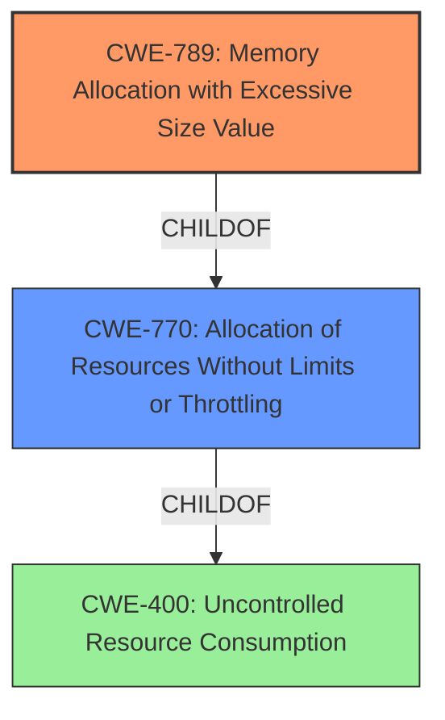

# Raw Analyzer Response for CVE-2021-3479

# Summary
| CWE ID  | CWE Name                                       | Confidence | CWE Abstraction Level | CWE Vulnerability Mapping Label | CWE-Vulnerability Mapping Notes |
| :------- | :--------------------------------------------- | :--------- | :-------------------- | :------------------------------ | :------------------------------ |
| CWE-789 | Memory Allocation with Excessive Size Value   | 0.9        | Variant               | Allowed                         | Primary CWE                     |
| CWE-770 | Allocation of Resources Without Limits or Throttling | 0.7        | Base                  | Allowed                         | Secondary Candidate             |

## Evidence and Confidence

*   **Confidence Score:** 0.8
*   **Evidence Strength:** HIGH

## Relationship Analysis
The primary CWE, CWE-789 (Memory Allocation with Excessive Size Value), is a variant of CWE-770 (Allocation of Resources Without Limits or Throttling), indicating a hierarchical relationship where CWE-789 is a more specific case of the broader resource allocation issue described by CWE-770. CWE-770 itself is a child of CWE-400 (Uncontrolled Resource Consumption), further illustrating a parent-child relationship. The selection of CWE-789 is preferred due to its specific focus on memory allocation based on untrusted size values, which aligns closely with the vulnerability description.

## Vulnerability Chain
The vulnerability chain starts with the processing of a **crafted file**. This leads to **excessive memory consumption** due to **improper memory allocation** within the OpenEXR Scanline API, resulting in an **out-of-memory** condition and ultimately a **denial of service (DoS)** impacting system availability. The root cause is the **lack of validation** of the size value, leading to **excessive memory allocation**.

## Summary of Analysis
The initial assessment focused on identifying the root cause of the vulnerability, which is the **excessive memory consumption** triggered by a **crafted file**. The evidence from the "CVE Reference Links Content Summary" clearly states that the vulnerability is due to an out-of-memory condition caused by the allocation of a very large buffer within the OpenEXR Scanline API functionality.

The Retriever results strongly suggested CWE-789 (Memory Allocation with Excessive Size Value) as a potential match, supported by a sparse score of 0.108. The description of CWE-789, "The product allocates memory based on an untrusted, large size value, but it does not ensure that the size is within expected limits, allowing arbitrary amounts of memory to be allocated," aligns directly with the vulnerability description.

CWE-770 (Allocation of Resources Without Limits or Throttling) was also considered, but CWE-789 was preferred because it is a variant that provides a more specific description of the weakness.

The selection of CWE-789 is further supported by the "Mapping Guidance," which recommends it due to its Variant level of abstraction. The vulnerability chain analysis confirms that the root cause is the **improper memory allocation** based on an **untrusted size value**, leading to a denial-of-service condition.

The final decision is based on a combination of the vulnerability description, the CVE Reference Links Content Summary, the Retriever results, and the CWE specifications. The selected CWEs are at the optimal level of specificity, providing an accurate representation of the vulnerability's root cause and potential impact.

Relevant CWE Information:

# Enhanced Context (25 CWEs)

## CWE-405: Asymmetric Resource Consumption (Amplification)
**Abstraction Level**: Class
**Similarity Score**: 0.74
**Source**: dense

**Description**:
The product does not properly control situations in which an adversary can cause the product to consume or produce excessive resources without requiring the adversary to invest equivalent work or otherwise prove authorization, i.e., the adversary's influence is "asymmetric."

**Mapping Guidance**:
- Usage: Allowed-with-Review
- Rationale: This CWE entry is a Class and might have Base-level children that would be more appropriate

## CWE-789: Memory Allocation with Excessive Size Value
**Abstraction Level**: Variant
**Similarity Score**: 0.73
**Source**: dense

**Description**:
The product allocates memory based on an untrusted, large size value, but it does not ensure that the size is within expected limits, allowing arbitrary amounts of memory to be allocated.

**Mapping Guidance**:
- Usage: Allowed
- Rationale: This CWE entry is at the Variant level of abstraction, which is a preferred level of abstraction for mapping to the root causes of vulnerabilities.

## CWE-407: Inefficient Algorithmic Complexity
**Abstraction Level**: Class
**Similarity Score**: 0.73
**Source**: dense

**Description**:
An algorithm in a product has an inefficient worst-case computational complexity that may be detrimental to system performance and can be triggered by an attacker, typically using crafted manipulations that ensure that the worst case is being reached.

**Mapping Guidance**:
- Usage: Allowed-with-Review
- Rationale: This CWE entry is a Class and might have Base-level children that would be more appropriate

## CWE-625: Permissive Regular Expression
**Abstraction Level**: Base
**Similarity Score**: 0.72
**Source**: dense

**Description**:
The product uses a regular expression that does not sufficiently restrict the set of allowed values.

**Mapping Guidance**:
- Usage: Allowed
- Rationale: This CWE entry is at the Base level of abstraction, which is a preferred level of abstraction for mapping to the root causes of vulnerabilities.

## CWE-186: Overly Restrictive Regular Expression
**Abstraction Level**: Base
**Similarity Score**: 0.72
**Source**: dense

**Description**:
A regular expression is overly restrictive, which prevents dangerous values from being detected.

**Mapping Guidance**:
- Usage: Allowed
- Rationale: This CWE entry is at the Base level of abstraction, which is a preferred level of abstraction for mapping to the root causes of vulnerabilities.

## CWE-404: Improper Resource Shutdown or Release
**Abstraction Level**: Class
**Similarity Score**: 0.72
**Source**: dense

**Description**:
The product does not release or incorrectly releases a resource before it is made available for re-use.

**Mapping Guidance**:
- Usage: Allowed-with-Review
- Rationale: This CWE entry is a Class and might have Base-level children that would be more appropriate

## CWE-799: Improper Control of Interaction Frequency
**Abstraction Level**: Class
**Similarity Score**: 0.72
**Source**: dense

**Description**:
The product does not properly limit the number or frequency of interactions that it has with an actor, such as the number of incoming requests.

**Mapping Guidance**:
- Usage: Allowed-with-Review
- Rationale: This CWE entry is a Class and might have Base-level children that would be more appropriate

## CWE-1333: Inefficient Regular Expression Complexity
**Abstraction Level**: Base
**Similarity Score**: 0.72
**Source**: dense

**Description**:
The product uses a regular expression with an inefficient, possibly exponential worst-case computational complexity that consumes excessive CPU cycles.

**Mapping Guidance**:
- Usage: Allowed
- Rationale: This CWE entry is at the Base level of abstraction, which is a preferred level of abstraction for mapping to the root causes of vulnerabilities.

## CWE-226: Sensitive Information in Resource Not Removed Before Reuse
**Abstraction Level**: Base
**Similarity Score**: 0.72
**Source**: dense

**Description**:
The product releases a resource such as memory or a file so that it can be made available for reuse, but it does not clear or "zeroize" the information contained in the resource before the product performs a critical state transition or makes the resource available for reuse by other entities.

**Mapping Guidance**:
- Usage: Allowed
- Rationale: This CWE entry is at the Base level of abstraction, which is a preferred level of abstraction for mapping to the root causes of vulnerabilities.

## CWE-834: Excessive Iteration
**Abstraction Level**: Class
**Similarity Score**: 0.71
**Source**: dense

**Description**:
The product performs an iteration or loop without sufficiently limiting the number of times that the loop is executed.

**Mapping Guidance**:
- Usage: Discouraged
- Rationale: This CWE entry is a level-1 Class (i.e., a child of a Pillar). It might have lower-level children that would be more appropriate

## CWE-789: Memory Allocation with Excessive Size Value
**Abstraction Level**: