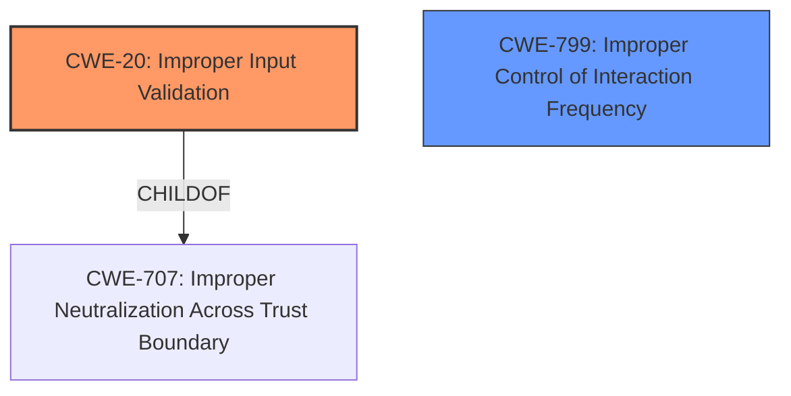

# Analysis Report for CVE-2021-34790

# Vulnerability Analysis Report: CVE-2021-34790

## Description


## Analysis (with Relationship Data)

# Summary
| CWE ID | CWE Name | Confidence | CWE Abstraction Level | CWE Vulnerability Mapping Label | CWE-Vulnerability Mapping Notes |
|---|---|---|---|---|---|
| CWE-20 | Improper Input Validation | 0.9 | Class | Primary | Discouraged |
| CWE-799 | Improper Control of Interaction Frequency | 0.6 | Class | Secondary | Allowed-with-Review |

## Evidence and Confidence

*   **Confidence Score:** 0.9
*   **Evidence Strength:** HIGH

## Relationship Analysis
The primary relationship influencing the decision is the ChildOf relationship where CWE-20 is a child of CWE-707 (Improper Neutralization Across Trust Boundary). This relationship highlights the potential for untrusted data to influence system behavior. The retriever results also show that CWE-20 can precede CWE-22 (Path Traversal) and CWE-119 (Buffer Overflow) in a vulnerability chain, further emphasizing the importance of input validation.



## Vulnerability Chain
The vulnerability chain starts with **insufficient traffic validation** within the ALG, leading to **improper input validation** (CWE-20). This **weakness** allows an attacker to bypass the ALG and open unauthorized connections. In some scenarios, **improper control of interaction frequency** (CWE-799) may be relevant if the attacker floods the system to bypass the ALG.

## Summary of Analysis
The initial analysis focused on the **insufficient traffic validation** within the ALG. The CVE Reference Links Content Summary explicitly states "Insufficient traffic validation for the Session Initiation Protocol (SIP) ALG" and "Insufficient traffic validation for the File Transfer Protocol (FTP) ALG." This **weakness** directly relates to **improper input validation** (CWE-20) since the ALG is not properly validating the traffic it receives.

The retriever results strongly suggest CWE-20, along with CWE-799, CWE-22, and others. However, given the specific context of **insufficient traffic validation**, CWE-20 is the most appropriate primary classification. Although CWE-20 is discouraged for general use, the provided root cause aligns with its description as the product does not validate or incorrectly validates that the input has the properties that are required to process the data safely and correctly.

CWE-799 is considered a secondary candidate because the vulnerability could potentially be exploited by sending a high volume of crafted traffic to bypass the ALG. However, the primary issue is the **lack of validation**, not necessarily the frequency of interactions.

The selection of CWE-20 is at the Class level, which, although not ideal, is justified given the lack of more specific information. The evidence directly supports this classification, providing a clear link between the **insufficient traffic validation** and the resulting vulnerability. The high confidence score reflects the strong alignment between the evidence and the chosen CWE.

Relevant CWE Information:

# Enhanced Context (25 CWEs)
The following CWEs were identified as potentially relevant to this vulnerability:

## CWE-1220: Insufficient Granularity of Access Control
**Abstraction Level**: Base
**Similarity Score**: 0.77
**Source**: dense

**Description**:
The product implements access controls via a policy or other feature with the intention to disable or restrict accesses (reads and/or writes) to assets in a system from untrusted agents. However, implemented access controls lack required granularity, which renders the control policy too broad because it allows accesses from unauthorized agents to the security-sensitive assets.

**Mapping Guidance**:
- Usage: Allowed
- Rationale: This CWE entry is at the Base level of abstraction, which is a preferred level of abstraction for mapping to the root causes of vulnerabilities.

*Not selected*: The primary issue is **insufficient traffic validation**, not the granularity of access control.

## CWE-691: Insufficient Control Flow Management
**Abstraction Level**: Pillar
**Similarity Score**: 0.76
**Source**: dense

**Description**:
The code does not sufficiently manage its control flow during execution, creating conditions in which the control flow can be modified in unexpected ways.

**Mapping Guidance**:
- Usage: Discouraged
- Rationale: This CWE entry is extremely high-level, a Pillar. However, classification research is limited for weaknesses of this type, so there can be gaps or organizational difficulties within CWE that force use of this weakness, even at such a high level of abstraction.

*Not selected*: This is too high-level and doesn't directly address the **insufficient traffic validation** issue.

## CWE-1289: Improper Validation of Unsafe Equivalence in Input
**Abstraction Level**: Base
**Similarity Score**: 0.76
**Source**: dense

**Description**:
The product receives an input value that is used as a resource identifier or other type of reference, but it does not validate or incorrectly validates that the input is equivalent to a potentially-unsafe value.

**Mapping Guidance**:
- Usage: Allowed
- Rationale: This CWE entry is at the Base level of abstraction, which is a preferred level of abstraction for mapping to the root causes of vulnerabilities.

*Not selected*: While there's input validation, it's not about checking equivalence of unsafe values, but rather general **insufficient traffic validation**.

## CWE-664: Improper Control of a Resource Through its Lifetime
**Abstraction Level**: Pillar
**Similarity Score**: 0.76
**Source**: dense

**Description**:
The product does not maintain or incorrectly maintains control over a resource throughout its lifetime of creation, use, and release.

**Mapping Guidance**:
- Usage: Discouraged
- Rationale: This CWE entry is high-level when lower-level children are available.

*Not selected*: Too high-level and doesn't directly address the **insufficient traffic validation** issue.

## CWE-799: Improper Control of Interaction Frequency
**Abstraction Level**: Class
**Similarity Score**: 0.76
**Source**: dense

**Description**:
The product does not properly limit the number or frequency of interactions that it has with an actor, such as the number of incoming requests.

**Mapping Guidance**:
- Usage: Allowed-with-Review
- Rationale: This CWE entry is a Class and might have Base-level children that would be more appropriate

*Selected as Secondary*: The vulnerability could potentially be exploited by sending a high volume of crafted traffic to bypass the ALG, however, the primary issue is the **lack of validation**.

## CWE-653: Improper Isolation or Compartmentalization
**Abstraction Level**: Class
**Similarity Score**: 0.76
**Source**: dense

**Description**:
The product does not properly compartmentalize or isolate functionality, processes, or resources that require different privilege levels, rights, or permissions.

**Mapping Guidance**:
- Usage: Allowed
- Rationale: This CWE entry is at the Base level of abstraction, which is a preferred level of abstraction for mapping to the root causes of vulnerabilities.

*Not selected*: This doesn't directly address the **insufficient traffic validation** issue.

## CWE-807: Reliance on Untrusted Inputs in a Security Decision
**Abstraction Level**: Base
**Similarity Score**: 0.76
**Source**: dense

**Description**:
The product uses a protection mechanism that relies on the existence or values of an input, but the input can be modified by an untrusted actor in a way that bypasses the protection mechanism.

**Mapping Guidance**:
- Usage: Allowed
- Rationale: This CWE entry is at the Base level of abstraction, which is a preferred level of abstraction for mapping to the root causes of vulnerabilities.

*Not selected*: It's more about the **lack of validation** of the input rather than relying on an untrusted input for a security decision.

## CWE-668: Exposure of Resource to Wrong Sphere
**Abstraction Level**: Class
**Similarity Score**: 0.75
**Source**: dense

**Description**:
The product exposes a resource to the wrong control sphere, providing unintended actors with inappropriate access to the resource.

**Mapping Guidance**:
- Usage: Discouraged
- Rationale: CWE-668 is high-level and is often misused as a catch-all when lower-level CWE IDs might be applicable. It is sometimes used for low-information vulnerability reports [REF-1287]. It is a level-1 Class (i.e., a child of a Pillar). It is not useful for trend analysis.

*Not selected*: Too high-level and doesn't directly address the **insufficient traffic validation** issue.

## CWE-274: Improper Handling of Insufficient Privileges
**Abstraction Level**: Base
**Similarity Score**: 0.75
**Source**: dense

**Description**:
The product does not handle or incorrectly handles when it has insufficient privileges to perform an operation,


## CWE Relationship Analysis

Current CWEs represent these abstraction levels: .


### Vulnerability Chain Analysis

**Chain starting from CWE-691:**
- 691 (Insufficient Control Flow Management) - ROOT


**Chain starting from CWE-664:**
- 664 (Improper Control of a Resource Through its Lifetime) - ROOT


### CWE Relationship Diagram

```mermaid
graph TD
    classDef primary fill:#f96,stroke:#333,stroke-width:2px
    classDef secondary fill:#69f,stroke:#333
    classDef tertiary fill:#9e9,stroke:#333
```


*Report generated on 2025-04-01 22:03:57*
