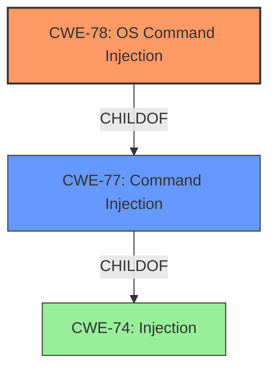

# Analysis Report for CVE-2021-34809

# Vulnerability Analysis Report: CVE-2021-34809

## Description


## Analysis (with Relationship Data)

# Summary
| CWE ID | CWE Name | Confidence | CWE Abstraction Level | CWE Vulnerability Mapping Label | CWE-Vulnerability Mapping Notes |
|---|---|---|---|---|---|
| CWE-78 | Improper Neutralization of Special Elements used in an OS Command ('OS Command Injection') | 1.0 | Base | Allowed | Primary CWE |
| CWE-77 | Improper Neutralization of Special Elements used in a Command ('Command Injection') | 0.7 | Class | Allowed-with-Review | Secondary Candidate |
| CWE-74 | Improper Neutralization of Special Elements in Output Used by a Downstream Component ('Injection') | 0.5 | Class | Discouraged | Secondary Candidate |

## Evidence and Confidence

*   **Confidence Score:** 0.9
*   **Evidence Strength:** HIGH

## Relationship Analysis
The primary relationship influencing the CWE selection is the hierarchical relationship between CWE-77 (Class) and CWE-78 (Base), where CWE-78 is a child of CWE-77. Given the specific context of OS commands being injected, CWE-78 is the more precise and appropriate choice. CWE-74 is a higher-level class that encompasses many types of injection, making it less specific than CWE-78 and therefore a less suitable mapping. The graph below visualizes these relationships.



## Vulnerability Chain
The vulnerability chain starts with the **improper neutralization of special elements** within the task management component, leading to **command injection**. This allows remote authenticated users to execute arbitrary code. The chain is:

1.  **Improper Neutralization** (**ROOT CAUSE**)
2.  **Command Injection** (CWE-78)
3.  Arbitrary Code Execution (**IMPACT**)

## Summary of Analysis
The initial analysis correctly identified the presence of a **command injection** vulnerability due to **improper neutralization of special elements**. The selection of CWE-78 is based on the fact that the vulnerability involves the injection of OS commands, as explicitly stated in the "Vulnerability Description Key Phrases" and "CVE Reference Links Content Summary".

The vulnerability description states: "**Improper neutralization of special elements** used in a command (Command Injection)...allows remote authenticated users to execute arbitrary code". The "CVE Reference Links Content Summary" also mentions "**Root cause of vulnerability**: Improper neutralization of special elements used in a command ('Command Injection')". This evidence strongly supports the selection of CWE-78.

While CWE-77 (Improper Neutralization of Special Elements used in a Command) is a parent of CWE-78, the more specific CWE-78 is preferred because the vulnerability specifically involves OS commands. CWE-74 is a high-level class that is too broad. The retriever results also support this decision, listing CWE-78 as a strong candidate.

Therefore, the final selection of CWE-78 is at the optimal level of specificity, as it accurately reflects the nature of the vulnerability based on the provided evidence.

Relevant CWE Information:

# Enhanced Context (25 CWEs)

## CWE-80: Improper Neutralization of Script-Related HTML Tags in a Web Page (Basic XSS)
**Abstraction Level**: Variant
**Similarity Score**: 0.80
**Source**: dense

**Description**:
The product receives input from an upstream component, but it does not neutralize or incorrectly neutralizes special characters such as "<", ">", and "&" that could be interpreted as web-scripting elements when they are sent to a downstream component that processes web pages.

**Mapping Guidance**:
- Usage: Allowed
- Rationale: This CWE entry is at the Variant level of abstraction, which is a preferred level of abstraction for mapping to the root causes of vulnerabilities.

**Rationale for Not Using:** This CWE is not related to command injection but to Cross-Site Scripting (XSS) vulnerabilities.

## CWE-74: Improper Neutralization of Special Elements in Output Used by a Downstream Component ('Injection')
**Abstraction Level**: Class
**Similarity Score**: 0.77
**Source**: dense

**Description**:
The product constructs all or part of a command, data structure, or record using externally-influenced input from an upstream component, but it does not neutralize or incorrectly neutralizes special elements that could modify how it is parsed or interpreted when it is sent to a downstream component.

**Mapping Guidance**:
- Usage: Discouraged
- Rationale: CWE-74 is high-level and often misused when lower-level weaknesses are more appropriate.

**Rationale for Not Using:** While CWE-74 is a parent of CWE-78, it is a more general "Injection" class. Since the vulnerability is specifically an OS command injection, CWE-78 is a more precise fit.

## CWE-1236: Improper Neutralization of Formula Elements in a CSV File
**Abstraction Level**: Base
**Similarity Score**: 0.76
**Source**: dense

**Description**:
The product saves user-provided information into a Comma-Separated Value (CSV) file, but it does not neutralize or incorrectly neutralizes special elements that could be interpreted as a command when the file is opened by a spreadsheet product.

**Mapping Guidance**:
- Usage: Allowed
- Rationale: This CWE entry is at the Base level of abstraction, which is a preferred level of abstraction for mapping to the root causes of vulnerabilities.

**Rationale for Not Using:** This CWE is specific to CSV files and not related to command injection.

## CWE-138: Improper Neutralization of Special Elements
**Abstraction Level**: Class
**Similarity Score**: 0.75
**Source**: dense

**Description**:
The product receives input from an upstream component, but it does not neutralize or incorrectly neutralizes special elements that could be interpreted as control elements or syntactic markers when they are sent to a downstream component.

**Mapping Guidance**:
- Usage: Discouraged
- Rationale: This CWE entry is a level-1 Class (i.e., a child of a Pillar). It might have lower-level children that would be more appropriate

**Rationale for Not Using:** This is a broad class. The vulnerability is related to OS Command injection, so it is better to use CWE-78.

## CWE-917: Improper Neutralization of Special Elements used in an Expression Language Statement ('Expression Language Injection')
**Abstraction Level**: Base
**Similarity Score**: 0.74
**Source**: dense

**Description**:
The product constructs all or part of an expression language (EL) statement in a framework such as a Java Server Page (JSP) using externally-influenced input from an upstream component, but it does not neutralize or incorrectly neutralizes special elements that could modify the intended EL statement before it is executed.

**Mapping Guidance**:
- Usage: Allowed
- Rationale: This CWE entry is at the Base level of abstraction, which is a preferred level of abstraction for mapping to the root causes of vulnerabilities.

**Rationale for Not Using:** This is related to Expression Language Injection, and not related to OS Command injection.

## CWE-184: Incomplete List of Disallowed Inputs
**Abstraction Level**: Base
**Similarity Score**: 0.74
**Source**: dense

**Description**:
The product implements a protection mechanism that relies on a list of inputs (or properties of inputs) that are not allowed by policy or otherwise require other action to neutralize before additional processing takes place, but the list is incomplete.

**Mapping Guidance**:
- Usage: Allowed
- Rationale: This CWE entry is at the Base level of abstraction, which is a preferred level of abstraction for mapping to the root causes of vulnerabilities.

**Rationale for Not Using:** This is related to an incomplete list of disallowed inputs, and not directly related to OS Command Injection.

## CWE-116: Improper Encoding or Escaping of Output
**Abstraction Level**: Class
**Similarity Score**: 0.74
**Source**: dense

**Description**:
The product prepares a structured message for communication with another component, but encoding or escaping of the data is either missing or done incorrectly. As a result, the intended structure of the message is not preserved.

**Mapping Guidance**:
- Usage: Allowed-with-Review
- Rationale: This CWE entry is a Class and might have Base-level children that would be more appropriate

**Rationale for Not Using:** This is related to encoding and escaping, and not related to OS Command Injection.

## CWE-1289: Improper Validation of Unsafe Equivalence in Input
**Abstraction Level**: Base
**Similarity Score**: 0.73
**Source**: dense

**Description**:
The product receives an input value that is used as a resource identifier or other type of reference, but it does not validate or incorrectly validates that the input is equivalent to a potentially-unsafe value.


## CWE Relationship Analysis

Current CWEs represent these abstraction levels: .


### Vulnerability Chain Analysis

**Chain starting from CWE-80:**
- 80 (Improper Neutralization of Script-Related HTML Tags in a Web Page (Basic XSS)) - ROOT


**Chain starting from CWE-78:**
- 78 (Improper Neutralization of Special Elements used in an OS Command ('OS Command Injection')) - ROOT


### CWE Relationship Diagram

```mermaid
graph TD
    classDef primary fill:#f96,stroke:#333,stroke-width:2px
    classDef secondary fill:#69f,stroke:#333
    classDef tertiary fill:#9e9,stroke:#333
```


*Report generated on 2025-04-01 22:45:49*
