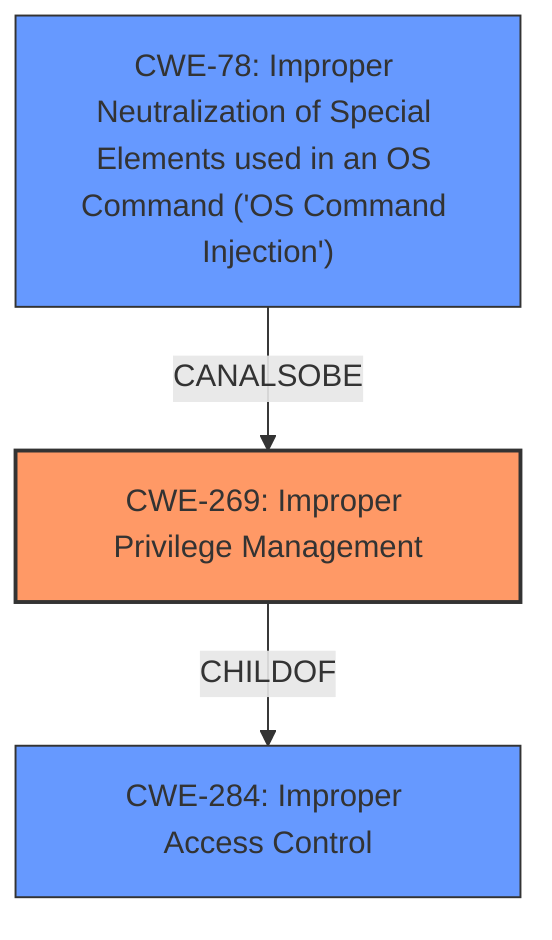

# Raw Analyzer Response for CVE-2021-34810

# Summary
| CWE ID | CWE Name | Confidence | CWE Abstraction Level | CWE Vulnerability Mapping Label | CWE-Vulnerability Mapping Notes |
|---|---|---|---|---|---|
| CWE-269 | Improper Privilege Management | 0.9 | Class | Primary | Allowed-with-Review |
| CWE-78 | Improper Neutralization of Special Elements used in an OS Command ('OS Command Injection') | 0.6 | Base | Secondary | Allowed |

## Evidence and Confidence

*   **Confidence Score:** 0.75
*   **Evidence Strength:** MEDIUM

## Relationship Analysis
The primary CWE identified is CWE-269, which is a Class-level CWE. While discouraged, it is the most direct match to the vulnerability description's **root cause**: "**Improper privilege management**". CWE-269 is a child of CWE-284 (Improper Access Control), which is a higher-level Pillar. The choice of CWE-269 over CWE-284 provides slightly more specificity. CWE-78 (Improper Neutralization of Special Elements used in an OS Command) is considered as a possible secondary CWE since **improper privilege management** could lead to OS command injection.

## Vulnerability Chain
The vulnerability chain starts with **improper privilege management** (CWE-269), which allows remote authenticated users to execute arbitrary code. The exact mechanism or vector is unspecified, making it challenging to pinpoint a more specific CWE. A potential consequence of the **improper privilege management** could be OS command injection (CWE-78) if the **improper privilege management** allows injection of special elements to execute OS commands.

## Summary of Analysis
The initial analysis identified **improper privilege management** as the **root cause** of the vulnerability, directly leading to the selection of CWE-269. The provided evidence supports this, with the "Vulnerability Description Key Phrases" explicitly stating "**rootcause:** **Improper privilege management**" and the "CVE Reference Links Content Summary" reinforcing this point.

The relationship analysis considered the hierarchical structure, opting for the Class-level CWE-269 over the Pillar-level CWE-284 due to its greater specificity. Additionally, the potential for OS command injection (CWE-78) was considered as a secondary weakness, as **improper privilege management** can manifest in various ways.

The final decision is based on the available evidence and the CWE descriptions. CWE-269 directly addresses the identified **root cause**, while CWE-78 represents a potential consequence. The level of specificity is appropriate, given the limited details regarding the specific attack vector.

Other CWEs Considered:

*   CWE-284: Improper Access Control - While related, this is a higher-level categorization, and CWE-269 is more specific to the **root cause**.
*   CWE-74: Improper Neutralization of Special Elements in Output Used by a Downstream Component ('Injection') - While a possibility, there is no explicit evidence of injection in the description.
*   CWE-89: Improper Neutralization of Special Elements used in an SQL Command ('SQL Injection') - Not applicable as there is no mention of SQL commands.
*   CWE-22: Improper Limitation of a Pathname to a Restricted Directory ('Path Traversal') - Not applicable as there is no mention of path traversal.
*   CWE-77: Improper Neutralization of Special Elements used in a Command ('Command Injection') - Possible but less direct than CWE-78.

Relevant CWE Information:

# Enhanced Context (25 CWEs)

## CWE-269: Improper Privilege Management
**Abstraction:** Class
**Status:** Draft

### Description
The product does not properly assign, modify, track, or check privileges for an actor, creating an unintended sphere of control for that actor.

### Extended Description
Not provided

### Alternative Terms
None

### Relationships
ChildOf -> CWE-284

### Mapping Guidance
**Usage:** Discouraged
**Rationale:** CWE-269 is commonly misused. It can be conflated with "privilege escalation," which is a technical impact that is listed in many low-information vulnerability reports [REF-1287]. It is not useful for trend analysis.
**Comments:** If an error or mistake allows privilege escalation, then use the CWE ID for that mistake. Avoid using CWE-269 when only phrases such as "privilege escalation" or "gain privileges" are available, as these indicate technical impact of the vulnerability - not the **root cause** weakness. If the **root cause** seems to be directly related to privileges, then examine the children of CWE-269 for additional hints, such as Execution with Unnecessary Privileges (CWE-250) or Incorrect Privilege Assignment (CWE-266).
**Reasons:**
- Frequent Misuse

### Additional Notes
**[Maintenance]** The relationships between privileges, permissions, and actors (e.g. users and groups) need further refinement within the Research view. One complication is that these concepts apply to two different pillars, related to control of resources (CWE-664) and protection mechanism failures (CWE-693).

### Observed Examples
- **CVE-2001-1555:** Terminal privileges are not reset when a user logs out.
- **CVE-2001-1514:** Does not properly pass security context to child processes in certain cases, allows privilege escalation.
- **CVE-2001-0128:** Does not properly compute roles.

## CWE-78: Improper Neutralization of Special Elements used in an OS Command ('OS Command Injection')
**Abstraction:** Base
**Status:** Stable

### Description
The product constructs all or part of an OS command using externally-influenced input from an upstream component, but it does not neutralize or incorrectly neutralizes special elements that could modify the intended OS command when it is sent to a downstream component.

### Extended Description
This weakness can lead to a vulnerability in environments in which the attacker does not have direct access to the operating system, such as in web applications. Alternately, if the weakness occurs in a privileged program, it could allow the attacker to specify commands that normally would not be accessible, or to call alternate commands with privileges that the attacker does not have. The problem is exacerbated if the compromised process does not follow the principle of least privilege, because the attacker-controlled commands may run with special system privileges that increases the amount of damage.

There are at least two subtypes of OS command injection:

*   The application intends to execute a single, fixed program that is under its own control. It intends to use externally-supplied inputs as arguments to that program. For example, the program might use system("nslookup [HOSTNAME]") to run nslookup and allow the user to supply a HOSTNAME, which is used as an argument. Attackers cannot prevent nslookup from executing. However, if the program does not remove command separators from the HOSTNAME argument, attackers could place the separators into the arguments, which allows them to execute their own program after nslookup has finished executing.
*   The application accepts an input that it uses to fully select which program to run, as well as which commands to use. The application simply redirects this entire command to the operating system. For example, the program might use "exec([COMMAND])" to execute the [COMMAND] that was supplied by the user. If the COMMAND is under attacker control, then the attacker can execute arbitrary commands or programs. If the command is being executed using functions like exec() and CreateProcess(), the attacker might not be able to combine multiple commands together in the same line.

From a weakness standpoint, these variants represent distinct programmer errors. In the first variant, the programmer clearly intends that input from untrusted parties will be part of the arguments in the command to be executed. In the second variant, the programmer does not intend for the command to be accessible to any untrusted party, but the programmer probably has not accounted for alternate ways in which malicious attackers can provide input.

### Alternative Terms
Shell injection
Shell metacharacters
OS Command Injection

### Relationships
ChildOf -> CWE-77
ChildOf -> CWE-74
ChildOf -> CWE-77
ChildOf -> CWE-77
CanAlsoBe -> CWE-88

### Mapping Guidance
**Usage:** Allowed
**Rationale:** This CWE entry is at the Base level of abstraction, which is a preferred level of abstraction for mapping to the **root causes** of vulnerabilities.
**Comments:** Carefully read both the name and description to ensure that this mapping is an appropriate fit. Do not try to 'force' a mapping to a lower-level