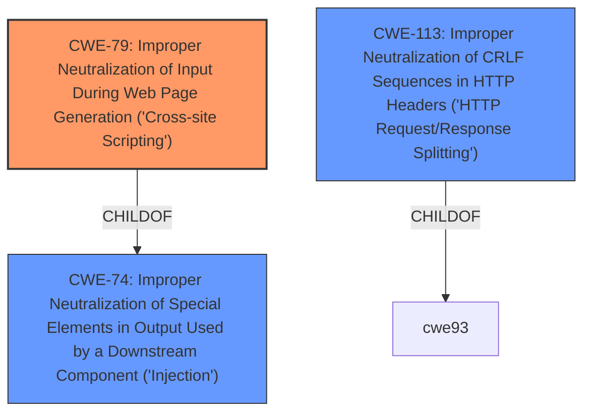

# Analysis Report for CVE-2021-34821

# Vulnerability Analysis Report: CVE-2021-34821

## Description


## Analysis (with Relationship Data)

# Summary
| CWE ID | CWE Name | Confidence | CWE Abstraction Level | CWE Vulnerability Mapping Label | CWE-Vulnerability Mapping Notes |
|---|---|---|---|---|---|
| CWE-79 | Improper Neutralization of Input During Web Page Generation ('Cross-site Scripting') | 1.0 | Base | Allowed | Primary CWE. The application fails to neutralize user-controlled input before including it in a web page. |
| CWE-113 | Improper Neutralization of CRLF Sequences in HTTP Headers ('HTTP Request/Response Splitting') | 0.5 | Variant | Allowed | Secondary CWE. The application may be vulnerable to HTTP Request/Response Splitting due to improper handling of CRLF sequences. |

## Evidence and Confidence

*   **Confidence Score:** 0.75
*   **Evidence Strength:** MEDIUM

## Relationship Analysis
The primary relationship influencing the CWE selection is the ChildOf relationship. CWE-79 is a base CWE that is a child of CWE-74. The vulnerability description clearly points to XSS due to the **wrong HTTP 404 error handling**, where the URL path is copied into the HTML document without proper neutralization. While other CWEs like CWE-113 were considered due to similar attack vectors involving HTTP requests, the core issue is the lack of output encoding leading to XSS.



## Vulnerability Chain
The vulnerability chain starts with the **wrong HTTP 404 error handling**, which leads to user-supplied data being directly embedded into the HTML output without proper neutralization. This **weakness** results in a Cross-Site Scripting (XSS) vulnerability, allowing an attacker to inject malicious scripts into the web page.

## Summary of Analysis
The initial analysis focused on identifying the root cause and the resulting weakness. The vulnerability description clearly states that the "**wrong HTTP 404 error handling**" leads to a **cross-site scripting** vulnerability. The retriever results also highlight CWE-79 as the top candidate.

The final decision to select CWE-79 as the primary CWE is based on the evidence that the application fails to neutralize user-controlled input (URL path filename) before including it in the HTML output. This directly matches the description of CWE-79: "The product does not neutralize or incorrectly neutralizes user-controllable input before it is placed in output that is used as a web page that is served to other users."

CWE-113 was considered as a secondary CWE because the attack vector involves sending malicious HTTP requests. However, the core issue is the lack of output encoding, which makes CWE-79 more appropriate.

The selected CWE is at the base level of specificity, which is optimal because it accurately represents the weakness without being overly specific.

Relevant CWE Information:

# Enhanced Context (25 CWEs)
The following CWEs were identified as potentially relevant to this vulnerability:

## CWE-113: Improper Neutralization of CRLF Sequences in HTTP Headers ('HTTP Request/Response Splitting')
**Abstraction Level**: Variant
**Similarity Score**: 0.80
**Source**: dense

**Description**:
The product receives data from an HTTP agent/component (e.g., web server, proxy, browser, etc.), but it does not neutralize or incorrectly neutralizes CR and LF characters before the data is included in outgoing HTTP headers.

**Mapping Guidance**:
- Usage: Allowed
- Rationale: This CWE entry is at the Variant level of abstraction, which is a preferred level of abstraction for mapping to the root causes of vulnerabilities.

Technical Explanation for CWE-79:

*   How the vulnerability's details match the CWE's characteristics: The vulnerability description indicates that the AAT Novus Management System copies the URL path filename into the HTML document as plain text tags without proper neutralization. This directly aligns with CWE-79, which describes the improper neutralization of user-controllable input before it is placed in output that is used as a web page.
*   The security implications and potential impact: The security implication is that an attacker can inject malicious scripts into the web page, potentially leading to information disclosure, session hijacking, or defacement.
*   Any parent-child relationships or chain patterns that influenced your mapping: CWE-79 is a base CWE and a child of CWE-74 (Improper Neutralization of Special Elements in Output Used by a Downstream Component ('Injection')). This relationship reinforces the idea that the vulnerability is related to improper handling of special elements in the output.
*   Whether the weakness is primary or secondary in the vulnerability: CWE-79 is the primary weakness in this vulnerability.
*   How the official MITRE mapping guidance influenced your decision: The MITRE mapping guidance for CWE-79 states that it is at the base level of abstraction, which is a preferred level for mapping root causes. The guidance also suggests carefully reading both the name and description to ensure that the mapping is an appropriate fit, which it is in this case.

Technical Explanation for CWE-113:

*   How the vulnerability's details match the CWE's characteristics: The vulnerability stems from **wrong HTTP 404 error handling**, meaning the **vector** is likely through HTTP Requests. An attacker might be able to inject CRLF sequences into the URL path, which could then be reflected in the response headers due to the error handling, leading to HTTP Request/Response Splitting.
*   The security implications and potential impact: If CRLF injection is possible, an attacker could manipulate HTTP headers, potentially leading to XSS or cache poisoning.
*   Any parent-child relationships or chain patterns that influenced your mapping: CWE-113 is a variant CWE.
*   Whether the weakness is primary or secondary in the vulnerability: CWE-113 is a secondary weakness.
*   How the official MITRE mapping guidance influenced your decision: The MITRE mapping guidance for CWE-113 states that it is at the Variant level of abstraction, which is a preferred level for mapping root causes.

CWEs considered but not used:

*   CWE-80: Improper Neutralization of Script-Related HTML Tags in a Web Page (Basic XSS): While related to XSS, CWE-79 is a more general case and better fits the description.
*   CWE-74: Improper Neutralization of Special Elements in Output Used by a Downstream Component ('Injection'): This is a class-level CWE and is too high-level for this specific vulnerability.
*   CWE-352: Cross-Site Request Forgery (CSRF): There's no evidence of CSRF in the description.
*   CWE-918: Server-Side Request Forgery (SSRF): There's no evidence of SSRF in the description.


## CWE Relationship Analysis

Current CWEs represent these abstraction levels: .


### Vulnerability Chain Analysis

**Chain starting from CWE-113:**
- 113 (Improper Neutralization of CRLF Sequences in HTTP Headers ('HTTP Request/Response Splitting')) - ROOT


**Chain starting from CWE-79:**
- 79 (Improper Neutralization of Input During Web Page Generation ('Cross-site Scripting')) - ROOT


### CWE Relationship Diagram

```mermaid
graph TD
    classDef primary fill:#f96,stroke:#333,stroke-width:2px
    classDef secondary fill:#69f,stroke:#333
    classDef tertiary fill:#9e9,stroke:#333
```


*Report generated on 2025-04-02 06:47:18*
