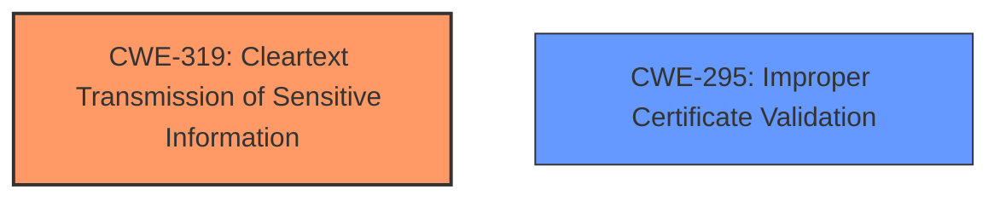

# Analysis Report for CVE-2021-34825

# Vulnerability Analysis Report: CVE-2021-34825

## Description


## Analysis (with Relationship Data)

# Summary
| CWE ID  | CWE Name                                | Confidence | CWE Abstraction Level | CWE Vulnerability Mapping Label | CWE-Vulnerability Mapping Notes |
| :------- | :-------------------------------------- | :--------- | :-------------------- | :------------------------------ | :------------------------------ |
| CWE-319 | Cleartext Transmission of Sensitive Information | 0.90      | Base                 | Allowed                         | Primary CWE                     |
| CWE-295 | Improper Certificate Validation     | 0.70      | Base                 | Allowed                         | Secondary Candidate             |

## Evidence and Confidence

*   **Confidence Score:** 0.80
*   **Evidence Strength:** HIGH

## Relationship Analysis
The primary relationship influencing the selection of CWE-319 is its direct relevance to the **insecure fallback** to plaintext communication when SSL/TLS is required but a valid certificate is not available. CWE-295 is a related issue, as the **lack of proper validation** of the certificate (or its absence) is the root cause enabling the fallback. Both are Base level CWEs.



## Vulnerability Chain
The vulnerability chain starts with the **improper handling** of the scenario where a valid SSL/TLS certificate is not available when `--require-ssl` is enabled. This leads to the **insecure fallback** to plaintext communication, ultimately resulting in the **transmission of sensitive information in cleartext**.

## Summary of Analysis
The analysis strongly indicates that the primary weakness is CWE-319 (Cleartext Transmission of Sensitive Information), as the core issue is the **transmission of data without encryption** when it should be encrypted. This occurs due to the program falling back to plaintext mode **instead of terminating** when SSL/TLS is required but a valid certificate is not available. The "CVE Reference Links Content Summary" section provides clear evidence: "The Quassel IRC client, when launched with the `--require-ssl` flag but unable to load an SSL/TLS certificate ..., would fall back to plaintext mode instead of terminating."

CWE-295 (Improper Certificate Validation) is considered as a secondary weakness. The root cause of the issue is the **inability to load and validate the certificate**, which then triggers the fallback. However, the immediate vulnerability is the cleartext transmission. The "CVE Reference Links Content Summary" mentions "Lack of proper error handling: The **lack of an explicit error and termination** when the certificate cannot be loaded masked the security issue".

Other CWEs were considered but deemed less relevant:

*   CWE-327 (Use of a Broken or Risky Cryptographic Algorithm): This CWE is not applicable because the issue isn't about using a weak algorithm, but rather about not using encryption at all.
*   CWE-400 (Uncontrolled Resource Consumption): This is not a resource exhaustion issue.
*   CWE-203 (Observable Discrepancy) and CWE-208 (Observable Timing Discrepancy): These relate to side-channel attacks, which are not the primary concern here.
* CWE-599 (Missing Validation of OpenSSL Certificate): While this is related, it is more specific and the evidence does not point to the vulnerability being OpenSSL specific. The **impact** is the transmission of data in cleartext.
* CWE-306 (Missing Authentication for Critical Function): Authentication is not the primary focus of this vulnerability, which is about the **lack of encryption** of transmitted data.

The selected CWEs are at the optimal level of specificity, with CWE-319 directly addressing the core weakness and CWE-295 providing a secondary view of the root cause.


## CWE Relationship Analysis

Current CWEs represent these abstraction levels: .


### Vulnerability Chain Analysis

**Chain starting from CWE-306:**
- 306 (Missing Authentication for Critical Function) - ROOT


**Chain starting from CWE-319:**
- 319 (Cleartext Transmission of Sensitive Information) - ROOT


### CWE Relationship Diagram

```mermaid
graph TD
    classDef primary fill:#f96,stroke:#333,stroke-width:2px
    classDef secondary fill:#69f,stroke:#333
    classDef tertiary fill:#9e9,stroke:#333
```


*Report generated on 2025-04-01 16:18:13*
